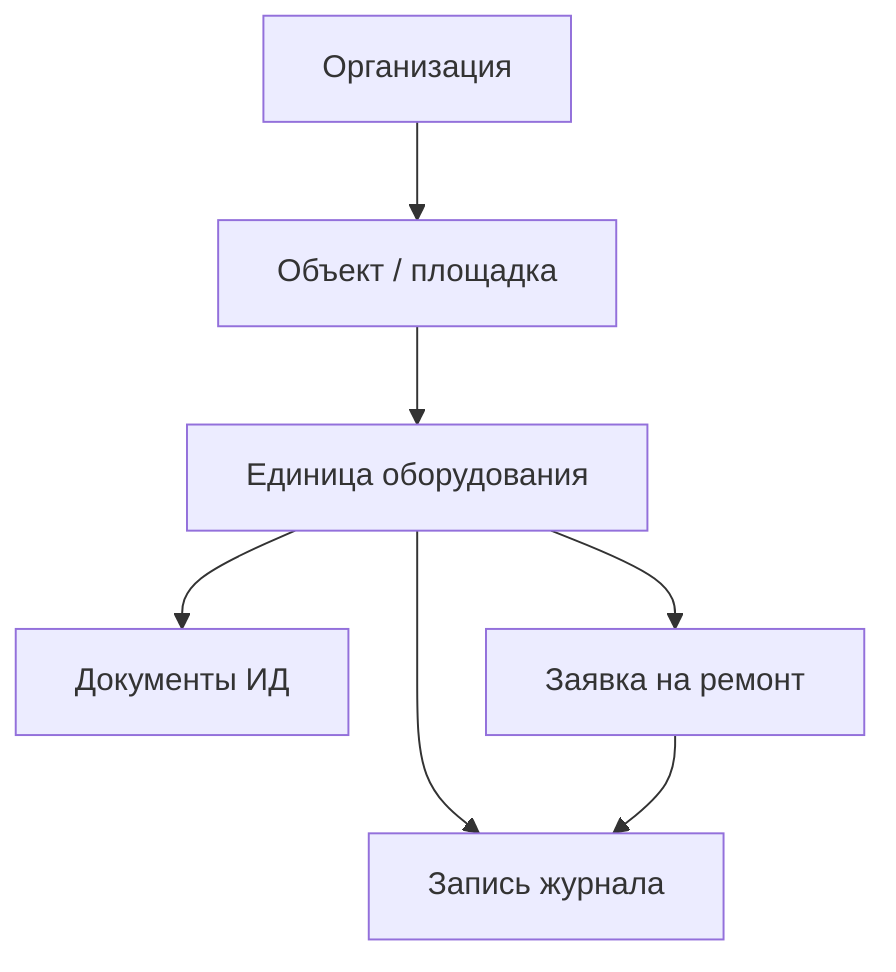

# B2B MVP: scope и отношение к текущему masterdocapp

**Дата:** 2026-05-23  
**Стратегия:** [STRATEGY.md](STRATEGY.md)  
**Статус:** продуктовое ТЗ для фазы 1 B2B

---

## Резюме решения

| Трек | Решение |
|------|---------|
| **B2B эксплуатация (приоритет GTM)** | Новый домен в `shared/` + новая навигация в `composeApp/`; не «перекрасить» B2C Atlant |
| **B2C Atlant** | Оставить как **модуль** `consumer/` или flavor; источник AI и поиска по ИЭ |
| **Backend** | Расширить REST (объекты, заявки, журнал); Onyx — для слоя «поиск по документам / подсказка» |

**Принцип MVP:** сначала **журнал + заявка + привязка к оборудованию + документы + отчёты**. Склад ЗИП, кладовщик и подрядчики — **backlog**, не первые релизы. Голос/STT — будущая платная надстройка, не MVP.

---

## Текущее состояние masterdocapp (as-is)

```
Root (табы)
├── Chat      → Onyx persona, стриминг, история (B2C FAQ Atlant)
└── Search    → поиск по базе знаний

Отдельно: EquipmentSelection → выбор Assistant (модель/тип оборудования)
```

**Стек:** KMP, Decompose, MVIKotlin, Koin, Ktor → backend/Onyx ([backend/README.md](../backend/README.md)).

**Не покрывает B2B:** объекты сети, заявки, журналы событий, роли, печать/выгрузка, мульти-тенант организации. Учёт ЗИП тоже отсутствует, но он вынесен в backlog и не является требованием первых релизов.

---

## Целевая модель B2B (to-be)



### Сущности фазы 1 (MVP)

| Сущность | Поля (минимум) | Комментарий |
|----------|----------------|-------------|
| **Organization** | id, name | Один тенант = одна сеть |
| **Site** | id, orgId, name, address | Магазин, РЦ, цех |
| **Asset** | id, siteId, name, inventoryNo?, category | Витрина, шкаф, компрессорный |
| **Document** | id, assetId?, siteId?, file, type | ИЭ, паспорт, схема; PDF |
| **WorkOrder** | id, siteId, assetId?, title, status, assignee, createdAt, closedAt | Заявка на ремонт |
| **JournalEntry** | id, type, siteId, assetId?, workOrderId?, text, author, at | ТО / неисправность / устранение |
| **User** | id, role | admin, dispatcher, engineer, requester?, reporter |

### Сущности фазы 2 (не MVP)

- **MaintenancePlan** / PPR calendar — регламенты и графики  
- **ChecklistTemplate** — отраслевые чек-листы осмотра  
- **Integration1C** — выгрузка в 1С:ТОиР

### Backlog (не первые релизы)

- **SparePart**, **StockMovement**, **MinStock**, **PartRequest**, роль кладовщика — склад ЗИП  
- Подрядчики / внешний инженер (`contractor`)  

---

## Функциональный scope MVP

### Must-have (релиз 1)

| # | Функция | Роль | Критерий готовности |
|---|---------|------|---------------------|
| 1 | Справочник объектов и оборудования | admin | CRUD объектов, категорий оборудования и активов |
| 2 | Заявка на ремонт | engineer, dispatcher | Создание с существующего asset, статусы: новая → в работе → закрыта |
| 3 | Журнал событий | engineer | Запись неисправности/ТО/устранения с привязкой к asset |
| 4 | Документы на оборудовании | admin, engineer | Загрузка PDF, просмотр, список по asset |
| 5 | Поиск по документам | engineer | Текстовый поиск; опционально Onyx RAG по document set |
| 6 | Выгрузка журнала и отчёты | admin, reporter | PDF/Excel за период по объекту или сети |
| 7 | Список заявок по сети | dispatcher | Фильтр по объекту, статусу, просрочке |
| 8 | Auth + org scope | all | Пользователь видит только свою организацию |

### Should-have (релиз 1.1, сразу после MVP)

| # | Функция |
|---|---------|
| 9 | Фото к заявке и записи журнала |
| 10 | Push / уведомление диспетчеру о новой заявке |
| 11 | AI-наставник по документации asset (без голосового ввода) |
| 12 | Офлайн-черновик заявки (mobile) |

### Won't-have в MVP

- Полноценный PPR / календарь регламентов  
- Склад ЗИП и списание по наряду  
- Кладовщик, заявки на запчасти, остатки, закупки  
- Подрядчики / contractor  
- Пожарные / лифтовые сертифицированные формы  
- Тендерный функционал 1С:ТОиР  
- B2C сценарий Atlant в том же продукте  

---

## Экраны MVP (composeApp)

| Экран | Описание |
|-------|----------|
| Login | org + user (v1 можно magic link / простой login) |
| Home dispatcher | Открытые заявки, счётчики по объектам |
| Sites list | Объекты сети |
| Site detail | Оборудование на объекте + быстрые действия |
| Asset detail | Документы, история журнала, открытые заявки, «спросить AI» |
| Create work order | Форма заявки |
| Journal timeline | Лента записей (фильтр по типу) |
| Documents | Список + viewer |
| Reports / Export | Выбор периода, объекта, статуса, инженера → PDF/Excel |

**Навигация:** заменить B2C-табы `Chat | Search` на B2B: `Заявки | Объекты | Журнал` (+ профиль). Чат — **внутри карточки оборудования**, не главный таб.

---

## Backend MVP

| Endpoint (черновик) | Назначение |
|---------------------|------------|
| `POST /auth/login` | Сессия |
| `GET/POST /sites` | Объекты |
| `GET/POST /assets` | Оборудование |
| `GET/POST /work-orders` | Заявки |
| `GET/POST /journal-entries` | Журнал |
| `POST /documents` | Upload |
| `GET /documents/{id}` | Download |
| `GET /export/journal` | Выгрузка |
| `POST /chat/...` | Существующий Onyx (опционально привязка persona к asset) |

**Хранение v1:** REST + серверная БД (PostgreSQL) — в [AGENTS.md](../masterdocapp/AGENTS.md) указано «без локальной БД в v1» для текущего клиента; для B2B серверная БД **обязательна**.

---

## Что переиспользовать из текущего кода

| Компонент | Переиспользование |
|-----------|-------------------|
| `ChatApi`, `HttpChatRepository`, стриминг | AI-наставник на карточке asset |
| `EquipmentSelection` / `Assistant` | Модель «тип оборудования» → seed категорий asset |
| Decompose + MVIKotlin + Koin | Архитектура новых фич |
| `MasterdocTheme`, UI kit | Визуальная целостность |
| Onyx document sets | Индексация ИЭ по asset/site |
| Wasm/Android/iOS targets | Те же платформы; приоритет **Android + Web** для инженера |

---

## Структура модулей (рекомендация)

```
shared/
  domain/
    consumer/     # B2C: chat, assistant
    facility/     # B2B: site, asset, workorder, journal
  data/
    consumer/
    facility/
  presentation/
    consumer/
    facility/

composeApp/
  ui/
    consumer/       # Atlant flow (опционально отключаемый)
    facility/       # B2B screens
```

**Сборка:** product flavor `consumer` | `facility` или feature flag `BuildConfig.B2B_MODE` для одного бинарника на пилот.

---

## Roadmap по фазам

| Фаза | Срок (ориентир) | Содержание |
|------|-----------------|------------|
| **0** | 1–2 нед | Документы стратегии ✅, custdev 5 интервью, лендинг SEO |
| **1 MVP** | 6–8 нед | Сущности, API, экраны §, выгрузка журнала, 1 пилотный клиент |
| **1.1** | +3 нед | Фото, push, AI в asset |
| **2** | +6 нед | MaintenancePlan, чек-листы, календарь ТО, плановые заявки из документации |
| **3** | +8 нед | Расширенные отчёты, интеграция 1С (если custdev подтвердит) |
| **Backlog** | — | Склад ЗИП, кладовщик, contractor |
| **Paid add-on later** | — | Голосовой ввод / STT |

---

## Критерии «MVP готов к пилоту»

1. Один объект: ≥10 единиц оборудования, ≥3 документа.  
2. Инженер создаёт заявку и запись журнала с телефона &lt; 2 мин.  
3. Руководитель выгружает журнал за месяц одним действием.  
4. Диспетчер видит все открытые заявки сети.  
5. `./gradlew check` зелёный; CI все платформы по [AGENTS.md](../masterdocapp/AGENTS.md).

---

## Риски реализации

| Риск | Митигация |
|------|-----------|
| Смешение B2C/B2C в одном UX | Flavor или отдельный applicationId для B2B пилота |
| Scope creep (ЗИП, contractor) | Жёсткий backlog; не включать в первые релизы |
| Ранний фокус на голосе/STT | Оставить как платную надстройку после стабилизации текстового сценария |
| Нет серверной БД | Backend milestone 0 до UI заявок |
| Custdev опровергнет холод | Универсальные журналы в SEO остаются; ICP скорректировать в STRATEGY |

---

## Связь с лендингом

На лендинге обещать только **Must-have MVP** ([SEO_KEYWORDS.md](SEO_KEYWORDS.md) — без «склад ЗИП» в H1). После релиза 1.1 — добавить блок AI и фото.
