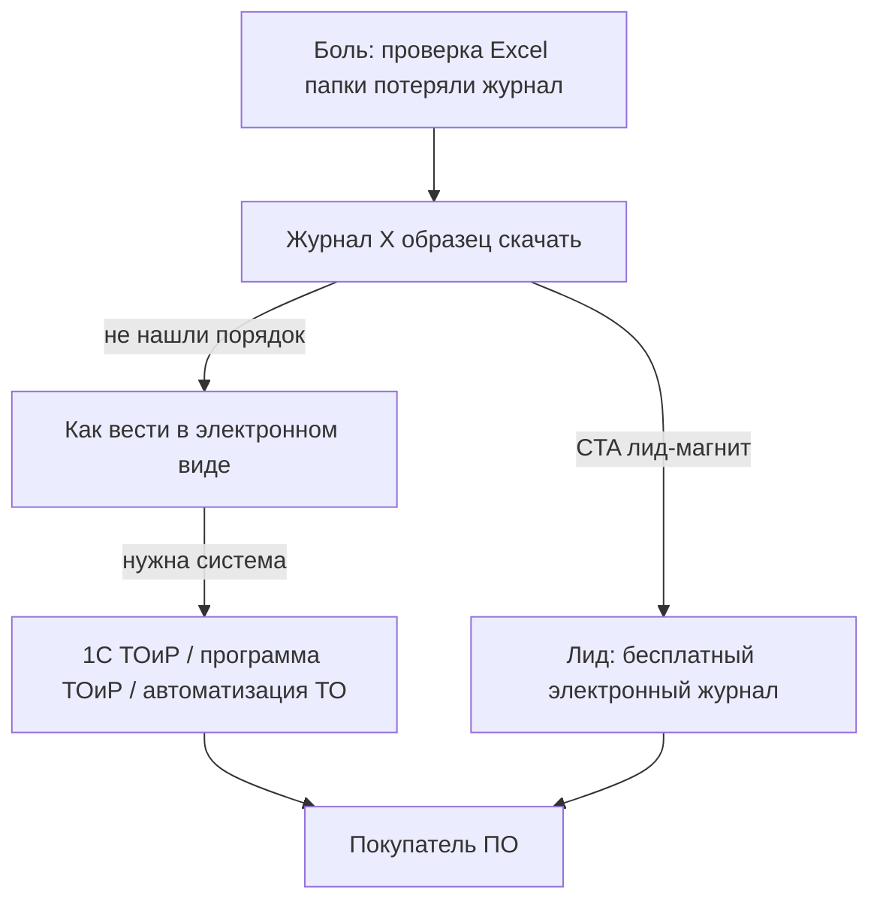

# Что ищут клиенты, которые хотят оцифровать журналы и документацию

**Дата:** 2026-05-23  
**Источник:** Яндекс Wordstat, РФ, 30 дней  
**Для кого:** маркетинг, лендинг, контекст — **не** product-only

---

## Главный вывод

**Почти никто не вводит «оцифровать журнал» или «цифровизация эксплуатации».**

Руководитель службы эксплуатации ищет так:

1. **Как правильно вести журнал** (образец, форма, ГОСТ) — думает, что нужна *бумага*.
2. **Можно ли вести в электронном виде** — когда уже слышал про ЭДО/проверку.
3. **Программу для учёта** — когда боль от проверки или масштаба сети перевесила.

Клиент «хочет оцифровать» в Wordstat выглядит как **три разных поисковых намерения**, а не одно слово «оцифровка».

---

## Три типа запросов (карта намерения)



| Тип | Что человек на самом деле хочет | Примеры запросов | Показов/мес |
|-----|--------------------------------|------------------|-------------|
| **A. Compliance** | Правильный бланк, не словить замечание | `журнал технического обслуживания` ~6 800, `образец` ~519, `скачать` ~704 | Очень много |
| | | `журнал неисправностей` ~2 300, `журнал учета неисправностей` ~580 | |
| | | `регламент технического обслуживания` ~7 600 | |
| | | `заявка на ремонт оборудования` ~836, `образец` ~109 | |
| **B. Электронный формат** | Разрешено ли, как оформить ЭЖ | `как вести журнал в электронном виде` ~110 | Мало |
| | | `журнал учета в электронном виде` ~703 (смешанный контекст) | |
| | | `электронный журнал технического обслуживания` ~72 | |
| | | `электронный журнал учета оборудования` ~28 | **Прямой продуктовый intent** |
| **C. ПО / автоматизация** | Система вместо тетради и Excel | `1с тоир` ~3 274 | Сильный коммерческий |
| | | `программа тоир` ~400 | |
| | | `программа для ведения журналов` ~113 | |
| | | `программы для ведения электронных журналов` ~25 | **Точное попадание в оцифровку** |
| | | `программа автоматизации технического обслуживания` ~64 | |
| | | `платные системы для автоматизации технического обслуживания оборудования` ~28 | |
| **D. Документация (ИД)** | Учёт, хранение, журнал выдачи | `учет технической документации` ~2 169 | Норматив + боль архива |
| | | `журнал учета технической документации` ~440 | |
| | | `хранение технической документации` ~1 803 | |
| | | `система хранения технической документации` ~72 | **Ближе к продукту** |
| | | `инструкция по эксплуатации оборудования` ~3 741 | Часто должностная инструкция, не ПО |

### Что почти НЕ ищут (ложные SEO-якоря)

| Запрос | Показов | Вывод |
|--------|---------|--------|
| перевод журналов в электронный вид | ~10 | Не формулируют |
| оцифровка документов | ~2 269 | **Сканирование архивов**, не ТОиР |
| электронный журнал (общее) | ~2 млн | **Школьный элжур**, не эксплуатация |
| цифровизация эксплуатации | — | Нет устойчивого спроса |
| электронная паспортизация оборудования | 0 | — |

---

## Отдельная ниша: уже ищут «электронный журнал» по пожарке

Внутри «система электронных журналов» (~12 765, в основном школа) есть **осознанный запрос на электронные журналы эксплуатации**:

| Запрос | ~Показов |
|--------|----------|
| электронный журнал систем противопожарной защиты | 220 |
| электронные журналы эксплуатации противопожарных систем | 215 |
| электронное ведение журнала эксплуатации систем противопожарной | 51 |

Это **уже digitization-ready** аудитория: знают, что журнал должен быть электронным. Для Masterdoc без отраслевых форм — слабый fit на старте, но показывает **формулировку рынка**: «электронный журнал эксплуатации [системы]».

---

## Как звучит клиент «хочу оцифровать» в поиске

### Журналы (неисправности, ТО, заявки)

Ищут **не** «оцифровка журнала», а:

- `журнал учета неисправностей оборудования` + **образец / скачать / форма**
- `журнал технического обслуживания и ремонта` + **скачать / образец**
- `ведение журнала` / `заполнение журнала`
- реже: `электронный журнал … оборудования`, `программа для ведения электронных журналов`

**Сообщение на лендинге:** «Электронный журнал учёта неисправностей и ТО — тот же порядок, что в образце, но с заявками и выгрузкой для проверки».

### Документация (паспорта, ИЭ, комплекты)

Ищут **не** «база знаний оборудования», а:

- `учет технической документации` (~2 169)
- `журнал учета технической документации` (~440)
- `организация учета технической документации` (~360)
- `хранение технической документации` (~1 803)
- `система хранения технической документации` (~72)
- `инструкция по эксплуатации оборудования` (~3 741) — смешанный intent

**Сообщение:** «Учёт и хранение технической документации на оборудовании и объекте: паспорт, ИЭ, схемы, поиск, привязка к заявке».

### Когда созрели для покупки ПО

- `1с тоир`, `программа тоир для предприятия`
- `программа учета ремонтов оборудования`
- `автоматизация технического обслуживания и ремонта` (~309)
- `программа автоматизации технического обслуживания` (~64)

---

## Практическая воронка для Masterdoc

| Этап | Запрос клиента | Ваш контент / CTA |
|------|----------------|-------------------|
| 1. Осознание | журнал … образец, регламент ТО | PDF-образец + «ведите в Masterdoc бесплатно на 1 объекте» |
| 2. Сомнение | можно ли в электронном виде, как вести | Статья: «Журнал ТО в электронном виде: что принять на проверке» |
| 3. Выбор ПО | 1с тоир альтернатива, программа тоир | Страница сравнения, демо заявки + журнала |
| 4. Документы | учет технической документации, система хранения | Блок «ИД на агрегате», не отдельный «архив» |

**Не покупают с первого запроса** — покупают после проверки, роста сети или провала с Excel.

---

## Формулировки для рекламы (именно digitization-ready)

**Поисковые кампании:**

```
программа для ведения электронных журналов
электронный журнал учета оборудования
электронный журнал технического обслуживания
журнал учета в электронном виде
система хранения технической документации
программа автоматизации технического обслуживания
1с тоир альтернатива
```

**Минус-слова:** школа, элжур, госуслуги образование, огнетушител (если нет форм), автомобил, сканер, вакансии оцифровка.

**Объявление (пример):**

> Журналы ТО и неисправностей в электронном виде. Учёт технической документации на оборудовании. Выгрузка для проверки. Проще Excel.

---

## Связь со стратегией

- Общее позиционирование: [STRATEGY.md](STRATEGY.md)  
- Полная матрица ключей: [SEO_KEYWORDS.md](SEO_KEYWORDS.md)  
- Custdev: спрашивать «что вбивали в Яндекс, когда решили уходить от бумаги?» — сверять с таблицами A–D выше.
