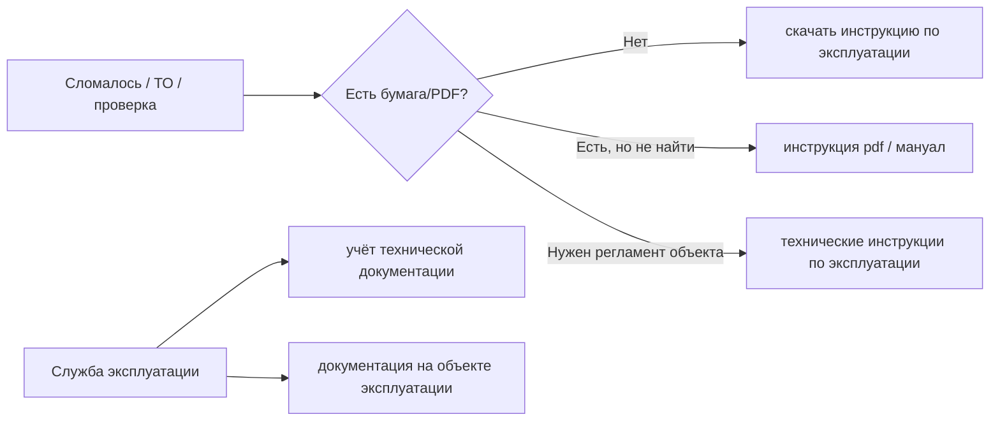

# Wordstat: документация «всегда под рукой у инженера»

Исследование: как в Яндексе ищут доступ к инструкциям, паспортам и эксплуатационной документации на оборудовании (не CMMS, не «ТОиР + ИИ»). Период — типичный месячный срез Wordstat.

## Вывод в одном абзаце

Люди **не ищут** формулировки вроде «электронная документация всегда под рукой», «база инструкций для инженера» или «документация на телефоне» (единицы–десятки показов). Реальный спрос выражается как **«нужна инструкция сейчас»**: *скачать инструкцию по эксплуатации*, *технические инструкции по эксплуатации*, *инструкция pdf*, отраслевые хвосты (котлы, станки, ТП). Для закупки со стороны службы эксплуатации — *учёт технической документации*, *документация на объекте эксплуатации*, *эксплуатационная документация оборудования*.

---

## Топ фраз под продукт Masterdoc

| Фраза | Показов/мес | Кто ищет | Fit для Masterdoc |
|-------|-------------|----------|-------------------|
| **скачать инструкцию по эксплуатации** | **15 782** | Инженер/мастер, «где взять мануал» | ★★★★ — ближайший к «под рукой»; много B2C (стиралки, телефоны), но есть промышленные хвосты |
| **технические инструкции по эксплуатации** | **8 240** | Промышленность, ТЭЦ, объекты | ★★★★★ — лучшее ядро для B2B-лендинга |
| **инструкция по эксплуатации pdf** | **1 451** | Нужен файл, не бумага | ★★★★ — «откройте на телефоне, не копайте сеть» |
| **инструкция по эксплуатации станка** | **2 973** | Производство, ЧПУ | ★★★★ |
| **инструкции по эксплуатации станков скачать** | **212** | То же, явный download-intent | ★★★★ |
| **техническая инструкция по эксплуатации оборудования** | **583** | Прямое попадание в ICP | ★★★★★ |
| **техническое описание и инструкция по эксплуатации** | **2 494** | Паспорт + инструкция | ★★★★ |
| **документация на объекте эксплуатации** | **1 544** | Начальник участка / служба | ★★★★ B2B |
| **учёт технической документации** | **2 169** | Документовед / главный механик | ★★★ B2B buyer |
| **эксплуатационная документация оборудования** | **879** | Норматив + состав документов | ★★★ |
| **документация на оборудование** (техническая) | **2 420** | Проект/эксплуатация | ★★★ |
| **паспорт на оборудование** | **4 416** | Оформление, проверки | ★★ (часто compliance, не «поиск в поле») |
| **паспорта оборудования скачать** | **163** | Download-intent | ★★★ |

### Промышленные хвосты у «скачать инструкцию…» (из топа запросов)

- станки — **212**
- котёл / тепловой пункт / энергоустановки — **118–122**
- компрессор — **75**
- производственные инструкции — **196**
- электроустановки — **122**

### Отраслевые кластеры (отдельные посадочные / статьи)

| Кластер | Показов | Комментарий |
|---------|---------|-------------|
| инструкции по эксплуатации котлов | 8 701 | Много бытовых газовых котлов (Baxi, Navien); для Masterdoc — промышленные/водогрейные хвосты |
| инструкция по технической эксплуатации теплопотребляющей установки | 647 | Сильный B2B (ТЭЦ, котельные) |
| инструкция по технической эксплуатации электроустановок | 172+ | Энергетика |
| инструкция по эксплуатации холодильника (скачать) | 130 | Не строить на этом H1, но MVP Atlant попадает в хвост |

---

## Что почти не ищут (не ставить в H1)

| Фраза | Показов | Почему не то |
|-------|---------|--------------|
| электронная техническая документация | 975 | ЕФНТД, нормативные базы, не полевой инженер |
| электронный фонд нормативно-технической документации | 150 | То же |
| база инструкций оборудования | 124 | Нет спроса на формулировку |
| техническая документация на телефоне | 11 | — |
| поиск по инструкции pdf | 24 | — |
| база знаний для инженеров | 21 | — |
| мобильное приложение + документация | единицы | — |
| чатгпт / нейросеть + инструкция оборудование | 2–12 | ИИ не в поисковом спросе |
| цифровой паспорт оборудования | 39 | Ранний/нишевый |
| мануал оборудования | 113 | Слишком мало |

---

## Как люди формулируют «всегда под рукой» (модель намерения)

- **Полевой инженер** говорит языком **инструкции / руководства / скачать / pdf**, не «электронный фонд».
- **Руководитель** — **учёт, объект эксплуатации, эксплуатационная документация, паспорт**.
- **«Мануал»** (309k) и **«руководство по ремонту»** (58k) — огромные, но уводят в авто и бытовую технику.

---

## Рекомендуемые формулировки для GTM

### SEO-ядро (страницы, статьи, контекст)

1. **технические инструкции по эксплуатации** — главный B2B-ключ.
2. **скачать инструкцию по эксплуатации** — максимальный объём; в тексте: «не ищите на форумах — все паспорта объекта в приложении».
3. **инструкция по эксплуатации pdf** — вторичный.
4. Long-tail: **техническая инструкция по эксплуатации оборудования**, **инструкция по эксплуатации станка**, **документация на объекте эксплуатации**.

### H1 / слоган (не из Вордстата дословно, но с привязкой к спросу)

- **Для инженера:** «Инструкции и паспорта оборудования — на телефоне у станка»  
  (под капотом SEO: *технические инструкции по эксплуатации*, *скачать инструкцию*).
- **Для покупателя:** «Вся эксплуатационная документация объекта — в одном месте»  
  (SEO: *документация на объекте эксплуатации*, *учёт технической документации*).

### Чего избегать в заголовке

- «Электронная техническая документация» (ассоциация с ЕФНТД).
- «CMMS / ТОиР с ИИ» (нет спроса).
- «База знаний для инженеров» (21 показ).

---

## Связь с другими клинами Masterdoc

| Клин | Ключ | Показов |
|------|------|---------|
| Журналы ТО | электронный журнал тоир | 6 |
| Журналы ТО | ведение журналов в электронном виде | 654 (не все ТОиР) |
| Документация | **технические инструкции по эксплуатации** | **8 240** |
| Документация | **скачать инструкцию по эксплуатации** | **15 782** |

**Документация «под рукой» — самый широкий поисковый вход** среди трёх; журналы — compliance-ниша с другим языком (*образец, скачать, гост*).

---

## Следующие шаги

1. Лендинг: блок «Для инженера» под ключ *технические инструкции по эксплуатации*; FAQ под *скачать инструкцию по эксплуатации*.
2. Контент: 3–5 статей под хвосты (станок, котельная/ТП, холодильное промышленное — без привязки бренда Atlant в title).
3. Custdev: спросить «где вы в последний раз искали инструкцию» — ожидаемые ответы: Google/Яндекс, папка на сервере, WhatsApp, а не «база знаний».

См. также: [SEO_KEYWORDS.md](./SEO_KEYWORDS.md), [DIGITIZATION_SEARCH_INTENT.md](./DIGITIZATION_SEARCH_INTENT.md).
