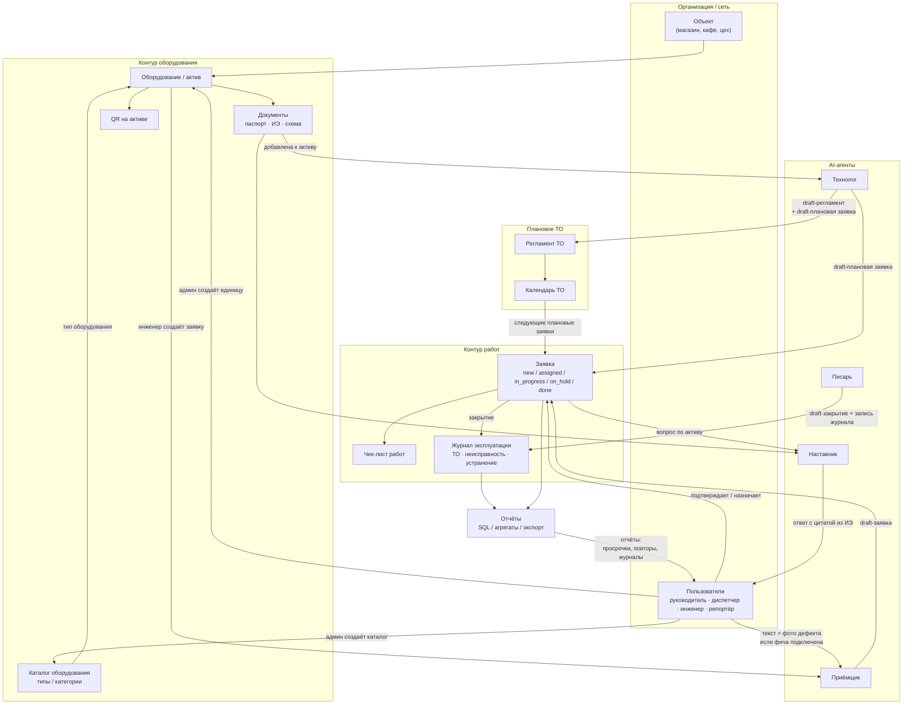
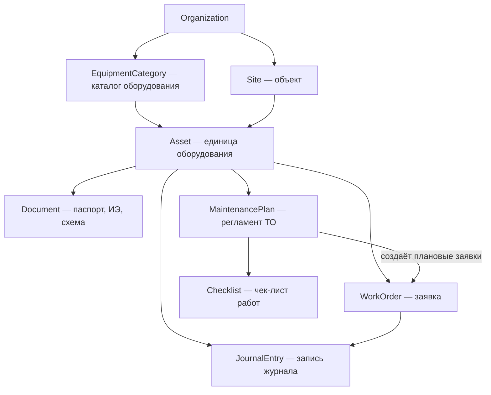
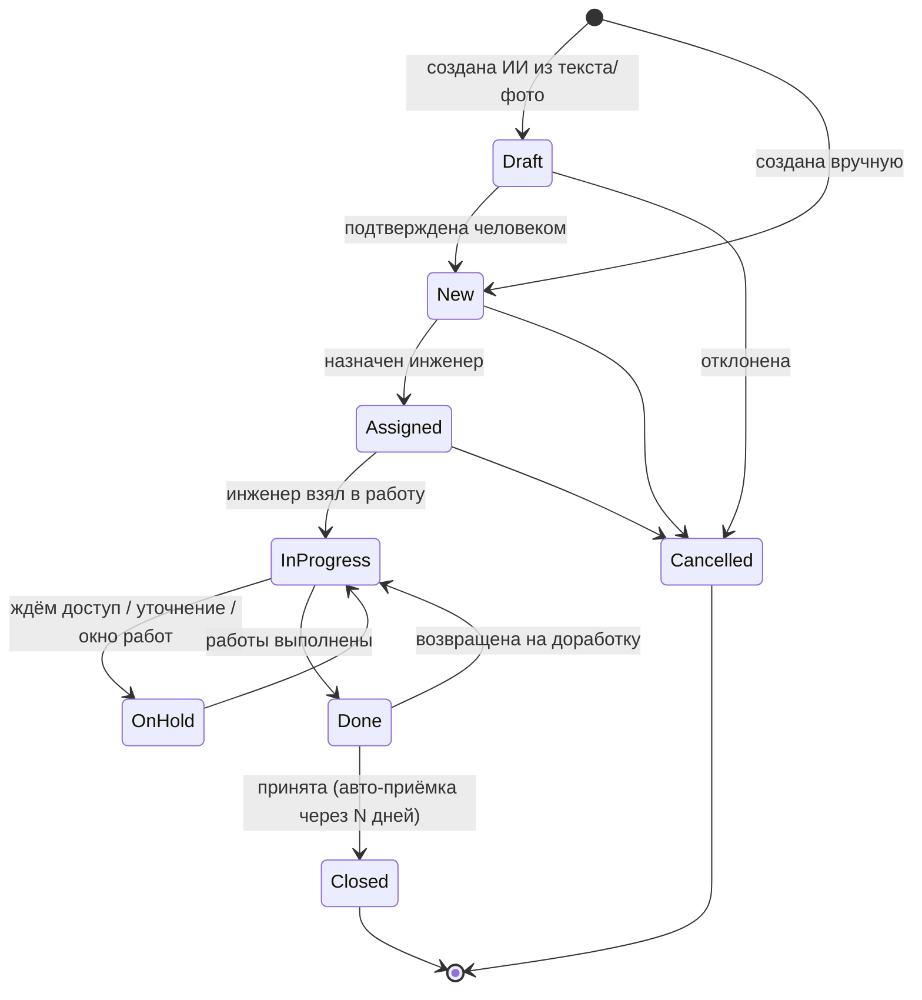
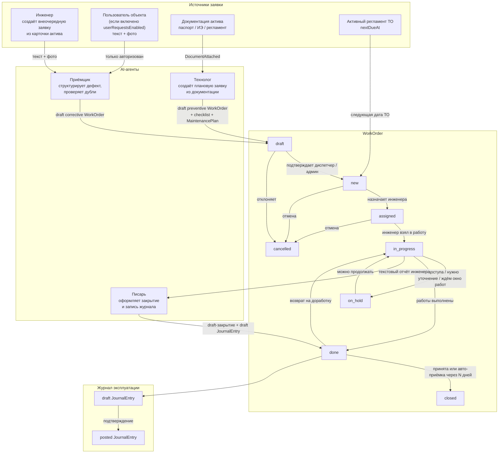
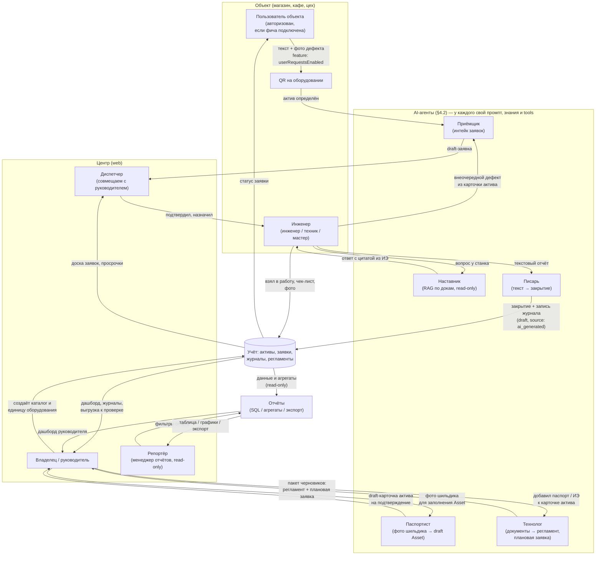
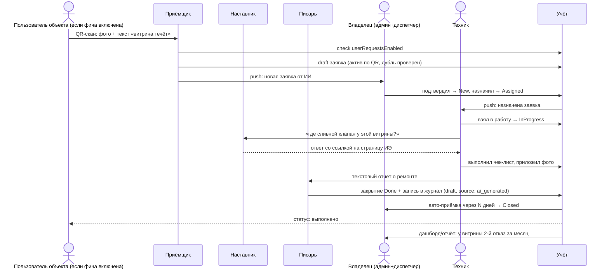
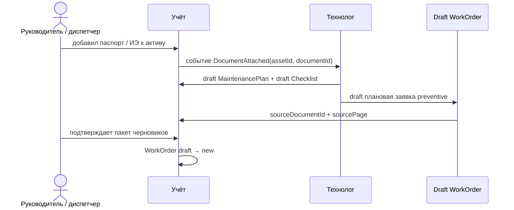

# ТОиР для малого бизнеса: проект системы

**Дата:** 2026-07-09
**Статус:** проектный документ (архитектура, конкуренты, стейты, рабочие места)
**Связанные документы:** [STRATEGY.md](STRATEGY.md), [B2B_MVP_SCOPE.md](B2B_MVP_SCOPE.md), [COMPETITOR_BATTLECARDS.md](COMPETITOR_BATTLECARDS.md)

> Скоуп: проектируем **работающую систему** — учёт, заявки, журналы, регламенты, роли и ИИ в ежедневных операциях. Склад ЗИП, кладовщик и подрядчики сознательно вынесены за рамки первых релизов — в backlog.

---

## 1. Идея в одном абзаце

Система ТОиР для малого бизнеса (1–50 объектов, 1–20 инженеров), в которой учёт и журналы — ядро ценности (см. STRATEGY: «AI — усилитель, не замена учёта»), а **ИИ встроен в ежедневные операции**: внеочередная заявка создаётся инженером или авторизованным пользователем (только если включена фича «заявки от пользователей»), инженер у станка спрашивает документацию в чате, закрытие заявки и запись журнала оформляются из текстового отчёта, регламенты ТО генерируются из паспортов и инструкций. Отчёты формируются обычным модулем отчётности из базы, без AI-агента. ИИ реализован не одним универсальным ассистентом, а **набором специализированных агентов** — у каждого свой промпт, свои знания и свои инструменты.

**Ограничение текущего скоупа:** все поля вводятся текстом, фото или выбором из списка.

### 1.1 Верхнеуровневая схема ТОиР

Смысл схемы: **актив** — центр системы. Каталог типов оборудования и конкретные единицы оборудования создаёт админ; от актива идут документы, QR, заявки, журнал и регламент. Когда к активу добавляют документацию, агент **Технолог** анализирует её и создаёт черновики: регламент ТО, чек-лист и плановую заявку. Если в инструкции указаны расходники или запчасти, Технолог добавляет это текстовой пометкой в чек-лист, но складского учёта в первых релизах нет. Заявка — основной рабочий объект: через неё инженер выполняет работу, пополняет журнал и создаёт историю по оборудованию. AI-агенты не заменяют учёт: они создают черновики, ищут по документам и структурируют текст. Отчёты — отдельный read-only модуль поверх базы и агрегатов, без LLM.

---

## 2. Целевой пользователь (уточнение ICP для малого бизнеса)

Смещение относительно [STRATEGY.md](STRATEGY.md) (там 10–100 объектов): **малый бизнес = 1–50 объектов, часто без выделенного диспетчера**.

| Сегмент | Пример | Кто работает в системе |
|---------|--------|------------------------|
| Микро (1–3 объекта) | Кафе с холодильным парком, пекарня, автомойка | Владелец = админ = диспетчер; 1–2 инженера/мастера |
| Малый (3–15 объектов) | Мини-сеть магазинов, тёмная кухня, малое производство | Завхоз/главный инженер + 2–5 исполнителей |
| Малый+ (15–50 объектов) | Региональная сеть, франшиза | Руководитель эксплуатации, диспетчер (часто совмещённый), 5–20 инженеров |

Следствие для проектирования: **роли должны сворачиваться**. Один человек может держать все роли (микро) — система не должна требовать «настройте оргструктуру» на старте.

---

## 3. Как ИИ реализован у конкурентов

### 3.1 Западные CMMS (лидеры категории)

| Продукт | AI в ежедневной работе | AI во вводе данных |
|---------|------------------------|--------------------|
| **MaintainX** (CoPilot) | CoPilot: поиск по мануалам и истории работ в чате, troubleshooting у станка; загрузка OEM-мануала → вопрос → **генерация work order или процедуры**; перевод SOP на языки; Anomaly Detection на показаниях счётчиков; Smart Time Estimates (оценка длительности работ из истории) | CoPilot извлекает данные актива **из фото шильдика или спецификации**; импорт CSV/Excel с маппингом колонок |
| **Limble** (Asset Snap, Winter Release 2026) | MCP-слой (доступ LLM-клиентов к данным CMMS read-only); AI Resource Planning (балансировка загрузки техников) | **Asset Snap: фото шильдика → распознавание производителя, модели, серийника → готовая карточка актива + QR-код** |
| **UpKeep** (Intelligence / Nova / Studio) | Nova — автономный агент по расписанию: аудит качества данных, флаги аномалий, отчёты «к утру»; Smart Checklist Builder — генерация ПМ-чек-листов по типу актива; авто-заметки закрытия заявки; Studio — «опиши приложение словами — ИИ соберёт» | Photo-to-Part (фото → карточка запчасти); AI-трансформация импорта промптами |
| **Fiix** (Foresight) | Foresight: анализ тысяч work orders → риски поломок, просрочек, compliance; asset insights — аномалии затрат/реактивного ТО без датчиков | Импорт классический (CSV-шаблоны), ИИ нет |
| **Pairio** (YC, референс из [PRODUCT_NOTE.md](PRODUCT_NOTE.md)) | AI-native: фото/видео у станка → поиск по тысячам страниц мануалов → пошаговая инструкция; после ремонта ИИ **собирает структурированный отчёт** (дефект, действия, запчасти); заявленное снижение времени ремонта ~25% | Загрузка мануалов + интеграции с SAP/Maximo |

### 3.2 Российские игроки

| Продукт | AI-возможности | Комментарий для нас |
|---------|----------------|---------------------|
| **1С:ТОиР / Деснол** | «ТОиР Аналитик» (2026): облачная надстройка — ИИ-чат по данным о ремонтах («покажи 5 самых дорогих станков»), 100+ экспертных диагностик скрытых потерь, автоотчёт руководству; предиктивный сервис аномалий на датчиках (градиентный бустинг) для 1С:RCM | ИИ — **аналитика для директора завода**. Вход в 1С:ТОиР остаётся проектом внедрения на месяцы. Наше окно: лёгкая система для сети без ERP-проекта |
| **HubEx** | ИИ-ассистент, обученный на документации компании (техкарты, регламенты, PDF, история работ); доступен в приложении/веб/Telegram; подключение 1–2 недели, отдельная платная услуга (20–60 тыс. ₽) | ИИ — платная надстройка-консультант; индексацию документов делает вендор, не клиент |
| **Okdesk** | ИИ как «нулевая линия»: автоответы на типовые обращения, автозаполнение полей заявки, маршрутизация | ИИ для диспетчеризации сервисной компании |
| **Excel/бумага** (главный incumbent) | — | Планка UX: система должна быть не сложнее тетради и WhatsApp |

### 3.3 Выводы из анализа конкурентов

1. **Категория уже назвала паттерны, их можно не изобретать:** текст/фото → заявка; RAG-чат по мануалам у станка (все); мануал → процедура/чек-лист (MaintainX, UpKeep); фото шильдика → актив (Limble, MaintainX). Складские сценарии фиксируем как backlog, но не включаем в начальный скоуп.
2. **Никто на рынке РФ не собрал это для малого бизнеса.** У Деснола ИИ — аналитика для enterprise; у HubEx — платный чат-бот с внедрением от вендора; у Okdesk — автоответы.
3. **Human-in-the-loop обязателен везде** (все конкуренты дают «review and edit before save») — это и снимает риск галлюцинаций, и создаёт доверие.
4. **Западные вендоры прячут ИИ в дорогие тарифы** (UpKeep — Premium+, MaintainX CoPilot — add-on). Для малого бизнеса базовые AI-функции должны входить в основной тариф — они и есть продукт.

---

## 4. AI-слой: принципы и агенты

### 4.1 Два инварианта

**Инвариант 1: ИИ никогда не пишет в учёт напрямую.** Всё, что создаёт агент, живёт в статусе «черновик» (`draft`) до подтверждения человеком. Поле `source: ai_generated` на всех порождённых ИИ записях обязательно — для доверия (бейдж «создано ИИ, подтверждено Ивановым») и для метрик качества.

**Инвариант 2: не один универсальный ассистент, а набор специализированных агентов.** Каждый агент имеет собственный системный промпт, собственный набор знаний (контекст) и собственный набор инструментов (tools) — и не имеет доступа к чужим. Паспортист не умеет отвечать на вопросы по инструкции, Наставник исполнителя не умеет писать в справочники. Это даёт: (а) меньше галлюцинаций — узкий промпт на узкой задаче; (б) дешевле — маленькие модели на рутинных агентах, тяжёлые только там, где нужно; (в) безопаснее — права агента = права инструментов, которые ему выданы; (г) измеримо — у каждого агента своя метрика качества и свой eval-набор.

### 4.2 Реестр AI-агентов

Пользователь не выбирает агента — его вызывает контекст (экран, канал, тип действия); между собой агенты общаются только через данные учёта, не напрямую.

| Агент | Задача | Знания (контекст) | Промпт-фокус | Инструменты (tools) | Модель | Фаза |
|-------|--------|-------------------|--------------|---------------------|--------|------|
| **Паспортист** | Фото шильдика → draft-карточка Asset для админа | Каталог типов оборудования организации; справочник производителей и типовых моделей категории (холод, HVAC); формат полей Asset | Извлеки поля, не выдумывай: нет поля на фото — верни пусто + confidence; финальную карточку подтверждает только админ | createDraftAsset | VLM среднего класса | MVP |
| **Приёмщик** | Текст/фото из формы исполнителя или авторизованного пользователя → draft-заявка внеочередного ремонта | Список активов объекта; категории дефектов; открытые заявки (антидубль); флаг `userRequestsEnabled` | Структурируй симптом, определи актив, проверь дубль; не диагностируй; если пользовательские заявки выключены — не создавай draft от пользователя | createDraftWorkOrder, findAsset, findDuplicates, checkFeatureFlag | Быстрая дешёвая LLM | 1.1 |
| **Наставник** | Ответы исполнителю у станка по документации | RAG строго по документам актива/объекта + история ремонтов этого актива | Отвечай только из источников, всегда цитируй страницу; не знаешь — скажи «в документации нет» | searchDocs, getAssetHistory (read-only) | LLM среднего класса + RAG | 1.1 |
| **Писарь** | Текстовый отчёт инженера → структурированное закрытие + запись журнала | Текущая заявка (актив, чек-лист) | Заполни «дефект/причина/действия/результат» только из введённого текста | draftCloseout, draftJournalEntry | Быстрая дешёвая LLM | 1.1 |
| **Технолог** | Событие «документация добавлена к активу» → draft-регламент, draft-плановая заявка и draft-чек-лист | Только документы данного актива + отраслевые шаблоны регламентов | Каждый пункт чек-листа — со ссылкой на страницу источника; расходники/запчасти из документации фиксируй только текстовой пометкой в чек-листе, без складского учёта | createDraftPlan, createDraftWorkOrder, createDraftChecklist | Тяжёлая LLM (редкие вызовы) | Фаза 2 |

Правила реестра:

- **Один агент — одна метрика.** Паспортист: % полей без правки; Наставник: доля ответов с корректной цитатой; Приёмщик: % draft-заявок, подтверждённых без редактирования. Метрики видны нам (eval) и клиенту (доверие).
- **Знания раздаются по минимуму.** Наставник не видит чужие активы, Приёмщик видит только активы/заявки в своём контексте, Технолог видит только документы конкретного актива. Это же ответ на 152-ФЗ: контур каждого агента понятен и документируем.
- **Пишущие инструменты — только `createDraft*`.** Ни у одного агента нет инструмента прямой записи в учёт (инвариант 1). Read-only агент Наставник не имеет пишущих инструментов вовсе.
- **Оркестрация тонкая.** Никакого «агента-менеджера», который сам решает, кого позвать: маршрутизация детерминирована контекстом (канал входа, экран, тип действия). Исключение фазы 3+ — бот, где Приёмщик может передать диалог Наставнику («это не поломка, вот как включить разморозку»).

---

## 5. Модель данных

Расширяет сущности [B2B_MVP_SCOPE.md](B2B_MVP_SCOPE.md) (Organization, Site, Asset, Document, WorkOrder, JournalEntry, User) новыми:

| Новая сущность | Назначение | Минимальные поля |
|----------------|------------|------------------|
| **EquipmentCategory** | Каталог типов оборудования организации; создаёт и редактирует только админ | id, orgId, name, parentId?, defaultChecklistId?, defaultFields[], isActive |
| **MaintenancePlan** | Регламент ТО актива (в малом бизнесе — простая периодичность, не полноценный ППР); создаётся как черновик Технологом при добавлении документации | id, assetId, title, интервал (дни/моточасы), checklistId, nextDueAt, isActive, source (ai_generated / manual / template) |
| **Checklist** | Шаблон работ для ТО или типовой заявки | id, title, items[] (текст, обязательность, фото-подтверждение), source |

Черновики агентов не требуют отдельной сущности: у Asset, WorkOrder и JournalEntry есть статус `draft` (см. стейт-машины §6), у записей — поле `source`.

Каталог оборудования и единицы оборудования — зона ответственности **админа**:

- `EquipmentCategory` создаёт/редактирует только админ.
- `Asset` создаёт/подтверждает только админ.
- Паспортист может заполнить `draft Asset` по фото шильдика, но не активирует карточку.
- Инженер использует существующий Asset: создаёт внеочередные заявки, смотрит документы, закрывает работы, но не ведёт каталог и не создаёт единицы оборудования.

---

## 6. Стейты (обязательные машины состояний)

Правило проектирования для малого бизнеса: **минимум статусов в UI, полнота — в данных**. Ниже — обязательный набор.

### 6.1 WorkOrder (заявка) — ядро системы

Обязательные статусы: `draft` (только для AI-созданных), `new`, `assigned`, `in_progress`, `on_hold`, `done`, `closed`, `cancelled`.

#### Жизнь заявки: от источника до журнала

Разница источников:

- `corrective` / внеочередная заявка: создаётся инженером или авторизованным пользователем объекта (если включена фича), проходит через Приёмщика и попадает во `draft`.
- `preventive` / плановая заявка: создаётся Технологом при добавлении документации к активу или календарём активного регламента; дальше живёт как обычная WorkOrder.
- Закрытие всегда создаёт запись журнала: либо напрямую из закрытия, либо через черновик Писаря, который подтверждает человек.

Решения для малого бизнеса:

- **`draft` виден только как «входящие от ИИ»** — не засоряет доску диспетчера.
- **`assigned` и `in_progress` можно схлопнуть настройкой** (микро-сегмент: владелец сам и назначает, и делает).
- **Авто-закрытие `done → closed`** через настраиваемые N дней — у малого бизнеса нет процедуры приёмки.
- Просрочка — не статус, а вычисляемый флаг от `dueAt` (иначе комбинаторика статусов взрывается).

Кто создаёт внеочередные (`type = corrective`) заявки:

- **Инженер** — базовый и обязательный сценарий: создаёт заявку из карточки актива или из своего рабочего места после осмотра/обхода/сообщения с объекта.
- **Авторизованный пользователь объекта** — только если у организации включена фича `userRequestsEnabled`; создаёт заявку из QR-карточки актива или формы обращения.
- **Анонимный заявитель без аккаунта** — не входит в базовый скоуп. QR без авторизации открывает справочную карточку/контакт ответственного, но не создаёт WorkOrder.

Приёмщик может подготовить `draft WorkOrder` только для разрешённого источника. Если фича `userRequestsEnabled` выключена, вход от пользователя объекта не превращается в заявку; её должен завести инженер.

### 6.2 MaintenancePlan / плановое ТО

Плановое ТО **не имеет собственного цикла исполнения** — оно порождает обычную заявку. Один цикл статусов для исполнителя вместо двух — критично для простоты.

Ключевое правило: **при добавлении документации к активу агент Технолог сразу создаёт связанный пакет черновиков**:

1. `MaintenancePlan` — что и как часто делать.
2. `Checklist` — шаги выполнения.
3. `WorkOrder` типа `preventive` в статусе `draft` — первая плановая заявка на ремонт/ТО.

Если в документации указаны расходники или запчасти, Технолог добавляет это как текстовую пометку в чек-лист («проверить наличие/подготовить ...»), но **не создаёт складскую заявку**. Пользователь подтверждает пакет целиком или редактирует отдельные части. После подтверждения: регламент становится `active`, плановая заявка переходит `draft → new`.

### 6.3 JournalEntry (запись журнала)

Журнал — append-only (требование compliance: история без правок задним числом):

- `draft` → `posted` (для AI-оформленных из текстового отчёта и авто-записей из заявок);
- `posted` → `voided` (сторнирование отдельной записью-исправлением, оригинал не удаляется).

Записи создаются: вручную исполнителем; автоматически при закрытии заявки; агентом Писарь из текстового отчёта.

### 6.4 Asset (единица оборудования)

`draft` (создан админом вручную или подготовлен Паспортистом, не подтверждён) → `active` (подтвердил админ) → `inactive` (законсервирован) → `retired` (списан). Плюс вычисляемый операционный флаг `down` (есть открытая заявка с признаком «оборудование остановлено») — для дашборда руководителя.

### 6.5 Что сознательно НЕ делаем в стейтах (v1–2)

- Согласование заявок по цепочке (enterprise-паттерн 1С:ТОиР).
- Склад ЗИП, кладовщик, заявки на запчасти, списания, остатки, закупки и резервирование ЗИП под наряд.
- SLA-эскалации с уровнями (Okdesk/HubEx-территория) — только флаг просрочки и напоминание.

---

## 7. Рабочие места (обязательные)

### 7.1 Матрица ролей

| Роль | Устройство | Обязательность |
|------|-----------|----------------|
| **Владелец / руководитель** (admin) | Web + мобильный дашборд | Обязательна |
| **Диспетчер** (dispatcher) | Web | Обязательна как роль, но **совмещаемая** с admin |
| **Инженер** (engineer: инженер / техник / мастер) | Мобильное приложение (Android приоритет) | Обязательна |
| **Пользователь объекта** (requester: продавец, повар, оператор) | Авторизованный web/mobile/бот; создание внеочередных заявок только при включённой фиче `userRequestsEnabled` | Опциональна — можно не подключать, тогда внеочередные заявки заводит инженер |
| **Репортёр / менеджер отчётов** (reporter) | Web | Опциональна — read-only роль для формирования любых отчётов в пределах доступных объектов |

Ключевые отличия от enterprise-ТОиР: **planner/инженер по надёжности отсутствует** — его функцию (составление регламентов и чек-листов) выполняет агент Технолог + подтверждение руководителя; **нет отдельного разделения engineer/technician** — есть одна роль `engineer`, которая и создаёт внеочередные заявки, и выполняет работы; **contractor не входит в первые релизы** — внешний подрядчик в будущем будет тем же инженером, но не в штате; **каталог оборудования и единицы оборудования ведёт админ**, а инженер работает по уже заведённым активам; **склада и кладовщика в первых релизах нет**.

Важно не путать роли:

- `requester` — пользователь объекта, который может создать обращение только при включённой фиче `userRequestsEnabled`.
- `reporter` — менеджер отчётов; не создаёт заявки и не меняет справочники, но может формировать отчёты по заявкам, журналам, активам, регламентам и просрочкам в рамках своего доступа.

### 7.2 Рабочее место инженера (мобильное)

Экраны: Мои заявки (сегодня/просрочено) → Карточка заявки (чек-лист, фото, документы актива, чат с Наставником «спроси по инструкции») → Закрытие текстовым отчётом (написал коротко — Писарь оформил) → Сканер QR (открыть актив/создать заявку у агрегата).

Требования: офлайн-черновики (объекты с плохой связью), крупные элементы UI, максимум 2 тапа до создания заявки.

### 7.3 Рабочее место диспетчера/руководителя (web)

Экраны: Доска заявок по сети (фильтр: объект, статус, просрочка — из B2B_MVP_SCOPE must-have №7) → Входящие от ИИ (draft-заявки и черновики агентов на подтверждение) → **Каталог оборудования** (типы/категории) → **Единицы оборудования** (Asset, подтверждение draft от Паспортиста, печать QR) → **Пакеты Технолога** (документация добавлена к активу → draft-регламент + draft-плановая заявка + checklist) → Календарь ТО (ближайшие плановые) → Журналы + выгрузка PDF/Excel за период (must-have №6) → Справочники (объекты, люди).

### 7.4 Рабочее место репортёра / менеджера отчётов (web)

Репортёр работает только в read-only режиме. Экраны: Конструктор отчёта → фильтры (объекты, период, тип заявки, статус, актив, инженер) → таблица/графики → экспорт PDF/Excel → сохранённые шаблоны отчётов. Отчёты формируются обычными запросами к базе и предрасчитанным агрегатам, без AI-агента и без текстовых промптов.

### 7.5 Рабочее место пользователя объекта / заявителя

QR-стикер на оборудовании (генерируется при создании актива — как у Limble) открывает карточку оборудования. Если фича `userRequestsEnabled` включена и пользователь авторизован, он может отправить текст + фото дефекта → Приёмщик создаёт `draft WorkOrder` с уже определённым активом. Если фича выключена, QR работает только как справочная карточка/контакт ответственного, а внеочередную заявку заводит инженер.

### 7.6 Схема взаимодействия ролей и агентов

Общая карта: кто с кем и чем обменивается. AI-слой — реестр специализированных агентов (§4.2); каждый вызывается своим контекстом, всё созданное агентами проходит подтверждение человеком (инварианты §4.1).

Ключевые контуры на схеме:

1. **Заявочный** (инженер или авторизованный пользователь при включённой фиче → Приёмщик → диспетчер → инженер → учёт): внеочередную заявку нельзя создать анонимно. QR только определяет актив и открывает разрешённое действие; Приёмщик структурирует, ищет дубли и проверяет feature flag, диспетчер подтверждает и назначает.
2. **Исполнительский** (инженер ↔ Наставник/Писарь ↔ учёт): у станка инженера обслуживают два разных агента — read-only Наставник отвечает по документации, Писарь оформляет сказанное в закрытие и журнал; журнал пополняется как побочный эффект работы.
3. **Справочный / плановый** (админ → Паспортист/Технолог → учёт): каталог оборудования и единицы оборудования создаёт админ; Паспортист только помогает заполнить карточку по шильдику. При добавлении документации к активу Технолог создаёт связанный пакет черновиков — регламент и плановую заявку. Админ подтверждает пакет, а не создаёт плановые работы вручную.
4. **Отчётный / управленческий** (учёт → отчётный модуль → руководитель/reporter): руководитель смотрит дашборд и выгружает журналы к проверке; reporter формирует любые read-only отчёты в рамках доступа. AI здесь не используется.

Сквозной сценарий (микро-сегмент, все центральные роли — один человек):

Каждый агент в сценарии видит только своё: Приёмщик — активы объекта и открытые заявки, Наставник — документы конкретной витрины, Писарь — текущую заявку. Отчёты строятся не агентом, а read-only модулем отчётности поверх базы.

Сценарий плановой работы из документации:

Критично: плановая заявка создаётся **агентом Технологом из документации** и связана с регламентом/чек-листом. Если в документации указаны расходники или запчасти, это остаётся текстовой пометкой в чек-листе до появления складского контура в backlog.

---

## 8. Технический контур (кратко, в связке с B2B_MVP_SCOPE)

| Слой | Решение |
|------|---------|
| Клиенты | KMP (Decompose, MVIKotlin) — Android для инженера, Web для диспетчера (как в B2B_MVP_SCOPE); авторизованный web/mobile/бот для пользователей объекта только при включённой фиче `userRequestsEnabled` |
| Backend | REST + PostgreSQL (обязательна, см. B2B_MVP_SCOPE); объектное хранилище для фото/PDF |
| AI-слой | Мультиагентный (§4.2): общий рантайм агентов + декларативные определения (промпт, источники знаний, tools, модель — конфиг на агента); RAG-инфраструктура (Onyx-контур из B2C Atlant) как разделяемый сервис, но индексы скоупятся на агента |
| Маршрутизация | Детерминированная: канал входа / экран / тип действия → конкретный агент; без агента-оркестратора |
| AI-провайдеры | Абстракция над моделями на уровне рантайма: каждому агенту — свой tier (дешёвые на Приёмщика/Писаря, тяжёлые на Технолога); для РФ-рынка — вариант с YandexGPT/GigaChat для клиентов с требованиями к локализации данных |
| Отчёты | SQL/ORM-запросы + предрасчитанные агрегаты + экспорт PDF/Excel; без LLM/AI-агента |
| Качество | Per-agent eval-наборы и метрики (§4.2); логирование вызовов агентов для разбора ошибок извлечения |

Новые endpoint'ы поверх черновика API из B2B_MVP_SCOPE: `POST /assets/from-photo` (шильдик → draft), `POST /documents` (добавление документации к активу → событие для Технолога), `POST /documents/{id}/analyze-maintenance` (ручной перезапуск анализа), `GET/POST /maintenance-plans`, `POST /work-orders/text` (текст/фото → draft), `POST /work-orders/{id}/closeout/text`.

---

## 9. Roadmap (дельта к фазам B2B_MVP_SCOPE)

| Фаза | Содержание | AI-агенты |
|------|------------|-----------|
| **1 MVP** | Сущности и экраны по B2B_MVP_SCOPE: объекты, каталог оборудования, единицы оборудования, заявки, журнал, документы, выгрузка | Паспортист (draft-карточка актива по фото шильдика для подтверждения админом) |
| **1.1** | Фото, push, QR-карточка актива, опциональные заявки от авторизованных пользователей объекта | Приёмщик (текст/фото → draft-заявка от инженера или авторизованного пользователя при включённой фиче), Наставник (чат по докам на активе), Писарь (текстовое закрытие) |
| **2** | MaintenancePlan + Checklist, календарь ТО | Технолог (при добавлении документации: draft-регламент + draft-плановая заявка + checklist) |
| **3** | Конструктор отчётов для reporter; дашборды руководителя из базы | AI не используется |
| **Backlog** | Склад ЗИП и кладовщик; заявки на запчасти; внешний инженер/contractor не в штате | Возвращаем по сигналам custdev |

Сдвиг относительно B2B_MVP_SCOPE: регламенты ТО (там фаза 3) поднимаются в фазу 2, потому что AI-генерация из ИЭ снимает главную причину, по которой ППР был «тяжёлым». Склад ЗИП и кладовщик, которые раньше рассматривались как фаза 2, теперь сознательно вынесены в backlog.

---

## 10. Позиционирование против конкурентов (сообщение)

> «1С:ТОиР внедряют квартал. HubEx подключает ИИ за две недели и отдельные деньги. У нас инженер заводит внеочередную заявку текстом и фото прямо с карточки оборудования, спрашивает инструкцию у агрегата, а журнал под проверку собирается сам — из работы, а не вместо неё.»

Не обещаем в H1: «ИИ-ТОиР» (нет поискового спроса — см. [WORDSTAT_MARKET_MATRIX.md](WORDSTAT_MARKET_MATRIX.md)); ИИ продаём на демо, SEO-вход остаётся через журналы/заявки/документацию.

---

## 11. Риски

| Риск | Митигация |
|------|-----------|
| Точность извлечения (стёртые шильдики, неполное описание дефекта) | Human-in-the-loop везде; метрика % принятых без правки; fallback на ручной ввод в том же экране |
| Стоимость инференса | Свой tier модели на агента: дешёвые на частые вызовы (Приёмщик, Писарь), тяжёлые на редкие (Технолог); лимиты на организацию |
| Недоверие «ИИ придумал регламент» | Каждый пункт чек-листа со ссылкой на страницу источника (ИЭ); бейдж source: ai_generated + кто подтвердил |
| Конкуренты скопируют (Limble/UpKeep уже имеют примитивы) | Они не идут в РФ и в малый бизнес; наша защита — рублёвый рынок, Telegram-каналы, отраслевые шаблоны под холод/ритейл |
| Требования локализации данных (152-ФЗ) | Опция российских LLM-провайдеров; анонимизация как у «ТОиР Аналитик» |
