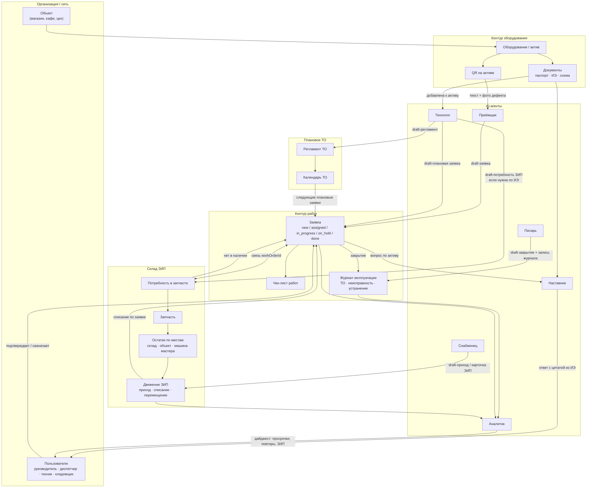
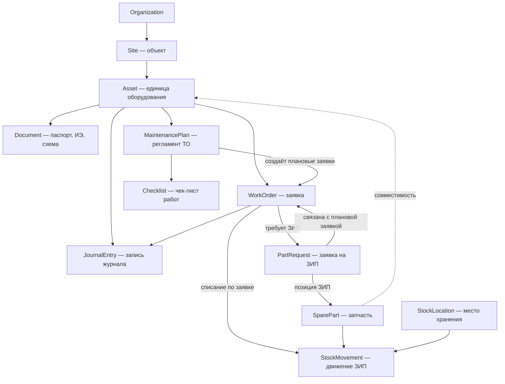
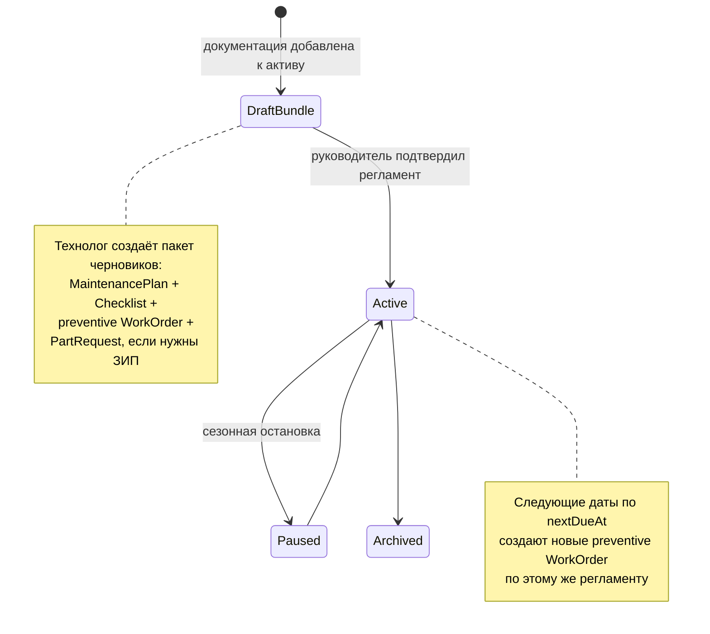
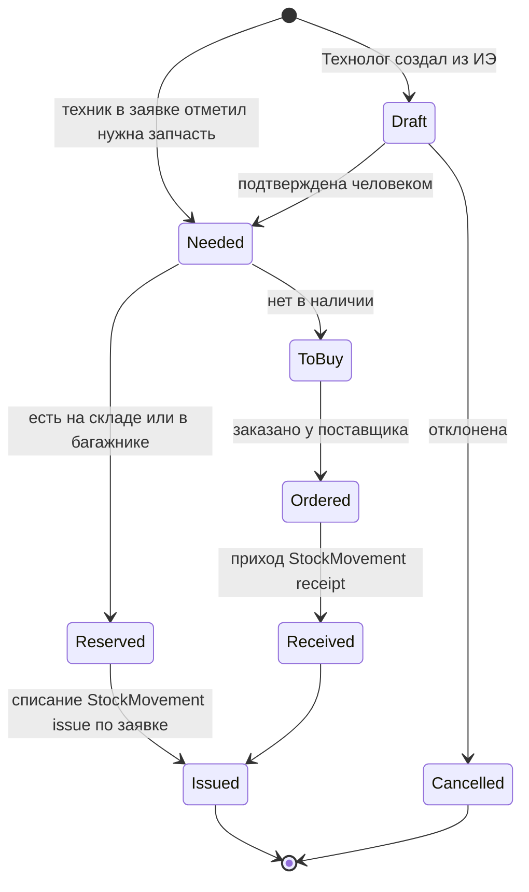
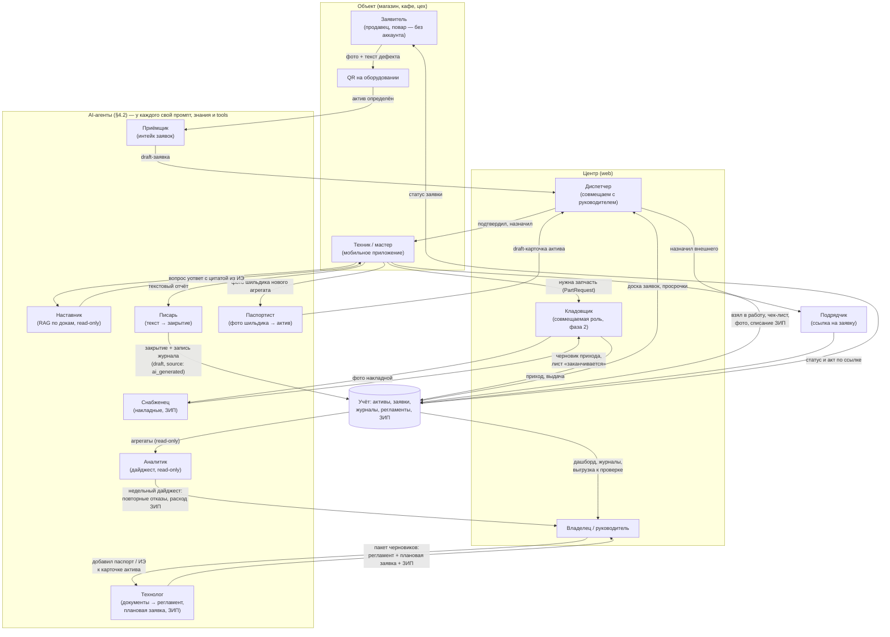
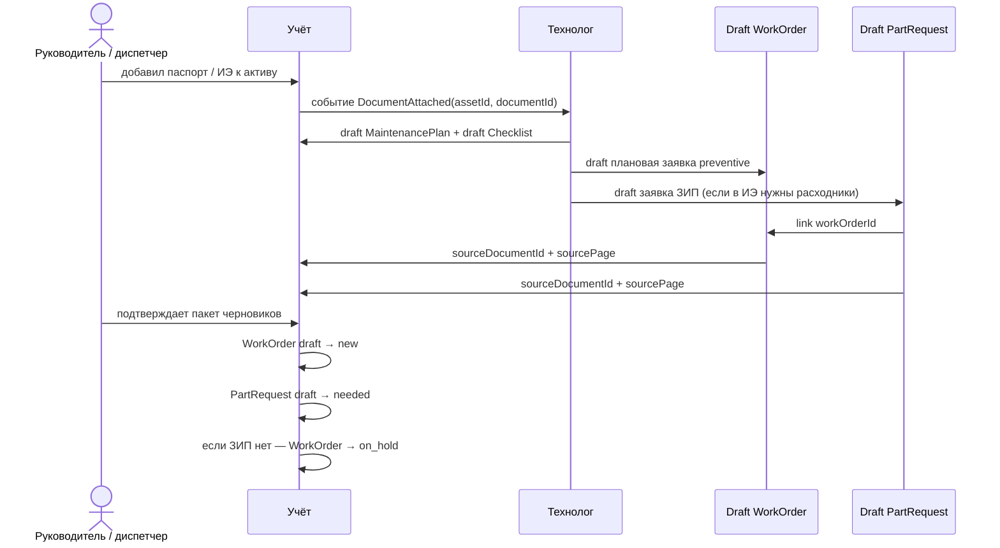

# ТОиР для малого бизнеса: проект системы

**Дата:** 2026-07-09
**Статус:** проектный документ (архитектура, конкуренты, стейты, рабочие места)
**Связанные документы:** [STRATEGY.md](STRATEGY.md), [B2B_MVP_SCOPE.md](B2B_MVP_SCOPE.md), [COMPETITOR_BATTLECARDS.md](COMPETITOR_BATTLECARDS.md)

> Скоуп: проектируем **работающую систему** — учёт, заявки, журналы, регламенты, склад, роли и ИИ в ежедневных операциях. Массовый AI-онбординг (пакетный ввод парка, оцифровка бумажных журналов, импорт Excel) сознательно вынесен за рамки документа — в backlog.

---

## 1. Идея в одном абзаце

Система ТОиР для малого бизнеса (1–50 объектов, 1–20 техников), в которой учёт и журналы — ядро ценности (см. STRATEGY: «AI — усилитель, не замена учёта»), а **ИИ встроен в ежедневные операции**: заявка создаётся текстом или фото через QR на оборудовании, техник у станка спрашивает документацию в чате, закрытие заявки и запись журнала оформляются из текстового отчёта, регламенты ТО генерируются из паспортов и инструкций, руководитель получает недельный дайджест. ИИ реализован не одним универсальным ассистентом, а **набором специализированных агентов** — у каждого свой промпт, свои знания и свои инструменты.

**Ограничение текущего скоупа:** перевод речи в текст (STT), голосовые заметки и голосовое закрытие заявок не рассматриваем в первых фазах. Все поля вводятся текстом, фото или выбором из списка. Голосовой ввод — отдельный слой ввода в backlog, который можно добавить позже без изменения доменной модели и агентов.

### 1.1 Верхнеуровневая схема ТОиР

Смысл схемы: **актив** — центр системы. От него идут документы, QR, заявки, журнал, регламент и складские движения. Когда к активу добавляют документацию, агент **Технолог** анализирует её и создаёт черновики: регламент ТО, плановую заявку и связанные потребности ЗИП, если в инструкции для работы указаны расходники или запчасти. Заявка — основной рабочий объект: через неё техник выполняет работу, списывает ЗИП, пополняет журнал и создаёт историю по оборудованию. AI-агенты не заменяют учёт: они создают черновики, ищут по документам, структурируют текст и готовят дайджесты.

---

## 2. Целевой пользователь (уточнение ICP для малого бизнеса)

Смещение относительно [STRATEGY.md](STRATEGY.md) (там 10–100 объектов): **малый бизнес = 1–50 объектов, часто без выделенного диспетчера**.

| Сегмент | Пример | Кто работает в системе |
|---------|--------|------------------------|
| Микро (1–3 объекта) | Кафе с холодильным парком, пекарня, автомойка | Владелец = админ = диспетчер; 1–2 мастера или подрядчик |
| Малый (3–15 объектов) | Мини-сеть магазинов, тёмная кухня, малое производство | Завхоз/главный инженер + 2–5 техников |
| Малый+ (15–50 объектов) | Региональная сеть, франшиза | Руководитель эксплуатации, диспетчер (часто совмещённый), 5–20 техников, подрядчики |

Следствие для проектирования: **роли должны сворачиваться**. Один человек может держать все роли (микро) — система не должна требовать «настройте оргструктуру» на старте.

---

## 3. Как ИИ реализован у конкурентов

### 3.1 Западные CMMS (лидеры категории)

| Продукт | AI в ежедневной работе | AI во вводе данных |
|---------|------------------------|--------------------|
| **MaintainX** (CoPilot) | CoPilot: поиск по мануалам и истории работ в чате (текст и голос), troubleshooting у станка; загрузка OEM-мануала → вопрос → **генерация work order или процедуры**; перевод SOP на языки; Anomaly Detection на показаниях счётчиков; Smart Time Estimates (оценка длительности работ из истории) | CoPilot извлекает данные актива **из фото шильдика или спецификации**; импорт CSV/Excel с маппингом колонок |
| **Limble** (Asset Snap, Winter Release 2026) | MCP-слой (доступ LLM-клиентов к данным CMMS read-only); AI Resource Planning (балансировка загрузки техников) | **Asset Snap: фото шильдика → распознавание производителя, модели, серийника → готовая карточка актива + QR-код** |
| **UpKeep** (Intelligence / Nova / Studio) | Nova — автономный агент по расписанию: аудит качества данных, флаги аномалий, отчёты «к утру»; **Voice Fill — голосовое создание заявок**; Smart Checklist Builder — генерация ПМ-чек-листов по типу актива; авто-заметки закрытия заявки; Studio — «опиши приложение словами — ИИ соберёт» | Photo-to-Part (фото → карточка запчасти); AI-трансформация импорта промптами |
| **Fiix** (Foresight) | Foresight: анализ тысяч work orders → риски поломок, просрочек, compliance; asset insights — аномалии затрат/реактивного ТО без датчиков | Импорт классический (CSV-шаблоны), ИИ нет |
| **Pairio** (YC, референс из [PRODUCT_NOTE.md](PRODUCT_NOTE.md)) | AI-native: голос/фото/видео у станка → поиск по тысячам страниц мануалов → пошаговая инструкция; после ремонта техник наговаривает — ИИ **сам собирает структурированный отчёт** (дефект, действия, запчасти); заявленное снижение времени ремонта ~25% | Загрузка мануалов + интеграции с SAP/Maximo |

### 3.2 Российские игроки

| Продукт | AI-возможности | Комментарий для нас |
|---------|----------------|---------------------|
| **1С:ТОиР / Деснол** | «ТОиР Аналитик» (2026): облачная надстройка — ИИ-чат по данным о ремонтах («покажи 5 самых дорогих станков»), 100+ экспертных диагностик скрытых потерь, автоотчёт руководству; предиктивный сервис аномалий на датчиках (градиентный бустинг) для 1С:RCM | ИИ — **аналитика для директора завода**. Вход в 1С:ТОиР остаётся проектом внедрения на месяцы. Наше окно: лёгкая система для сети без ERP-проекта |
| **HubEx** | ИИ-ассистент, обученный на документации компании (техкарты, регламенты, PDF, история работ); доступен в приложении/веб/Telegram; подключение 1–2 недели, отдельная платная услуга (20–60 тыс. ₽) | ИИ — платная надстройка-консультант; индексацию документов делает вендор, не клиент |
| **Okdesk** | ИИ как «нулевая линия»: автоответы на типовые обращения, автозаполнение полей заявки, маршрутизация | ИИ для диспетчеризации сервисной компании |
| **Excel/бумага** (главный incumbent) | — | Планка UX: система должна быть не сложнее тетради и WhatsApp |

### 3.3 Склад ЗИП у конкурентов

| Продукт | Складской контур | AI в складе |
|---------|------------------|-------------|
| **MaintainX** | Каталог запчастей, привязка к активам и поставщикам; техник отмечает использованные запчасти прямо в work order → остаток списывается автоматически; min-уровни → алерт → автогенерация purchase order; шаринг остатков между площадками | CoPilot подсказывает объёмы дозаказа и тренды расхода по истории |
| **Fiix** | Полный цикл закупки: purchase request → PO → RFQ по email; ABC-классификация запчастей; интеграция остатков с ERP | **Parts Forecaster**: прогноз «что, сколько и когда заказать» из истории списаний, графика ПМ и сезонности |
| **UpKeep** | Каталог, min-уровни, списание через заявку | **Photo-to-Part**: фото запчасти → готовая карточка в каталоге |
| **1С:ТОиР** | Полноценное МТО: склады, резервирование под наряд, лимитно-заборные карты, интеграция с 1С-бухгалтерией | Нет |
| **МойСклад / 1С:УТ** (из [COMPETITOR_BATTLECARDS.md](COMPETITOR_BATTLECARDS.md) §6) | Складской учёт без привязки к дефекту и активу — поэтому и проигрывает: не отвечает «какая запчасть на каком агрегате в каком магазине» | Нет |

Общий паттерн категории: **склад в CMMS — не самостоятельный модуль, а продолжение заявки** (списание при закрытии work order, «ждём запчасть» как статус заявки, min-уровень → закупка). Малому бизнесу не нужен WMS — нужен ответ на три вопроса: *что есть, где лежит, что заканчивается*.

### 3.4 Выводы из анализа конкурентов

1. **Категория уже назвала паттерны, их можно не изобретать:** текст/фото → заявка; RAG-чат по мануалам у станка (все); мануал → процедура/чек-лист (MaintainX, UpKeep); фото шильдика → актив (Limble, MaintainX); списание ЗИП в заявке (MaintainX). Голосовые сценарии конкурентов (UpKeep Voice Fill, Pairio) фиксируем как backlog, но не включаем в начальный скоуп.
2. **Никто на рынке РФ не собрал это для малого бизнеса.** У Деснола ИИ — аналитика для enterprise; у HubEx — платный чат-бот с внедрением от вендора; у Okdesk — автоответы.
3. **Human-in-the-loop обязателен везде** (все конкуренты дают «review and edit before save») — это и снимает риск галлюцинаций, и создаёт доверие.
4. **Западные вендоры прячут ИИ в дорогие тарифы** (UpKeep — Premium+, MaintainX CoPilot — add-on). Для малого бизнеса базовые AI-функции должны входить в основной тариф — они и есть продукт.

---

## 4. AI-слой: принципы и агенты

### 4.1 Два инварианта

**Инвариант 1: ИИ никогда не пишет в учёт напрямую.** Всё, что создаёт агент, живёт в статусе «черновик» (`draft`) до подтверждения человеком. Поле `source: ai_generated` на всех порождённых ИИ записях обязательно — для доверия (бейдж «создано ИИ, подтверждено Ивановым») и для метрик качества.

**Инвариант 2: не один универсальный ассистент, а набор специализированных агентов.** Каждый агент имеет собственный системный промпт, собственный набор знаний (контекст) и собственный набор инструментов (tools) — и не имеет доступа к чужим. Паспортист не умеет отвечать на вопросы по инструкции, наставник техника не умеет писать в справочники. Это даёт: (а) меньше галлюцинаций — узкий промпт на узкой задаче; (б) дешевле — маленькие модели на рутинных агентах, тяжёлые только там, где нужно; (в) безопаснее — права агента = права инструментов, которые ему выданы; (г) измеримо — у каждого агента своя метрика качества и свой eval-набор.

### 4.2 Реестр AI-агентов

Пользователь не выбирает агента — его вызывает контекст (экран, канал, тип действия); между собой агенты общаются только через данные учёта, не напрямую.

| Агент | Задача | Знания (контекст) | Промпт-фокус | Инструменты (tools) | Модель | Фаза |
|-------|--------|-------------------|--------------|---------------------|--------|------|
| **Паспортист** | Фото шильдика → карточка Asset (новый агрегат — карточка с телефона) | Справочник производителей и типовых моделей категории (холод, HVAC); формат полей Asset | Извлеки поля, не выдумывай: нет поля на фото — верни пусто + confidence | createDraftAsset | VLM среднего класса | MVP |
| **Приёмщик** | Текст/фото из QR-формы или бота → draft-заявка | Список активов объекта (по QR/гео); категории дефектов; открытые заявки (антидубль) | Структурируй симптом, определи актив, проверь дубль; не диагностируй | createDraftWorkOrder, findAsset, findDuplicates | Быстрая дешёвая LLM | 1.1 |
| **Наставник** | Ответы технику у станка по документации | RAG строго по документам актива/объекта + история ремонтов этого актива | Отвечай только из источников, всегда цитируй страницу; не знаешь — скажи «в документации нет» | searchDocs, getAssetHistory (read-only) | LLM среднего класса + RAG | 1.1 |
| **Писарь** | Текстовый отчёт техника → структурированное закрытие + запись журнала | Текущая заявка (актив, чек-лист); каталог ЗИП для распознавания названий запчастей | Заполни «дефект/причина/действия/запчасти» только из введённого текста | draftCloseout, draftJournalEntry, matchParts | Быстрая дешёвая LLM | 1.1 |
| **Технолог** | Событие «документация добавлена к активу» → draft-регламент, draft-плановая заявка, draft-чек-лист и draft-потребности ЗИП | Только документы данного актива + отраслевые шаблоны регламентов + каталог SparePart для сопоставления расходников | Каждый пункт чек-листа и каждая потребность ЗИП — со ссылкой на страницу источника; нет источника — пометь как «типовой/на проверку» | createDraftPlan, createDraftWorkOrder, createDraftChecklist, createDraftPartRequests | Тяжёлая LLM (редкие вызовы) | Фаза 2 |
| **Снабженец** | Фото запчасти/накладной → карточки и приход; лист «заканчивается» | Каталог SparePart организации; словарь артикулов поставщиков | Извлеки позиции накладной, сопоставь с каталогом, новое — как черновик | createDraftParts, createDraftReceipt, getStockBalances | VLM среднего класса | Фаза 2 |
| **Аналитик** | Недельный дайджест руководителю: просрочки, повторные отказы, активы-«пожиратели» бюджета (лайт-версия Fiix Foresight / ТОиР Аналитик) | Агрегаты учёта: заявки, простои, расход ЗИП; пороговые правила (повторный отказ, рост расходов) | Только факты из данных с цифрами и ссылками на заявки; без советов «купите новое» | queryAggregates (read-only) | Тяжёлая LLM (1 вызов/нед.) | Фаза 3 |

Правила реестра:

- **Один агент — одна метрика.** Паспортист: % полей без правки; Наставник: доля ответов с корректной цитатой; Приёмщик: % draft-заявок, подтверждённых без редактирования. Метрики видны нам (eval) и клиенту (доверие).
- **Знания раздаются по минимуму.** Наставник не видит чужие активы, Аналитик не видит содержимое документов — только агрегаты. Это же ответ на 152-ФЗ: контур каждого агента понятен и документируем.
- **Пишущие инструменты — только `createDraft*`.** Ни у одного агента нет инструмента прямой записи в учёт (инвариант 1). Read-only агенты (Наставник, Аналитик) не имеют пишущих инструментов вовсе.
- **Оркестрация тонкая.** Никакого «агента-менеджера», который сам решает, кого позвать: маршрутизация детерминирована контекстом (канал входа, экран, тип действия). Исключение фазы 3+ — бот, где Приёмщик может передать диалог Наставнику («это не поломка, вот как включить разморозку»).

---

## 5. Модель данных

Расширяет сущности [B2B_MVP_SCOPE.md](B2B_MVP_SCOPE.md) (Organization, Site, Asset, Document, WorkOrder, JournalEntry, User) новыми:

| Новая сущность | Назначение | Минимальные поля |
|----------------|------------|------------------|
| **MaintenancePlan** | Регламент ТО актива (в малом бизнесе — простая периодичность, не полноценный ППР); создаётся как черновик Технологом при добавлении документации | id, assetId, title, интервал (дни/моточасы), checklistId, nextDueAt, isActive, source (ai_generated / manual / template) |
| **Checklist** | Шаблон работ для ТО или типовой заявки | id, title, items[] (текст, обязательность, фото-подтверждение), source |
| **PartRequest** (фаза 2) | Заявка/потребность на ЗИП, всегда связанная с WorkOrder; для планового ремонта создаётся Технологом вместе с draft WorkOrder | id, workOrderId, partId?, title, qty, status, neededBy, source, sourceDocumentId?, sourcePage? |
| **SparePart** (фаза 2) | Каталожная карточка запчасти | id, name, articleNo, compatibleAssetIds[] / category, minQty, unit, photo, source |
| **StockLocation** (фаза 2) | Место хранения — намеренно упрощено | id, type (central / site / vehicle — «багажник мастера»), siteId?, name |
| **StockMovement** (фаза 2) | Атомарное движение ЗИП; остаток = сумма движений, отдельной таблицы остатков нет | id, partId, locationId, qty (+/–), type (receipt / issue / transfer / adjustment), workOrderId?, actor, at |

Складской принцип для малого бизнеса: **остатки — производное от движений, а движения привязаны к заявкам**. Это прямо отвечает на боль из battlecards §6: «какая запчасть на каком агрегате в каком магазине» — через цепочку StockMovement → WorkOrder → Asset → Site. `StockLocation.type = vehicle` — легализация реальности «ЗИП в багажнике» из [CUSTDEV_GUIDE.md](CUSTDEV_GUIDE.md) (блок D, вопрос 11).

Черновики агентов не требуют отдельной сущности: у Asset, WorkOrder, JournalEntry и PartRequest есть статус `draft` (см. стейт-машины §6), у записей — поле `source`.

---

## 6. Стейты (обязательные машины состояний)

Правило проектирования для малого бизнеса: **минимум статусов в UI, полнота — в данных**. Ниже — обязательный набор.

### 6.1 WorkOrder (заявка) — ядро системы

Обязательные статусы: `draft` (только для AI-созданных), `new`, `assigned`, `in_progress`, `on_hold`, `done`, `closed`, `cancelled`.

Решения для малого бизнеса:

- **`draft` виден только как «входящие от ИИ»** — не засоряет доску диспетчера.
- **`assigned` и `in_progress` можно схлопнуть настройкой** (микро-сегмент: владелец сам и назначает, и делает).
- **Авто-закрытие `done → closed`** через настраиваемые N дней — у малого бизнеса нет процедуры приёмки.
- Просрочка — не статус, а вычисляемый флаг от `dueAt` (иначе комбинаторика статусов взрывается).

### 6.2 MaintenancePlan / плановое ТО

Плановое ТО **не имеет собственного цикла исполнения** — оно порождает обычную заявку. Один цикл статусов для техника вместо двух — критично для простоты.

Ключевое правило: **при добавлении документации к активу агент Технолог сразу создаёт связанный пакет черновиков**:

1. `MaintenancePlan` — что и как часто делать.
2. `Checklist` — шаги выполнения.
3. `WorkOrder` типа `preventive` в статусе `draft` — первая плановая заявка на ремонт/ТО.
4. `PartRequest` в статусе `draft`, если в документации для этой работы указаны расходники или запчасти.

Пользователь подтверждает пакет целиком или редактирует отдельные части. После подтверждения: регламент становится `active`, плановая заявка переходит `draft → new`, а связанная заявка на ЗИП остаётся привязанной к этой плановой заявке через `PartRequest.workOrderId`.

### 6.3 JournalEntry (запись журнала)

Журнал — append-only (требование compliance: история без правок задним числом):

- `draft` → `posted` (для AI-оформленных из текстового отчёта и авто-записей из заявок);
- `posted` → `voided` (сторнирование отдельной записью-исправлением, оригинал не удаляется).

Записи создаются: вручную техником; автоматически при закрытии заявки; агентом Писарь из текстового отчёта.

### 6.4 Asset (единица оборудования)

`draft` (создан ИИ, не подтверждён) → `active` → `inactive` (законсервирован) → `retired` (списан). Плюс вычисляемый операционный флаг `down` (есть открытая заявка с признаком «оборудование остановлено») — для дашборда руководителя.

### 6.5 Склад ЗИП (фаза 2)

Два лёгких контура вместо полноценного WMS:

**StockMovement — без машины состояний.** Движение либо проведено, либо его нет (append-only, как журнал); ошибка исправляется обратным движением `adjustment`. Никаких «черновиков накладной» и резервирования под наряд (это 1С:ТОиР-территория) — кроме движений, созданных Снабженцем из фото накладной: они создаются черновиками и попадают в учёт после подтверждения кладовщиком (инвариант 1).

**PartRequest (заявка/потребность на запчасть) — минимальная машина, встроенная в WorkOrder:**

Связка со стейтами заявки: `PartRequest.workOrderId` — обязательное поле. Если `Needed/ToBuy/Ordered`, связанная WorkOrder автоматически получает причину блокировки «ждём запчасть» и переходит в `on_hold`; по `Received` возвращается в `in_progress` или `new` (если работа ещё не начата). Диспетчеру не нужно вести это руками. Min-уровень (`SparePart.minQty`) порождает не документ закупки, а **уведомление** со списком «что заканчивается» — закупает малый бизнес где угодно, наша задача — вовремя сказать «что и сколько» (паттерн MaintainX/Fiix, урезанный до уведомления).

### 6.6 Что сознательно НЕ делаем в стейтах (v1–2)

- Согласование заявок по цепочке (enterprise-паттерн 1С:ТОиР).
- Полный цикл закупки PO/RFQ с согласованиями (Fiix/1С-территория) — только PartRequest из §6.5.
- Резервирование ЗИП под наряд и лимитно-заборные карты.
- SLA-эскалации с уровнями (Okdesk/HubEx-территория) — только флаг просрочки и напоминание.

---

## 7. Рабочие места (обязательные)

### 7.1 Матрица ролей

| Роль | Устройство | Обязательность |
|------|-----------|----------------|
| **Владелец / руководитель** (admin) | Web + мобильный дашборд | Обязательна |
| **Диспетчер** (dispatcher) | Web | Обязательна как роль, но **совмещаемая** с admin |
| **Техник / мастер** (technician) | Мобильное приложение (Android приоритет) | Обязательна |
| **Подрядчик** (contractor) | Ссылка-приглашение на одну заявку, без лицензии | Желательна в v1.1 — малый бизнес часто чинит руками подрядчика |
| **Заявитель** (reporter: продавец, повар, оператор) | Без аккаунта: QR на оборудовании → форма/бот | Обязательна — иначе заявки останутся в WhatsApp |
| **Кладовщик / снабженец** (storekeeper) | Web + мобильный сканер | Роль обязательна с фазы 2, но **совмещаемая**: в микро- и малом сегменте её держит руководитель или сам техник |

Ключевые отличия от enterprise-ТОиР: **planner/инженер по надёжности отсутствует** — его функцию (составление регламентов и чек-листов) выполняет агент Технолог + подтверждение руководителя; **выделенного кладовщика нет** — складские операции размазаны по рабочим местам техника (списание в заявке) и руководителя (уведомления о min-остатках, приход по накладной).

### 7.2 Рабочее место техника (мобильное)

Экраны: Мои заявки (сегодня/просрочено) → Карточка заявки (чек-лист, фото, документы актива, чат с Наставником «спроси по инструкции») → Закрытие текстовым отчётом (написал коротко — Писарь оформил) → Сканер QR (открыть актив/создать заявку у агрегата).

Требования: офлайн-черновики (объекты с плохой связью), крупные элементы UI, максимум 2 тапа до создания заявки.

### 7.3 Рабочее место диспетчера/руководителя (web)

Экраны: Доска заявок по сети (фильтр: объект, статус, просрочка — из B2B_MVP_SCOPE must-have №7) → Входящие от ИИ (draft-заявки и черновики агентов на подтверждение) → **Пакеты Технолога** (документация добавлена к активу → draft-регламент + draft-плановая заявка + draft-заявки ЗИП) → Календарь ТО (ближайшие плановые) → Журналы + выгрузка PDF/Excel за период (must-have №6) → Справочники (объекты, активы, люди).

### 7.4 Рабочее место заявителя (без лицензии)

QR-стикер на оборудовании (генерируется при создании актива — как у Limble) → открывается форма или Telegram-бот: фото + текст → Приёмщик создаёт draft-заявку с уже определённым активом. Это одновременно и канал заявок, и вирусный контур: продавец магазина видит, что «заявки тут решаются».

### 7.5 Складской контур в рабочих местах (фаза 2)

Отдельного «АРМ кладовщика» нет — складские функции встроены туда, где происходит физическое действие:

| Где | Функция |
|-----|---------|
| Заявка техника (mobile) | «Отметить использованные запчасти» — поиск/скан → qty → StockMovement `issue` при закрытии заявки (паттерн MaintainX); «нужна запчасть» → PartRequest, заявка сама уходит в `on_hold` |
| Мобильный сканер | Приход по фото накладной (Снабженец → черновики движений → подтверждение); инвентаризация: скан + фактическое количество → `adjustment` |
| Web руководителя | Остатки по местам хранения (центральный склад / объект / машина мастера); лист «заканчивается» из min-уровней; расход ЗИП в разрезе актива и объекта — «куда уходят деньги» |
| Каталог | Карточка SparePart с фото и совместимыми активами; создание через Photo-to-Part |

### 7.6 Схема взаимодействия ролей и агентов

Общая карта: кто с кем и чем обменивается. AI-слой — реестр специализированных агентов (§4.2); каждый вызывается своим контекстом, всё созданное агентами проходит подтверждение человеком (инварианты §4.1).

Ключевые контуры на схеме:

1. **Заявочный** (заявитель → Приёмщик → диспетчер → техник/подрядчик → учёт): единственная точка входа дефекта — QR/бот; Приёмщик только структурирует и ищет дубли, диспетчер подтверждает и назначает.
2. **Исполнительский** (техник ↔ Наставник/Писарь ↔ учёт): у станка техника обслуживают два разных агента — read-only Наставник отвечает по документации, Писарь оформляет сказанное в закрытие и журнал; журнал пополняется как побочный эффект работы.
3. **Справочный / плановый** (техник/руководитель → Паспортист/Технолог → учёт): новый агрегат заводится фотографией шильдика; при добавлении документации к активу Технолог создаёт связанный пакет черновиков — регламент, плановую заявку и заявки ЗИП. Пользователь подтверждает пакет, а не создаёт плановые работы вручную.
4. **Складской** (Технолог/техник → кладовщик ↔ Снабженец → учёт): PartRequest всегда привязан к WorkOrder; для плановых работ заявки на ЗИП создаёт Технолог из документации, для внеплановых — техник из карточки заявки. Движения ЗИП всегда привязаны к заявке.
5. **Управленческий** (учёт → Аналитик → руководитель): руководитель ничего не вводит — смотрит дашборд, подтверждает регламенты, читает дайджест, выгружает журналы к проверке.

Сквозной сценарий (микро-сегмент, все центральные роли — один человек):

Каждый агент в сценарии видит только своё: Приёмщик — активы объекта и открытые заявки, Наставник — документы конкретной витрины, Писарь — текущую заявку и каталог ЗИП, Аналитик — агрегаты без содержимого документов.

Сценарий плановой работы из документации:

Критично: заявка планового ремонта и заявка на запчасти создаются **одним агентом Технологом из одного источника документации** и связываются сразу через `PartRequest.workOrderId`. Нельзя создавать заявку на ЗИП отдельно от плановой работы: иначе потеряется ответ на вопрос «для какого ремонта нужна эта запчасть».

---

## 8. Технический контур (кратко, в связке с B2B_MVP_SCOPE)

| Слой | Решение |
|------|---------|
| Клиенты | KMP (Decompose, MVIKotlin) — Android для техника, Web для диспетчера (как в B2B_MVP_SCOPE); Telegram-бот для заявителей |
| Backend | REST + PostgreSQL (обязательна, см. B2B_MVP_SCOPE); объектное хранилище для фото/PDF |
| AI-слой | Мультиагентный (§4.2): общий рантайм агентов + декларативные определения (промпт, источники знаний, tools, модель — конфиг на агента); RAG-инфраструктура (Onyx-контур из B2C Atlant) как разделяемый сервис, но индексы скоупятся на агента |
| Маршрутизация | Детерминированная: канал входа / экран / тип действия → конкретный агент; без агента-оркестратора |
| AI-провайдеры | Абстракция над моделями на уровне рантайма: каждому агенту — свой tier (дешёвые на Приёмщика/Писаря, тяжёлые на Технолога/Аналитика); для РФ-рынка — вариант с YandexGPT/GigaChat для клиентов с требованиями к локализации данных |
| Качество | Per-agent eval-наборы и метрики (§4.2); логирование вызовов агентов для разбора ошибок извлечения |

Новые endpoint'ы поверх черновика API из B2B_MVP_SCOPE: `POST /assets/from-photo` (шильдик → draft), `POST /documents` (добавление документации к активу → событие для Технолога), `POST /documents/{id}/analyze-maintenance` (ручной перезапуск анализа), `GET/POST /maintenance-plans`, `POST /work-orders/text` (текст/фото → draft), `POST /work-orders/{id}/closeout/text`; фаза 2 (склад): `GET/POST /spare-parts`, `POST /stock-movements`, `GET /stock/balances` (агрегат по движениям), `POST /work-orders/{id}/part-requests`.

---

## 9. Roadmap (дельта к фазам B2B_MVP_SCOPE)

| Фаза | Содержание | AI-агенты |
|------|------------|-----------|
| **1 MVP** | Сущности и экраны по B2B_MVP_SCOPE: объекты, активы, заявки, журнал, документы, выгрузка | Паспортист (карточка актива по фото шильдика) |
| **1.1** | Фото, push, QR-заявитель, подрядчик по ссылке | Приёмщик (текст/QR → draft-заявка), Наставник (чат по докам на активе), Писарь (текстовое закрытие) |
| **2** | MaintenancePlan + Checklist, календарь ТО; **склад ЗИП** (§5, §6.5, §7.5): SparePart, StockMovement, PartRequest, min-остатки | Технолог (при добавлении документации: draft-регламент + draft-плановая заявка + draft-заявки ЗИП), Снабженец (накладные, Photo-to-Part) |
| **3** | Дайджест-аналитика руководителю, прогноз расхода ЗИП | Аналитик; лайт-версия Parts Forecaster (что дозаказать к плановым ТО) |
| **Backlog** | Массовый AI-онбординг: пакетные фото шильдиков, оцифровка бумажных журналов, импорт Excel промптами; голосовой ввод и STT | Возвращаем по сигналам custdev |

Сдвиг относительно B2B_MVP_SCOPE: регламенты ТО (там фаза 3) поднимаются в фазу 2, потому что AI-генерация из ИЭ снимает главную причину, по которой ППР был «тяжёлым»; ЗИП — в фазе 2, как и планировалось (см. B2B_MVP_SCOPE: «склад — следствие наряда»), но в урезанной модели §6.5 — движения и потребности, без PO/резервирования.

---

## 10. Позиционирование против конкурентов (сообщение)

> «1С:ТОиР внедряют квартал. HubEx подключает ИИ за две недели и отдельные деньги. У нас заявка создаётся текстом и фото через QR на витрине, техник спрашивает инструкцию прямо у агрегата, а журнал под проверку собирается сам — из работы, а не вместо неё.»

Не обещаем в H1: «ИИ-ТОиР» (нет поискового спроса — см. [WORDSTAT_MARKET_MATRIX.md](WORDSTAT_MARKET_MATRIX.md)); ИИ продаём на демо, SEO-вход остаётся через журналы/заявки/документацию.

---

## 11. Риски

| Риск | Митигация |
|------|-----------|
| Точность извлечения (стёртые шильдики, неполное описание дефекта) | Human-in-the-loop везде; метрика % принятых без правки; fallback на ручной ввод в том же экране |
| Стоимость инференса | Свой tier модели на агента: дешёвые на частые вызовы (Приёмщик, Писарь), тяжёлые на редкие (Технолог, Аналитик); лимиты на организацию |
| Недоверие «ИИ придумал регламент» | Каждый пункт чек-листа со ссылкой на страницу источника (ИЭ); бейдж source: ai_generated + кто подтвердил |
| Конкуренты скопируют (Limble/UpKeep уже имеют примитивы) | Они не идут в РФ и в малый бизнес; наша защита — рублёвый рынок, Telegram-каналы, отраслевые шаблоны под холод/ритейл |
| Требования локализации данных (152-ФЗ) | Опция российских LLM-провайдеров; анонимизация как у «ТОиР Аналитик» |
