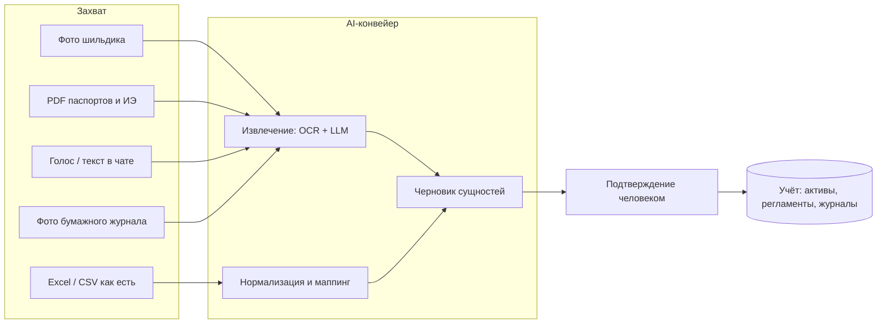
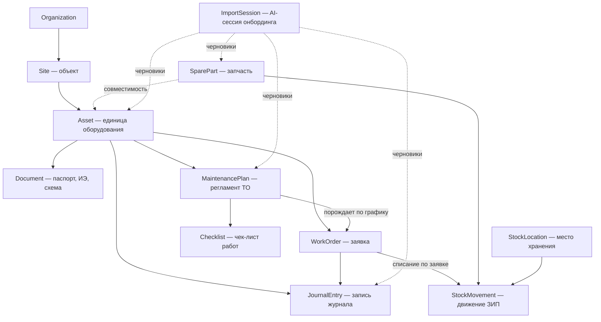
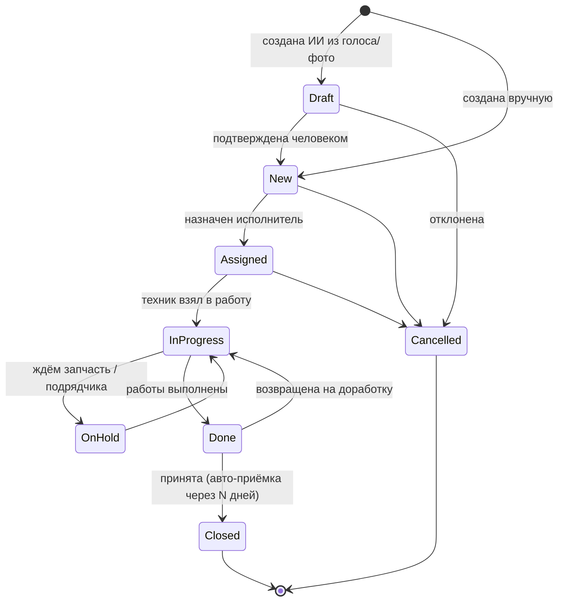
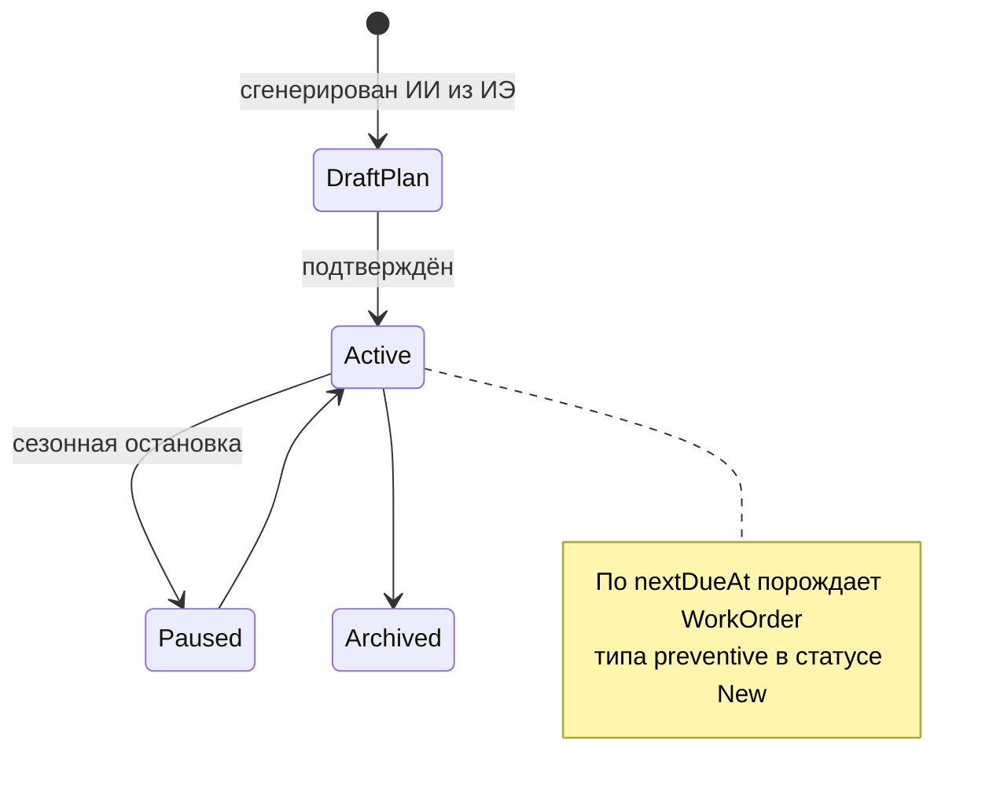
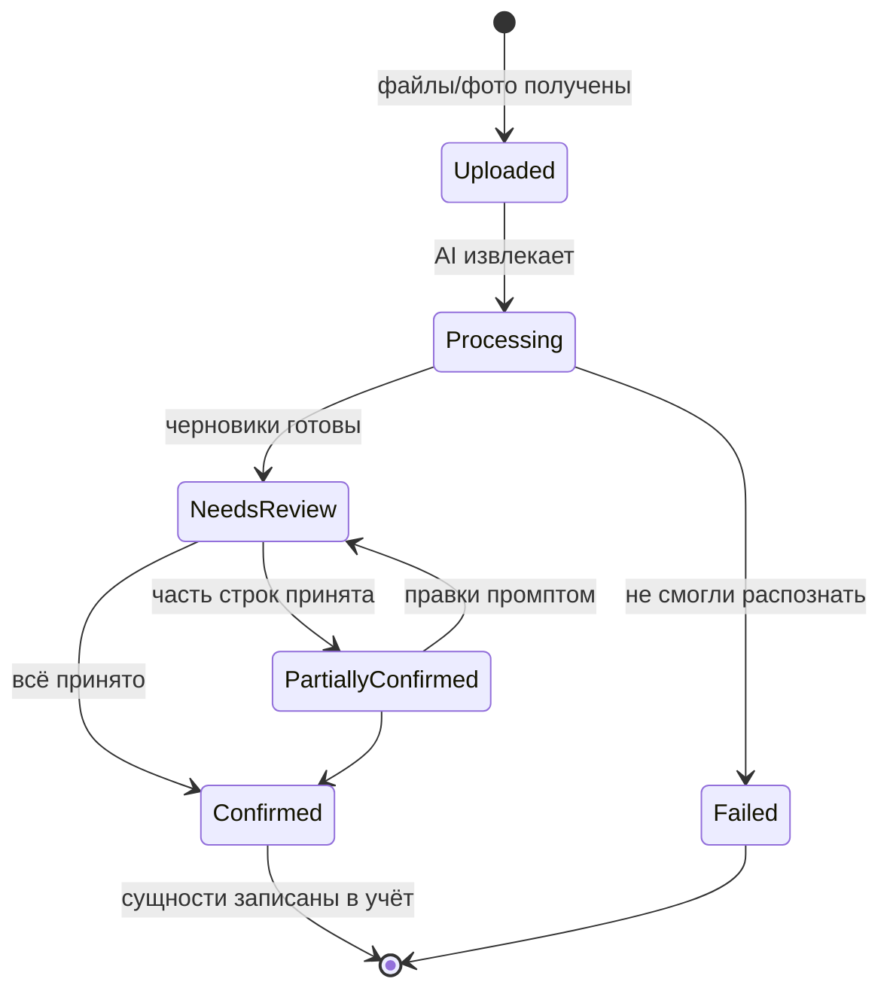
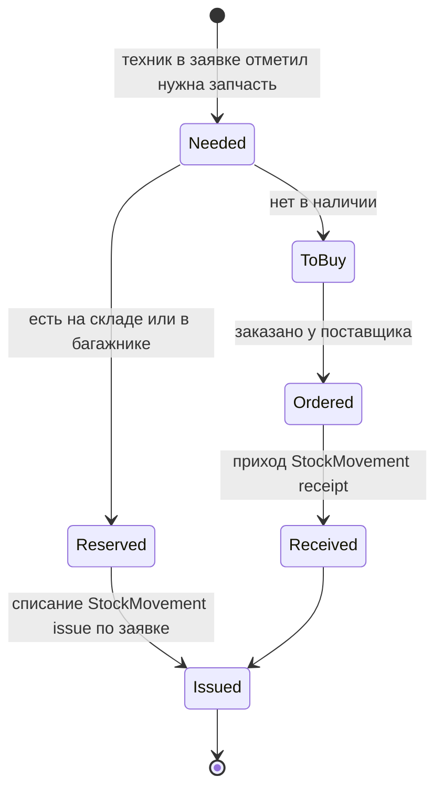
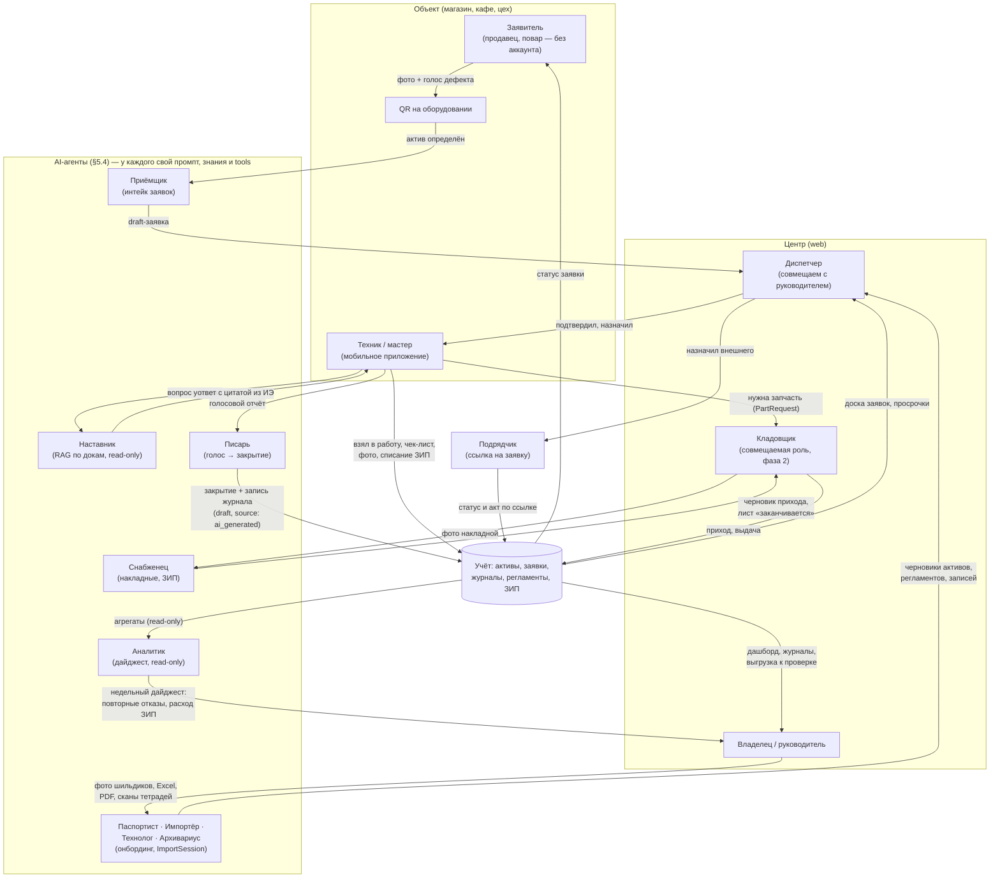
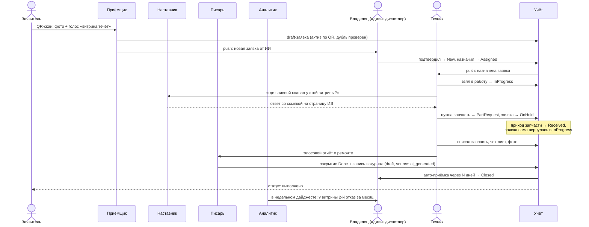

# ТОиР для малого бизнеса: проект системы с AI-онбордингом

**Дата:** 2026-07-09
**Статус:** проектный документ (архитектура, конкуренты, стейты, рабочие места)
**Связанные документы:** [STRATEGY.md](STRATEGY.md), [B2B_MVP_SCOPE.md](B2B_MVP_SCOPE.md), [COMPETITOR_BATTLECARDS.md](COMPETITOR_BATTLECARDS.md), [DIGITIZATION_SEARCH_INTENT.md](DIGITIZATION_SEARCH_INTENT.md)

---

## 1. Идея в одном абзаце

Система ТОиР для малого бизнеса (1–50 объектов, 1–20 техников), в которой **ИИ убирает главный барьер входа — заполнение системы данными**. Классический CMMS умирает у малого бизнеса на этапе «занесите 200 единиц оборудования, настройте регламенты, обучите людей». Мы проектируем систему, где онбординг делается **фотографией шильдика, загрузкой Excel «как есть» и голосом**, а регламенты ТО и чек-листы **генерируются ИИ из паспортов и инструкций**. Учёт и журналы остаются ядром ценности (см. STRATEGY: «AI — усилитель, не замена учёта»), но именно ИИ сокращает время до первой пользы с недель до часа.

---

## 2. Почему онбординг — главная проблема, которую решает ИИ

Из документов репозитория:

- **STRATEGY.md, риск №2:** «Поиск ≠ покупка — трафик по "скачать журнал" нужен лид-магнит + быстрый онбординг».
- **B2B_MVP_SCOPE, критерий пилота:** «Один объект: ≥10 единиц оборудования, ≥3 документа» — это ручная работа, которую клиент должен сделать *до* получения ценности.
- **Battlecards §1:** главный конкурент — Excel; проигрываем, когда «нет боли». Значит, стоимость перехода должна быть почти нулевой.
- **CUSTDEV_GUIDE, H5:** документация на объекте — острая боль техника; документы уже есть в виде PDF/фото/папок — их надо не «вносить», а «скормить» системе.

Вывод: **у малого бизнеса нет ни админа, ни интегратора, ни времени**. Единственный жизнеспособный путь внедрения — система сама строит справочники из того, что у клиента уже есть: шильдики, тетради, Excel, PDF, WhatsApp-переписки.

---

## 3. Как AI-онбординг реализован у конкурентов

### 3.1 Западные CMMS (лидеры категории)

| Продукт | AI-возможности онбординга | AI в ежедневной работе |
|---------|---------------------------|------------------------|
| **MaintainX** (CoPilot) | Импорт активов CSV/Excel с маппингом колонок; CoPilot извлекает данные актива **из фото шильдика или спецификации**; загрузка OEM-мануала → вопрос → **генерация work order или процедуры** из мануала | CoPilot: поиск по мануалам и истории работ в чате (текст и голос), troubleshooting у станка; перевод SOP на языки; Anomaly Detection на показаниях счётчиков; Smart Time Estimates (оценка длительности работ из истории) |
| **Limble** (Asset Snap, Winter Release 2026) | **Asset Snap: фото шильдика → распознавание производителя, модели, серийника → готовая карточка актива + QR-код**; заявленный эффект — онбординг legacy-парка «до 80% быстрее»; импорт из Excel — классический, без ИИ | MCP-слой (доступ LLM-клиентов к данным CMMS read-only); AI Resource Planning (балансировка загрузки техников) |
| **UpKeep** (Intelligence / Nova / Studio) | **AI-трансформация импорта: загрузил «грязный» Excel → правишь данные промптами на естественном языке** («приведи даты к одному формату», «убери пробелы в названиях») без формул; Photo-to-Part (фото → карточка запчасти); Smart Data Cleanup при импорте | Nova — автономный агент по расписанию: аудит качества данных, флаги аномалий, отчёты «к утру»; Voice Fill — голосовое создание заявок; Smart Checklist Builder — генерация ПМ-чек-листов по типу актива; авто-заметки закрытия заявки; Studio — «опиши приложение словами — ИИ соберёт» |
| **Fiix** (Foresight) | Импорт классический (CSV-шаблоны, порядок: custom fields → users → assets → parts → PM → work orders) — ИИ в импорте нет | Foresight: анализ тысяч work orders → риски поломок, просрочек, compliance; asset insights — аномалии затрат/реактивного ТО без датчиков |
| **Pairio** (YC, референс из [PRODUCT_NOTE.md](PRODUCT_NOTE.md)) | Онбординг = **загрузка мануалов + голос**: система AI-native, справочник строится по ходу работы; интеграции с SAP/Maximo для подтягивания данных | Голос/фото/видео у станка → поиск по тысячам страниц мануалов → пошаговая инструкция; после ремонта техник наговаривает — ИИ **сам собирает структурированный отчёт** (дефект, действия, запчасти); заявленное снижение времени ремонта ~25% |

### 3.2 Российские игроки

| Продукт | AI-возможности | Комментарий для нас |
|---------|----------------|---------------------|
| **1С:ТОиР / Деснол** | «ТОиР Аналитик» (2026): облачная надстройка — ИИ-чат по данным о ремонтах («покажи 5 самых дорогих станков»), 100+ экспертных диагностик скрытых потерь, автоотчёт руководству; предиктивный сервис аномалий на датчиках (градиентный бустинг) для 1С:RCM | ИИ — **аналитика для директора завода**, не онбординг. Вход в 1С:ТОиР остаётся проектом внедрения на месяцы. Наше окно: «за час, а не за квартал» |
| **HubEx** | ИИ-ассистент, обученный на документации компании (техкарты, регламенты, PDF, история работ); доступен в приложении/веб/Telegram; подключение 1–2 недели, отдельная платная услуга (20–60 тыс. ₽) | ИИ — платная надстройка-консультант, а не встроенный онбординг. Индексацию документов делает вендор, не клиент |
| **Okdesk** | ИИ как «нулевая линия»: автоответы на типовые обращения, автозаполнение полей заявки, маршрутизация | ИИ для диспетчеризации сервисной компании; онбординг справочников — ручной |
| **Excel/бумага** (главный incumbent) | — | Именно поэтому «сфотографируй тетрадь — получи журнал» бьёт сильнее любой фичи |

### 3.3 Склад ЗИП у конкурентов

| Продукт | Складской контур | AI в складе |
|---------|------------------|-------------|
| **MaintainX** | Каталог запчастей, привязка к активам и поставщикам; техник отмечает использованные запчасти прямо в work order → остаток списывается автоматически; min-уровни → алерт → автогенерация purchase order; шаринг остатков между площадками | CoPilot подсказывает объёмы дозаказа и тренды расхода по истории |
| **Fiix** | Полный цикл закупки: purchase request → PO → RFQ по email; ABC-классификация запчастей; интеграция остатков с ERP | **Parts Forecaster**: прогноз «что, сколько и когда заказать» из истории списаний, графика ПМ и сезонности |
| **UpKeep** | Каталог, min-уровни, списание через заявку | **Photo-to-Part**: фото запчасти → готовая карточка в каталоге |
| **1С:ТОиР** | Полноценное МТО: склады, резервирование под наряд, лимитно-заборные карты, интеграция с 1С-бухгалтерией | Нет |
| **МойСклад / 1С:УТ** (из [COMPETITOR_BATTLECARDS.md](COMPETITOR_BATTLECARDS.md) §6) | Складской учёт без привязки к дефекту и активу — поэтому и проигрывает: не отвечает «какая запчасть на каком агрегате в каком магазине» | Нет |

Общий паттерн категории: **склад в CMMS — не самостоятельный модуль, а продолжение заявки** (списание при закрытии work order, «ждём запчасть» как статус заявки, min-уровень → закупка). Малому бизнесу не нужен WMS — нужен ответ на три вопроса: *что есть, где лежит, что заканчивается*.

### 3.4 Выводы из анализа конкурентов

1. **Категория уже назвала паттерны, их можно не изобретать:** фото шильдика → актив (Limble Asset Snap, MaintainX CoPilot); мануал → процедура/чек-лист (MaintainX, UpKeep); «грязный» Excel → чистый импорт промптами (UpKeep); голос → заявка/отчёт (UpKeep Voice Fill, Pairio); RAG-чат по мануалам у станка (все).
2. **Никто на рынке РФ не собрал это для малого бизнеса.** У Деснола ИИ — аналитика для enterprise; у HubEx — платный чат-бот с внедрением от вендора; у Okdesk — автоответы. **Свободна ниша «AI-онбординг за час» в рублёвой зоне.**
3. **ИИ-онбординг — это не одна фича, а конвейер:** захват (фото/файл/голос) → извлечение → черновик → подтверждение человеком → запись в учёт. Human-in-the-loop обязателен везде (все конкуренты дают «review and edit before save») — это и снимает риск галлюцинаций, и создаёт доверие.
4. **Западные вендоры прячут ИИ в дорогие тарифы** (UpKeep — Premium+, MaintainX CoPilot — add-on). Для малого бизнеса ИИ-онбординг должен быть **бесплатным на входе** — он снижает CAC, а не является upsell.

---

## 4. Целевой пользователь (уточнение ICP для малого бизнеса)

Смещение относительно [STRATEGY.md](STRATEGY.md) (там 10–100 объектов): **малый бизнес = 1–50 объектов, часто без выделенного диспетчера**.

| Сегмент | Пример | Кто работает в системе |
|---------|--------|------------------------|
| Микро (1–3 объекта) | Кафе с холодильным парком, пекарня, автомойка | Владелец = админ = диспетчер; 1–2 мастера или подрядчик |
| Малый (3–15 объектов) | Мини-сеть магазинов, тёмная кухня, малое производство | Завхоз/главный инженер + 2–5 техников |
| Малый+ (15–50 объектов) | Региональная сеть, франшиза | Руководитель эксплуатации, диспетчер (часто совмещённый), 5–20 техников, подрядчики |

Следствие для проектирования: **роли должны сворачиваться**. Один человек может держать все роли (микро) — система не должна требовать «настройте оргструктуру» на старте.

---

## 5. Архитектура AI-онбординга («вхождение в работу»)

### 5.1 Принцип: Time-to-First-Value < 1 час

**Инвариант 1:** ИИ никогда не пишет в учёт напрямую. Всё, что извлечено, живёт в статусе «черновик» до подтверждения пользователем (см. стейт-машину ImportSession в §7.5).

**Инвариант 2: не один универсальный ассистент, а набор специализированных агентов.** Каждый агент имеет собственный системный промпт, собственный набор знаний (контекст) и собственный набор инструментов (tools) — и не имеет доступа к чужим. Импорт-агент не умеет отвечать на вопросы по инструкции, наставник техника не умеет писать в справочники. Это даёт: (а) меньше галлюцинаций — узкий промпт на узкой задаче; (б) дешевле — маленькие модели на рутинных агентах, тяжёлые только там, где нужно; (в) безопаснее — права агента = права инструментов, которые ему выданы; (г) измеримо — у каждого агента своя метрика качества и свой eval-набор. Полный реестр — §5.4.

### 5.2 Пять AI-сценариев онбординга (по убыванию приоритета)

| # | Сценарий | Вход | Выход | Аналог у конкурентов |
|---|----------|------|-------|----------------------|
| 1 | **Актив по фото шильдика** | Фото таблички на агрегате | Карточка Asset: производитель, модель, серийник, год; QR-метка для печати | Limble Asset Snap, MaintainX CoPilot |
| 2 | **Импорт «грязного» Excel** | Любая таблица клиента без подготовки | Маппинг колонок ИИ + правки промптами → активы/объекты/заявки | UpKeep Data Transformations |
| 3 | **Регламент из документа** | PDF паспорта/ИЭ (или наш типовой шаблон по категории) | План ТО (периодичность) + чек-лист работ, привязанные к активу | MaintainX «manual → procedure», UpKeep Smart Checklist |
| 4 | **Заявка голосом/фото** | Голосовое сообщение или фото дефекта (в т.ч. из Telegram/WhatsApp) | Оформленная заявка: актив угадан по QR/гео/названию, симптом структурирован | UpKeep Voice Fill, Pairio, Okdesk-автозаполнение |
| 5 | **Оцифровка бумажного журнала** | Фото страниц тетради/распечатки | Записи журнала задним числом с датами и активами | Нет у конкурентов — наш дифференциатор под compliance-спрос из [DIGITIZATION_SEARCH_INTENT.md](DIGITIZATION_SEARCH_INTENT.md) |
| 6 | **Запчасть по фото / накладной** (фаза 2) | Фото запчасти, коробки или накладной поставщика | Карточка SparePart (или пачка карточек из накладной) + приход на склад | UpKeep Photo-to-Part; распознавание накладной — нет у конкурентов |

Сценарий 5 уникально ложится на наш рынок: Wordstat показывает, что клиент живёт в «журнал → образец → скачать»; фото его текущей тетради — идеальный мост из бумаги в систему.

### 5.3 AI в ежедневной работе (после онбординга)

- **Чат по документации на карточке актива** (RAG по PDF актива/объекта — переиспользуем Onyx-контур из B2C Atlant, см. [B2B_MVP_SCOPE.md](B2B_MVP_SCOPE.md) §переиспользование).
- **Автозаметка закрытия заявки:** техник наговаривает — ИИ структурирует «дефект / причина / что сделано / запчасти» (паттерн Pairio).
- **Подсказка по симптому:** «витрина плачет» → вероятные причины из ИЭ + истории этого актива.
- **Еженедельный дайджест руководителю:** просрочки, повторные отказы, активы-«пожиратели» бюджета (лайт-версия Fiix Foresight / ТОиР Аналитик — фаза 2+).

### 5.4 Реестр AI-агентов

Каждая задача из §5.2–5.3 закреплена за отдельным агентом. Пользователь не выбирает агента — его вызывает контекст (экран, тип файла, канал), между собой агенты общаются только через данные учёта, не напрямую.

| Агент | Задача | Знания (контекст) | Промпт-фокус | Инструменты (tools) | Модель | Фаза |
|-------|--------|-------------------|--------------|---------------------|--------|------|
| **Паспортист** | Фото шильдика → карточка Asset (§5.2 #1) | Справочник производителей и типовых моделей категории (холод, HVAC); формат полей Asset | Извлеки поля, не выдумывай: нет поля на фото — верни пусто + confidence | createDraftAsset | VLM среднего класса | MVP |
| **Импортёр** | «Грязный» Excel → сущности; правки промптами (§5.2 #2) | Схема наших сущностей; словарь синонимов колонок («инв. №», «зав. номер»…) | Маппинг и нормализация, без интерпретации содержимого | mapColumns, transformRows, createDrafts | LLM среднего класса | MVP |
| **Технолог** | PDF паспорта/ИЭ → план ТО + чек-лист (§5.2 #3) | Только документы данного актива + отраслевые шаблоны регламентов | Каждый пункт чек-листа — со ссылкой на страницу источника; нет источника — пометь как «типовой» | createDraftPlan, createDraftChecklist | Тяжёлая LLM (редкие вызовы) | Фаза 2 |
| **Архивариус** | Фото бумажного журнала → записи задним числом (§5.2 #5) | Формы типовых журналов (ТО, неисправности); список активов и людей организации для сопоставления | Распознай строки, сопоставь активы, даты не выдумывай | createDraftJournalEntries | VLM тяжёлая | Фаза 2 |
| **Приёмщик** | Голос/фото/текст из QR-формы или бота → draft-заявка (§5.2 #4) | Список активов объекта (по QR/гео); категории дефектов; открытые заявки (антидубль) | Структурируй симптом, определи актив, проверь дубль; не диагностируй | createDraftWorkOrder, findAsset, findDuplicates | Быстрая дешёвая LLM | 1.1 |
| **Наставник** | Ответы технику у станка по документации (§5.3) | RAG строго по документам актива/объекта + история ремонтов этого актива | Отвечай только из источников, всегда цитируй страницу; не знаешь — скажи «в документации нет» | searchDocs, getAssetHistory (read-only) | LLM среднего класса + RAG | 1.1 |
| **Писарь** | Голосовой отчёт техника → структурированное закрытие + запись журнала (§5.3) | Текущая заявка (актив, чек-лист); каталог ЗИП для распознавания названий запчастей | Заполни «дефект/причина/действия/запчасти» только из сказанного | draftCloseout, draftJournalEntry, matchParts | Быстрая дешёвая LLM + STT | 1.1 |
| **Снабженец** | Фото запчасти/накладной → карточки и приход (§5.2 #6); лист «заканчивается» | Каталог SparePart организации; словарь артикулов поставщиков | Извлеки позиции накладной, сопоставь с каталогом, новое — как черновик | createDraftParts, createDraftReceipt, getStockBalances | VLM среднего класса | Фаза 2 |
| **Аналитик** | Недельный дайджест руководителю (§5.3) | Агрегаты учёта: заявки, простои, расход ЗИП; пороговые правила (повторный отказ, рост расходов) | Только факты из данных с цифрами и ссылками на заявки; без советов «купите новое» | queryAggregates (read-only) | Тяжёлая LLM (1 вызов/нед.) | Фаза 3 |

Правила реестра:

- **Один агент — одна метрика.** Паспортист: % полей без правки; Импортёр: % строк принято; Наставник: доля ответов с корректной цитатой; Приёмщик: % draft-заявок, подтверждённых без редактирования. Метрики видны нам (eval) и клиенту (доверие).
- **Знания раздаются по минимуму.** Наставник не видит чужие активы, Аналитик не видит содержимое документов — только агрегаты. Это же ответ на 152-ФЗ: контур каждого агента понятен и документируем.
- **Пишущие инструменты — только `createDraft*`.** Ни у одного агента нет инструмента прямой записи в учёт (инвариант 1). Read-only агенты (Наставник, Аналитик) не имеют пишущих инструментов вовсе.
- **Оркестрация тонкая.** Никакого «агента-менеджера», который сам решает, кого позвать: маршрутизация детерминирована контекстом (тип ImportSession, канал входа, экран). Исключение фазы 3+ — бот, где Приёмщик может передать диалог Наставнику («это не поломка, вот как включить разморозку»).

---

## 6. Модель данных

Расширяет сущности [B2B_MVP_SCOPE.md](B2B_MVP_SCOPE.md) (Organization, Site, Asset, Document, WorkOrder, JournalEntry, User) новыми:

| Новая сущность | Назначение | Минимальные поля |
|----------------|------------|------------------|
| **MaintenancePlan** | Регламент ТО актива (в малом бизнесе — простая периодичность, не полноценный ППР) | id, assetId, title, интервал (дни/моточасы), checklistId, nextDueAt, isActive, source (ai_generated / manual / template) |
| **Checklist** | Шаблон работ для ТО или типовой заявки | id, title, items[] (текст, обязательность, фото-подтверждение), source |
| **ImportSession** | Единица AI-онбординга: пачка фото/файл/диктовка → черновики → подтверждение | id, type (nameplate / excel / document / journal_scan / voice / part_photo / invoice), status, inputFiles[], draftEntities[], confirmedBy, stats |
| **SparePart** (фаза 2) | Каталожная карточка запчасти | id, name, articleNo, compatibleAssetIds[] / category, minQty, unit, photo, source |
| **StockLocation** (фаза 2) | Место хранения — намеренно упрощено | id, type (central / site / vehicle — «багажник мастера»), siteId?, name |
| **StockMovement** (фаза 2) | Атомарное движение ЗИП; остаток = сумма движений, отдельной таблицы остатков нет | id, partId, locationId, qty (+/–), type (receipt / issue / transfer / adjustment), workOrderId?, actor, at |

Складской принцип для малого бизнеса: **остатки — производное от движений, а движения привязаны к заявкам**. Это прямо отвечает на боль из battlecards §6: «какая запчасть на каком агрегате в каком магазине» — через цепочку StockMovement → WorkOrder → Asset → Site. `StockLocation.type = vehicle` — это легализация реальности «ЗИП в багажнике» из [CUSTDEV_GUIDE.md](CUSTDEV_GUIDE.md) (блок D, вопрос 11).

Поле `source: ai_generated` на всех порождённых ИИ записях — обязательное: для доверия (показываем бейдж «создано ИИ, подтверждено Ивановым») и для метрик качества извлечения.

---

## 7. Стейты (обязательные машины состояний)

Правило проектирования для малого бизнеса: **минимум статусов в UI, полнота — в данных**. Ниже — обязательный набор.

### 7.1 WorkOrder (заявка) — ядро системы

Обязательные статусы: `draft` (только для AI-созданных), `new`, `assigned`, `in_progress`, `on_hold`, `done`, `closed`, `cancelled`.

Решения для малого бизнеса:

- **`draft` виден только как «входящие от ИИ»** — не засоряет доску диспетчера.
- **`assigned` и `in_progress` можно схлопнуть настройкой** (микро-сегмент: владелец сам и назначает, и делает).
- **Авто-закрытие `done → closed`** через настраиваемые N дней — у малого бизнеса нет процедуры приёмки.
- Просрочка — не статус, а вычисляемый флаг от `dueAt` (иначе комбинаторика статусов взрывается).

### 7.2 MaintenancePlan / плановое ТО

Плановое ТО **не имеет собственного цикла исполнения** — оно порождает обычную заявку. Один цикл статусов для техника вместо двух — критично для простоты.

### 7.3 JournalEntry (запись журнала)

Журнал — append-only (требование compliance: история без правок задним числом):

- `draft` → `posted` (для AI-распознанных из фото тетради и авто-записей из заявок);
- `posted` → `voided` (сторнирование отдельной записью-исправлением, оригинал не удаляется).

Записи создаются: вручную техником; автоматически при закрытии заявки; ИИ из фото бумажного журнала (через ImportSession).

### 7.4 Asset (единица оборудования)

`draft` (создан ИИ, не подтверждён) → `active` → `inactive` (законсервирован) → `retired` (списан). Плюс вычисляемый операционный флаг `down` (есть открытая заявка с признаком «оборудование остановлено») — для дашборда руководителя.

### 7.5 ImportSession (AI-онбординг) — новая машина, которой нет у классических CMMS

Обязательные статусы: `uploaded`, `processing`, `needs_review`, `partially_confirmed`, `confirmed`, `failed`. Именно этот контур делает онбординг воспроизводимым и измеримым (метрика: % строк, принятых без правки).

### 7.6 Склад ЗИП (фаза 2)

Два лёгких контура вместо полноценного WMS:

**StockMovement — без машины состояний.** Движение либо проведено, либо его нет (append-only, как журнал); ошибка исправляется обратным движением `adjustment`. Никаких «черновиков накладной» и резервирования под наряд (это 1С:ТОиР-территория) — кроме движений, созданных ИИ из фото накладной: они проходят через ImportSession (§7.5) и попадают в учёт только после подтверждения.

**PartRequest (потребность в запчасти) — минимальная машина, встроенная в заявку:**

Связка со стейтами заявки: `Needed/ToBuy/Ordered` автоматически переводят WorkOrder в `on_hold` с причиной «ждём запчасть» и возвращают в `in_progress` по `Received` — диспетчеру не нужно вести это руками. Min-уровень (`SparePart.minQty`) порождает не документ закупки, а **уведомление** со списком «что заканчивается» — закупает малый бизнес где угодно, наша задача — вовремя сказать «что и сколько» (паттерн MaintainX/Fiix, урезанный до уведомления).

### 7.7 Что сознательно НЕ делаем в стейтах (v1–2)

- Согласование заявок по цепочке (enterprise-паттерн 1С:ТОиР).
- Полный цикл закупки PO/RFQ с согласованиями (Fiix/1С-территория) — только PartRequest из §7.6.
- Резервирование ЗИП под наряд и лимитно-заборные карты.
- SLA-эскалации с уровнями (Okdesk/HubEx-территория) — только флаг просрочки и напоминание.

---

## 8. Рабочие места (обязательные)

### 8.1 Матрица ролей

| Роль | Устройство | Обязательность |
|------|-----------|----------------|
| **Владелец / руководитель** (admin) | Web + мобильный дашборд | Обязательна |
| **Диспетчер** (dispatcher) | Web | Обязательна как роль, но **совмещаемая** с admin |
| **Техник / мастер** (technician) | Мобильное приложение (Android приоритет) | Обязательна |
| **Подрядчик** (contractor) | Ссылка-приглашение на одну заявку, без лицензии | Желательна в v1.1 — малый бизнес часто чинит руками подрядчика |
| **Заявитель** (reporter: продавец, повар, оператор) | Без аккаунта: QR на оборудовании → форма/бот | Обязательна — иначе заявки останутся в WhatsApp |
| **Кладовщик / снабженец** (storekeeper) | Web + мобильный сканер | Роль обязательна с фазы 2, но **совмещаемая**: в микро- и малом сегменте её держит руководитель или сам техник |

Ключевые отличия от enterprise-ТОиР: **planner/инженер по надёжности отсутствует** — его функцию (составление регламентов и чек-листов) выполняет ИИ + подтверждение руководителя; **выделенного кладовщика нет** — складские операции размазаны по рабочим местам техника (списание в заявке) и руководителя (уведомления о min-остатках, приход по накладной).

### 8.2 Рабочее место техника (мобильное)

Экраны: Мои заявки (сегодня/просрочено) → Карточка заявки (чек-лист, фото, документы актива, чат с ИИ «спроси по инструкции») → Закрытие голосом (наговорил — ИИ оформил) → Сканер QR (открыть актив/создать заявку у агрегата).

Требования: офлайн-черновики (объекты с плохой связью), крупные элементы UI, максимум 2 тапа до создания заявки.

### 8.3 Рабочее место диспетчера/руководителя (web)

Экраны: Доска заявок по сети (фильтр: объект, статус, просрочка — из B2B_MVP_SCOPE must-have №7) → Входящие от ИИ (draft-заявки и черновики импорта на подтверждение) → Календарь ТО (ближайшие плановые) → Журналы + выгрузка PDF/Excel за период (must-have №6) → Справочники (объекты, активы, люди) → Мастер онбординга (§5).

### 8.4 Рабочее место заявителя (без лицензии)

QR-стикер на оборудовании (генерируется при создании актива — как у Limble) → открывается форма или Telegram-бот: фото + голос/текст → ИИ создаёт draft-заявку с уже определённым активом. Это одновременно и канал заявок, и вирусный контур: продавец магазина видит, что «заявки тут решаются».

### 8.5 Складской контур в рабочих местах (фаза 2)

Отдельного «АРМ кладовщика» нет — складские функции встроены туда, где происходит физическое действие:

| Где | Функция |
|-----|---------|
| Заявка техника (mobile) | «Отметить использованные запчасти» — поиск/скан → qty → StockMovement `issue` при закрытии заявки (паттерн MaintainX); «нужна запчасть» → PartRequest, заявка сама уходит в `on_hold` |
| Мобильный сканер | Приход по фото накладной (ImportSession → черновики движений → подтверждение); инвентаризация: скан + фактическое количество → `adjustment` |
| Web руководителя | Остатки по местам хранения (центральный склад / объект / машина мастера); лист «заканчивается» из min-уровней; расход ЗИП в разрезе актива и объекта — «куда уходят деньги» |
| Каталог | Карточка SparePart с фото и совместимыми активами; создание через Photo-to-Part |

### 8.6 Схема взаимодействия ролей и агентов

Общая карта: кто с кем и чем обменивается. AI-слой — не один ассистент, а реестр специализированных агентов (§5.4); каждый вызывается своим контекстом, всё созданное агентами проходит подтверждение человеком (инварианты §5.1).

Ключевые контуры на схеме:

1. **Заявочный** (заявитель → Приёмщик → диспетчер → техник/подрядчик → учёт): единственная точка входа дефекта — QR/бот; Приёмщик только структурирует и ищет дубли, диспетчер подтверждает и назначает.
2. **Исполнительский** (техник ↔ Наставник/Писарь ↔ учёт): у станка техника обслуживают два разных агента — read-only Наставник отвечает по документации, Писарь оформляет сказанное в закрытие и журнал; журнал пополняется как побочный эффект работы.
3. **Онбординговый** (руководитель → Паспортист/Импортёр/Технолог/Архивариус → диспетчер): четыре агента онбординга работают только внутри ImportSession и выдают черновики на подтверждение.
4. **Складской** (техник → кладовщик ↔ Снабженец → учёт): PartRequest из заявки — единственный способ «попросить запчасть»; движения ЗИП всегда привязаны к заявке.
5. **Управленческий** (учёт → Аналитик → руководитель): руководитель ничего не вводит — смотрит дашборд, подтверждает регламенты, читает дайджест, выгружает журналы к проверке.

Сквозной сценарий (микро-сегмент, все центральные роли — один человек):

Каждый агент в сценарии видит только своё: Приёмщик — активы объекта и открытые заявки, Наставник — документы конкретной витрины, Писарь — текущую заявку и каталог ЗИП, Аналитик — агрегаты без содержимого документов.

## 9. Онбординг-флоу первого дня (склейка всего выше)

| Шаг | Действие пользователя | Работа системы | Время |
|-----|----------------------|----------------|-------|
| 1 | Регистрация: название, отрасль (подсказка: «магазин/кафе/производство») | Создаёт Organization + первый Site; подставляет отраслевой набор категорий и шаблоны чек-листов | 2 мин |
| 2 | «Есть таблица оборудования?» — да: кидает Excel как есть / нет: идёт фотографировать шильдики | ImportSession: маппинг ИИ, правки промптами; либо Asset-Snap-поток фото → карточки | 15–30 мин на 20–50 активов |
| 3 | Загружает PDF паспортов/ИЭ (или пропускает) | Индексация RAG; предложение: «сгенерировать план ТО для 12 активов из инструкций?» | 10 мин |
| 4 | Подтверждает регламенты | MaintenancePlan → первые плановые заявки в календаре | 5 мин |
| 5 | Печатает QR-стикеры, клеит на оборудование | PDF со стикерами одним файлом | 10 мин |
| 6 | Тестовая заявка голосом с телефона | Draft → подтверждение → назначение | 3 мин |

**Целевая метрика активации:** организация с ≥10 активами, ≥1 регламентом и ≥1 закрытой заявкой в первые 7 дней. Дополнительные метрики: % строк импорта, принятых без правки (>80%), точность извлечения шильдика (>90% по полям производитель/модель).

---

## 10. Технический контур (кратко, в связке с B2B_MVP_SCOPE)

| Слой | Решение |
|------|---------|
| Клиенты | KMP (Decompose, MVIKotlin) — Android для техника, Web для диспетчера (как в B2B_MVP_SCOPE); Telegram-бот для заявителей |
| Backend | REST + PostgreSQL (обязательна, см. B2B_MVP_SCOPE); объектное хранилище для фото/PDF |
| AI-слой | Мультиагентный (§5.4): общий рантайм агентов + декларативные определения (промпт, источники знаний, tools, модель — конфиг на агента); RAG-инфраструктура (Onyx-контур из B2C Atlant) как разделяемый сервис, но индексы скоупятся на агента |
| Маршрутизация | Детерминированная: тип ImportSession / канал входа / экран → конкретный агент; без агента-оркестратора |
| Очередь | ImportSession обрабатывается асинхронно (processing → needs_review), push при готовности |
| AI-провайдеры | Абстракция над моделями на уровне рантайма: каждому агенту — свой tier (дешёвые на Приёмщика/Писаря, тяжёлые на Технолога/Аналитика); для РФ-рынка — вариант с YandexGPT/GigaChat для клиентов с требованиями к локализации данных |
| Качество | Per-agent eval-наборы и метрики (§5.4); логирование вызовов агентов для разбора ошибок извлечения |

Новые endpoint'ы поверх черновика API из B2B_MVP_SCOPE: `POST /import-sessions` (+ файлы), `GET /import-sessions/{id}`, `POST /import-sessions/{id}/confirm`, `POST /import-sessions/{id}/transform` (правка промптом), `GET/POST /maintenance-plans`, `POST /assets/{id}/generate-plan`, `POST /work-orders/voice` (голос → draft); фаза 2 (склад): `GET/POST /spare-parts`, `POST /stock-movements`, `GET /stock/balances` (агрегат по движениям), `POST /work-orders/{id}/part-requests`.

---

## 11. Roadmap (дельта к фазам B2B_MVP_SCOPE)

| Фаза | Содержание | AI-онбординг |
|------|------------|--------------|
| **1 MVP** | Сущности и экраны по B2B_MVP_SCOPE + ImportSession | Сценарии §5.2 #1 (шильдик) и #2 (Excel) — это и есть лид-магнит вместо «пустой системы» |
| **1.1** | Фото, push, AI-чат на активе | #4 заявка голосом; QR-заявитель |
| **2** | MaintenancePlan + Checklist, календарь ТО; **склад ЗИП** (§6, §7.6, §8.5): SparePart, StockMovement, PartRequest, min-остатки | #3 регламент из документа; #5 оцифровка бумажного журнала; #6 Photo-to-Part и приход по фото накладной |
| **3** | Дайджест-аналитика руководителю, подрядчики, прогноз расхода ЗИП | Недельный AI-дайджест; лайт-версия Parts Forecaster (что дозаказать к плановым ТО) |

Сдвиг относительно B2B_MVP_SCOPE: регламенты ТО (там фаза 3) поднимаются в фазу 2, потому что AI-генерация из ИЭ снимает главную причину, по которой ППР был «тяжёлым»; ЗИП — в фазе 2, как и планировалось (см. B2B_MVP_SCOPE: «склад — следствие наряда»), но в урезанной модели §7.6 — движения и потребности, без PO/резервирования.

---

## 12. Позиционирование против конкурентов (сообщение)

> «1С:ТОиР внедряют квартал. HubEx подключает ИИ за две недели и отдельные деньги. У нас: сфотографируйте шильдики и загрузите ваш Excel — через час у вас работающий учёт, журналы под проверку и план ТО, собранный ИИ из ваших же инструкций.»

Не обещаем в H1: «ИИ-ТОиР» (нет поискового спроса — см. [WORDSTAT_MARKET_MATRIX.md](WORDSTAT_MARKET_MATRIX.md)); ИИ продаём на демо и в онбординге, SEO-вход остаётся через журналы/заявки/документацию.

---

## 13. Риски

| Риск | Митигация |
|------|-----------|
| Точность извлечения (стёртые шильдики, кривые тетради) | Human-in-the-loop везде; метрика % принятых без правки; fallback на ручной ввод в том же экране |
| Стоимость инференса на бесплатном онбординге | Лимиты по сессиям; тяжёлые модели только на onboarding, дешёвые — на рутину |
| Недоверие «ИИ придумал регламент» | Каждый пункт чек-листа со ссылкой на страницу источника (ИЭ); бейдж source: ai_generated + кто подтвердил |
| Конкуренты скопируют (Limble/UpKeep уже имеют примитивы) | Они не идут в РФ и в малый бизнес; наша защита — рублёвый рынок, Telegram-каналы, отраслевые шаблоны под холод/ритейл |
| Требования локализации данных (152-ФЗ) | Опция российских LLM-провайдеров; анонимизация как у «ТОиР Аналитик» |
