# ТОиР для малого бизнеса: проект системы

**Дата:** 2026-07-09
**Статус:** проектный документ (архитектура, конкуренты, стейты, рабочие места)
**Связанные документы:** [STRATEGY.md](STRATEGY.md), [B2B_MVP_SCOPE.md](B2B_MVP_SCOPE.md), [COMPETITOR_BATTLECARDS.md](COMPETITOR_BATTLECARDS.md)

> Скоуп: проектируем **работающую систему** — учёт, заявки, журналы, регламенты, роли и ИИ в ежедневных операциях. Склад ЗИП, кладовщик и подрядчики сознательно вынесены за рамки первых релизов — в backlog.

---

## 1. Идея в одном абзаце

Система ТОиР для малого бизнеса (1–50 объектов, 1–20 инженеров), в которой учёт и журналы — ядро ценности (см. STRATEGY: «AI — усилитель, не замена учёта»), а **ИИ встроен в ежедневные операции**: внеочередная заявка создаётся инженером или авторизованным пользователем (только если включена фича «заявки от пользователей»), инженер у станка спрашивает документацию в чате, закрытие заявки и запись журнала оформляются из текстового отчёта, регламенты ТО генерируются из паспортов и инструкций. Отчёты формируются обычным модулем отчётности из базы, без AI-агента. ИИ реализован не одним универсальным ассистентом, а **набором специализированных агентов** — у каждого свой промпт, свои знания и свои инструменты.

**Ограничение текущего скоупа:** все поля вводятся текстом, фото или выбором из списка.

### 1.1 Верхнеуровневая схема ТОиР

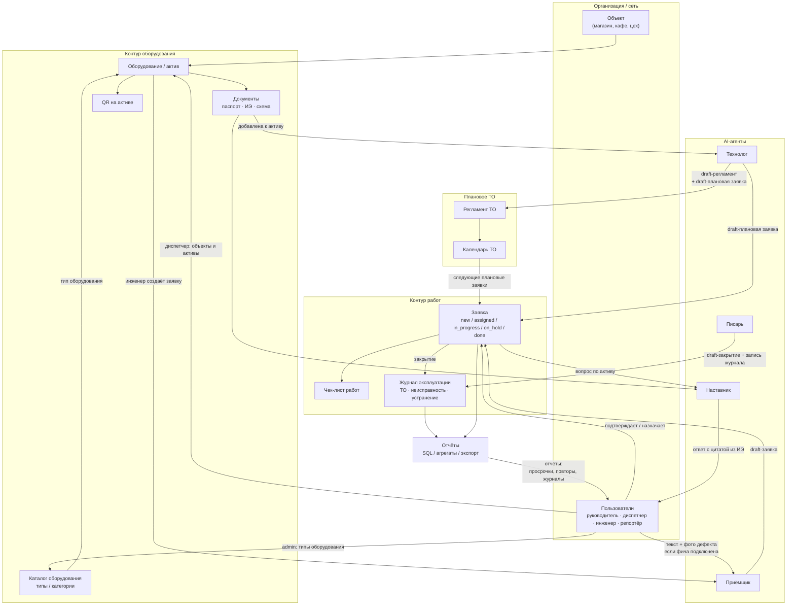

Смысл схемы: **актив** — центр системы. **Admin** настраивает систему (типы оборудования, пользователи, доступы); **диспетчер** ведёт операционные справочники (объекты, активы, документы). От актива идут QR, заявки, журнал и регламент. Когда к активу добавляют документацию, агент **Технолог** анализирует её и создаёт черновики: регламент ТО, чек-лист и плановую заявку. Если в инструкции указаны расходники или запчасти, Технолог добавляет это текстовой пометкой в чек-лист, но складского учёта в первых релизах нет. Заявка — основной рабочий объект: через неё инженер выполняет работу, пополняет журнал и создаёт историю по оборудованию. AI-агенты не заменяют учёт: они создают черновики, ищут по документам и структурируют текст. Отчёты — отдельный read-only модуль поверх базы и агрегатов, без LLM.

---

## 2. Целевой пользователь (уточнение ICP для малого бизнеса)

Смещение относительно [STRATEGY.md](STRATEGY.md) (там 10–100 объектов): **малый бизнес = 1–50 объектов, часто без выделенного диспетчера**.

| Сегмент | Пример | Кто работает в системе |
|---------|--------|------------------------|
| Микро (1–3 объекта) | Кафе с холодильным парком, пекарня, автомойка | Владелец часто совмещает **admin + dispatcher**; 1–2 инженера/мастера |
| Малый (3–15 объектов) | Мини-сеть магазинов, тёмная кухня, малое производство | Завхоз/главный инженер + 2–5 исполнителей |
| Малый+ (15–50 объектов) | Региональная сеть, франшиза | Руководитель эксплуатации, диспетчер (часто совмещённый), 5–20 инженеров |

Следствие для проектирования: **роли должны сворачиваться**. Один человек может держать все роли (микро) — система не должна требовать «настройте оргструктуру» на старте.

---

## 3. Как ИИ реализован у конкурентов

### 3.1 Западные CMMS (лидеры категории)

| Продукт | AI в ежедневной работе | Что берём как паттерн |
|---------|------------------------|----------------------|
| **MaintainX** (CoPilot) | CoPilot: поиск по мануалам и истории работ в чате, troubleshooting у станка; OEM-мануал → вопрос → **генерация work order или процедуры**; перевод SOP на языки; Anomaly Detection на показаниях счётчиков; Smart Time Estimates (оценка длительности работ из истории) | Документы и история актива как источник ответа инженеру; процедура/заявка как черновик, подтверждаемый человеком |
| **Limble** (Asset Snap, Winter Release 2026) | MCP-слой; AI Resource Planning; карточка актива из фото шильдика | Паспортист как помощник **диспетчера** при создании новой единицы оборудования |
| **UpKeep** (Intelligence / Nova / Studio) | Nova — автономный агент по расписанию: аудит качества данных, флаги аномалий, отчёты «к утру»; Smart Checklist Builder — генерация ПМ-чек-листов по типу актива; авто-заметки закрытия заявки; Studio — «опиши приложение словами — ИИ соберёт» | Чек-лист и закрытие заявки как черновики; отчёты пока делаем без AI |
| **Fiix** (Foresight) | Foresight: анализ work orders → риски поломок, просрочек, compliance; asset insights — аномалии затрат/реактивного ТО без датчиков | Отложенный ориентир для будущей аналитики; в первых релизах отчёты строятся из базы без AI |
| **Pairio** (YC, референс из [PRODUCT_NOTE.md](PRODUCT_NOTE.md)) | AI-native: фото/видео у станка → поиск по тысячам страниц мануалов → пошаговая инструкция; после ремонта ИИ **собирает структурированный отчёт** (дефект, действия, запчасти); заявленное снижение времени ремонта ~25% | Наставник по документации и Писарь для текстового закрытия |

### 3.2 Российские игроки

| Продукт | AI-возможности | Комментарий для нас |
|---------|----------------|---------------------|
| **1С:ТОиР / Деснол** | «ТОиР Аналитик» (2026): облачная надстройка — ИИ-чат по данным о ремонтах («покажи 5 самых дорогих станков»), 100+ экспертных диагностик скрытых потерь, автоотчёт руководству; предиктивный сервис аномалий на датчиках (градиентный бустинг) для 1С:RCM | ИИ — **аналитика для директора завода**. Вход в 1С:ТОиР остаётся проектом внедрения на месяцы. Наше окно: лёгкая система для сети без ERP-проекта |
| **HubEx** | ИИ-ассистент, обученный на документации компании (техкарты, регламенты, PDF, история работ); доступен в приложении/веб/Telegram; подключение 1–2 недели, отдельная платная услуга (20–60 тыс. ₽) | ИИ — платная надстройка-консультант; индексацию документов делает вендор, не клиент |
| **Okdesk** | ИИ как «нулевая линия»: автоответы на типовые обращения, автозаполнение полей заявки, маршрутизация | ИИ для диспетчеризации сервисной компании |
| **Excel/бумага** (главный incumbent) | — | Планка UX: система должна быть не сложнее тетради и WhatsApp |

### 3.3 Выводы из анализа конкурентов

1. **Категория уже назвала паттерны, их можно не изобретать:** текст/фото → заявка; RAG-чат по мануалам у станка (все); мануал → процедура/чек-лист (MaintainX, UpKeep); фото шильдика → актив (Limble, MaintainX). Складские сценарии фиксируем как backlog, но не включаем в начальный скоуп.
2. **Никто на рынке РФ не собрал это для малого бизнеса.** У Деснола ИИ — аналитика для enterprise; у HubEx — платный чат-бот с внедрением от вендора; у Okdesk — автоответы.
3. **Human-in-the-loop обязателен везде** (все конкуренты дают «review and edit before save») — это и снимает риск галлюцинаций, и создаёт доверие.
4. **Западные вендоры прячут ИИ в дорогие тарифы** (UpKeep — Premium+, MaintainX CoPilot — add-on). Для малого бизнеса базовые AI-функции должны входить в основной тариф — они и есть продукт.

---

## 4. AI-слой: принципы и агенты

### 4.1 Два инварианта

**Инвариант 1: ИИ никогда не пишет в учёт напрямую.** Всё, что создаёт агент, живёт в статусе «черновик» (`draft`) до подтверждения человеком. Поле `source: ai_generated` на всех порождённых ИИ записях обязательно — для доверия (бейдж «создано ИИ, подтверждено Ивановым») и для метрик качества.

**Инвариант 2: не один универсальный ассистент, а набор специализированных агентов.** Каждый агент имеет собственный системный промпт, собственный набор знаний (контекст) и собственный набор инструментов (tools) — и не имеет доступа к чужим. Паспортист не умеет отвечать на вопросы по инструкции, Наставник исполнителя не умеет писать в справочники. Это даёт: (а) меньше галлюцинаций — узкий промпт на узкой задаче; (б) дешевле — маленькие модели на рутинных агентах, тяжёлые только там, где нужно; (в) безопаснее — права агента = права инструментов, которые ему выданы; (г) измеримо — у каждого агента своя метрика качества и свой eval-набор.

### 4.2 Реестр AI-агентов

Пользователь не выбирает агента — его вызывает контекст (экран, канал, тип действия); между собой агенты общаются только через данные учёта, не напрямую.

| Агент | Задача | Знания (контекст) | Промпт-фокус | Инструменты (tools) | Модель | Фаза |
|-------|--------|-------------------|--------------|---------------------|--------|------|
| **Паспортист** | Фото шильдика → draft-карточка Asset для диспетчера | Каталог типов оборудования организации; справочник производителей и типовых моделей категории (холод, HVAC); формат полей Asset | Извлеки поля, не выдумывай: нет поля на фото — верни пусто + confidence; финальную карточку подтверждает только диспетчер | createDraftAsset | VLM среднего класса | MVP |
| **Приёмщик** | Текст/фото из формы исполнителя или авторизованного пользователя → draft-заявка внеочередного ремонта | Список активов объекта; категории дефектов; открытые заявки (антидубль); флаг `userRequestsEnabled` | Структурируй симптом, определи актив, проверь дубль; не диагностируй; если пользовательские заявки выключены — не создавай draft от пользователя | createDraftWorkOrder, findAsset, findDuplicates, checkFeatureFlag | Быстрая дешёвая LLM | 1.1 |
| **Наставник** | Ответы исполнителю у станка по документации | RAG строго по документам актива/объекта + история ремонтов этого актива | Отвечай только из источников, всегда цитируй страницу; не знаешь — скажи «в документации нет» | searchDocs, getAssetHistory (read-only) | LLM среднего класса + RAG | 1.1 |
| **Писарь** | Текстовый отчёт инженера → структурированное закрытие + запись журнала | Текущая заявка (актив, чек-лист) | Заполни «дефект/причина/действия/результат» только из введённого текста | draftCloseout, draftJournalEntry | Быстрая дешёвая LLM | 1.1 |
| **Технолог** | Событие «документация добавлена к активу» → draft-регламент, draft-плановая заявка и draft-чек-лист | Только документы данного актива + отраслевые шаблоны регламентов | Каждый пункт чек-листа — со ссылкой на страницу источника; расходники/запчасти из документации фиксируй только текстовой пометкой в чек-листе, без складского учёта | createDraftPlan, createDraftWorkOrder, createDraftChecklist | Тяжёлая LLM (редкие вызовы) | Фаза 2 |

Правила реестра:

- **Один агент — одна метрика.** Паспортист: % полей без правки; Наставник: доля ответов с корректной цитатой; Приёмщик: % draft-заявок, подтверждённых без редактирования. Метрики видны нам (eval) и клиенту (доверие).
- **Знания раздаются по минимуму.** Наставник не видит чужие активы, Приёмщик видит только активы/заявки в своём контексте, Технолог видит только документы конкретного актива. Это же ответ на 152-ФЗ: контур каждого агента понятен и документируем.
- **Пишущие инструменты — только `createDraft*`.** Ни у одного агента нет инструмента прямой записи в учёт (инвариант 1). Read-only агент Наставник не имеет пишущих инструментов вовсе.
- **Оркестрация тонкая.** Никакого «агента-менеджера», который сам решает, кого позвать: маршрутизация детерминирована контекстом (канал входа, экран, тип действия). Исключение фазы 3+ — бот, где Приёмщик может передать диалог Наставнику («это не поломка, вот как включить разморозку»).

---

## 5. Модель данных

Расширяет сущности [B2B_MVP_SCOPE.md](B2B_MVP_SCOPE.md) (Organization, Site, Asset, Document, WorkOrder, JournalEntry, User) новыми:

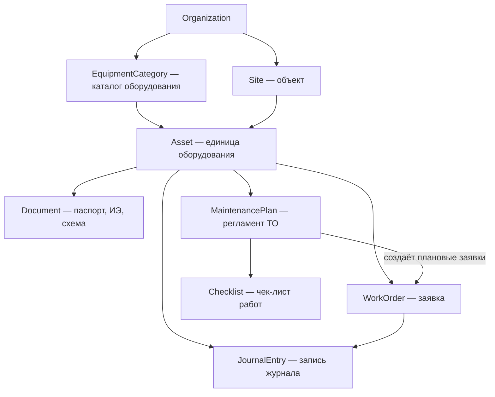

| Новая сущность | Назначение | Минимальные поля |
|----------------|------------|------------------|
| **EquipmentCategory** | Каталог **типов** оборудования (конфигурация системы); создаёт и редактирует только **admin** | id, orgId, name, parentId?, defaultChecklistId?, defaultFields[], isActive |
| **MaintenancePlan** | Регламент ТО актива (в малом бизнесе — простая периодичность, не полноценный ППР); создаётся как черновик Технологом при добавлении документации | id, assetId, title, интервал (дни/моточасы), checklistId, nextDueAt, isActive, source (ai_generated / manual / template) |
| **Checklist** | Шаблон работ для ТО или типовой заявки | id, title, items[] (текст, обязательность, фото-подтверждение), source |

Черновики агентов не требуют отдельной сущности: у Asset, WorkOrder и JournalEntry есть статус `draft` (см. стейт-машины §6), у записей — поле `source`.

Разделение ответственности за справочники:

- **admin (конфигурация):** `EquipmentCategory` — шаблоны типов оборудования; пользователи, роли, доступ к объектам, feature flags, настройки организации.
- **dispatcher (операции):** `Site`, `Asset` — объекты сети и единицы оборудования; загрузка документов; подтверждение draft от Паспортиста.
- Паспортист может заполнить `draft Asset` по фото шильдика, но активирует карточку **диспетчер**.
- Инженер использует существующий Asset: создаёт внеочередные заявки, смотрит документы, закрывает работы, но не ведёт справочники.

---

## 6. Стейты (обязательные машины состояний)

Правило проектирования для малого бизнеса: **минимум статусов в UI, полнота — в данных**. Ниже — обязательный набор.

### 6.1 WorkOrder (заявка) — ядро системы

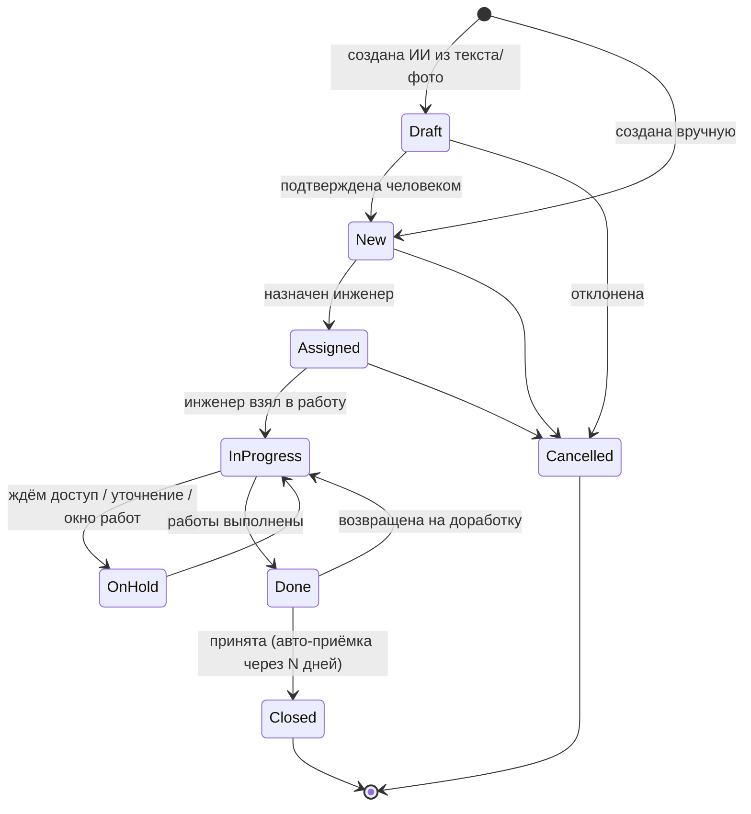

Обязательные статусы: `draft` (только для AI-созданных), `new`, `assigned`, `in_progress`, `on_hold`, `done`, `closed`, `cancelled`.

#### Жизнь заявки: от источника до журнала

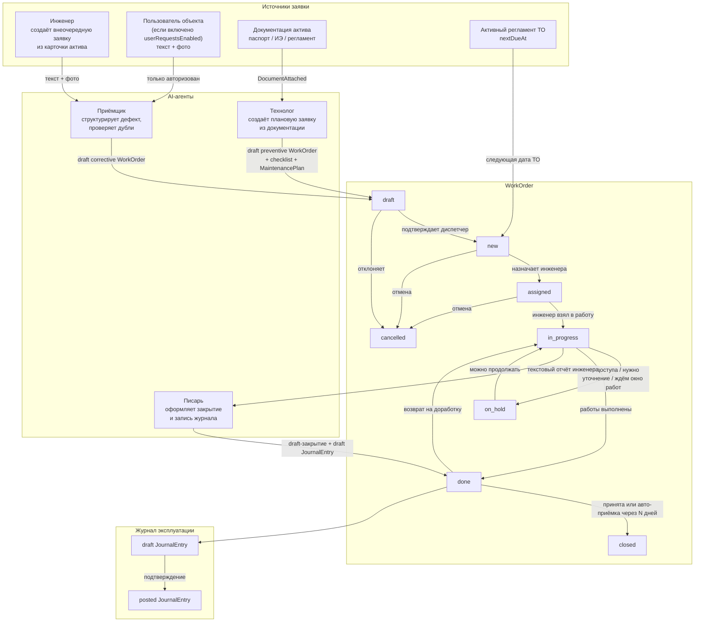

Разница источников:

- `corrective` / внеочередная заявка: создаётся инженером или авторизованным пользователем объекта (если включена фича), проходит через Приёмщика и попадает во `draft`.
- `preventive` / плановая заявка: создаётся Технологом при добавлении документации к активу или календарём активного регламента; дальше живёт как обычная WorkOrder. **Утверждает только диспетчер**.
- Закрытие всегда создаёт запись журнала: либо напрямую из закрытия, либо через черновик Писаря, который подтверждает человек.

Решения для малого бизнеса:

- **`draft` виден только как «входящие от ИИ»** — не засоряет доску диспетчера.
- **`assigned` и `in_progress` можно схлопнуть настройкой** (микро-сегмент: владелец сам и назначает, и делает).
- **Авто-закрытие `done → closed`** через настраиваемые N дней — у малого бизнеса нет процедуры приёмки.
- Просрочка — не статус, а вычисляемый флаг от `dueAt` (иначе комбинаторика статусов взрывается).

Кто создаёт внеочередные (`type = corrective`) заявки:

- **Инженер** — базовый и обязательный сценарий: создаёт заявку из карточки актива или из своего рабочего места после осмотра/обхода/сообщения с объекта.
- **Авторизованный пользователь объекта** — только если у организации включена фича `userRequestsEnabled`; создаёт заявку из QR-карточки актива или формы обращения.
- **Анонимный заявитель без аккаунта** — не входит в базовый скоуп. QR без авторизации открывает справочную карточку/контакт ответственного, но не создаёт WorkOrder.

Приёмщик может подготовить `draft WorkOrder` только для разрешённого источника. Если фича `userRequestsEnabled` выключена, вход от пользователя объекта не превращается в заявку; её должен завести инженер.

### 6.2 MaintenancePlan / плановое ТО

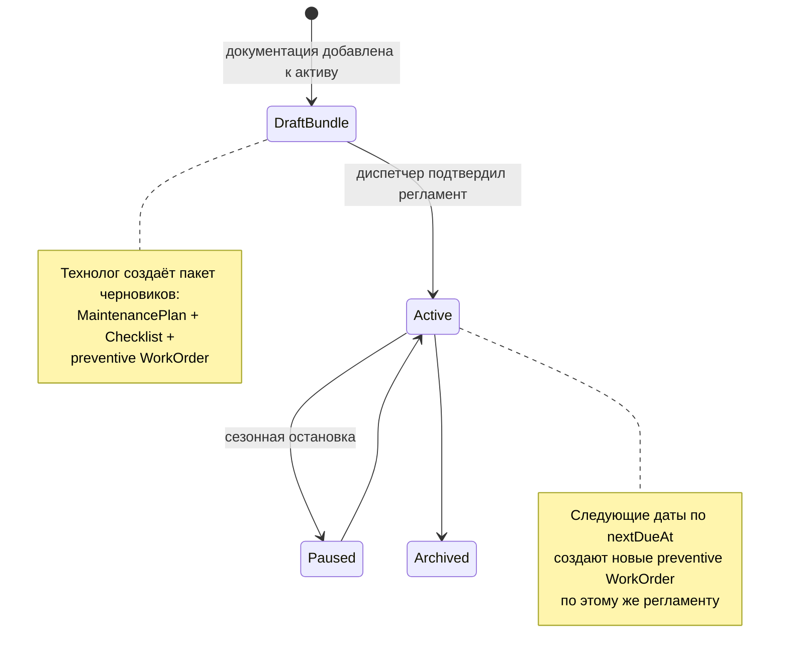

Плановое ТО **не имеет собственного цикла исполнения** — оно порождает обычную заявку. Один цикл статусов для исполнителя вместо двух — критично для простоты.

Ключевое правило: **при добавлении документации к активу агент Технолог сразу создаёт связанный пакет черновиков**:

1. `MaintenancePlan` — что и как часто делать.
2. `Checklist` — шаги выполнения.
3. `WorkOrder` типа `preventive` в статусе `draft` — первая плановая заявка на ремонт/ТО.

Если в документации указаны расходники или запчасти, Технолог добавляет это как текстовую пометку в чек-лист («проверить наличие/подготовить ...»), но **не создаёт складскую заявку**. **Диспетчер** подтверждает пакет целиком или редактирует отдельные части. После подтверждения: регламент становится `active`, плановая заявка переходит `draft → new`.

### 6.3 JournalEntry (запись журнала)

Журнал — append-only (требование compliance: история без правок задним числом):

- `draft` → `posted` (для AI-оформленных из текстового отчёта и авто-записей из заявок);
- `posted` → `voided` (сторнирование отдельной записью-исправлением, оригинал не удаляется).

Записи создаются: вручную исполнителем; автоматически при закрытии заявки; агентом Писарь из текстового отчёта.

### 6.4 Asset (единица оборудования)

`draft` (создан диспетчером вручную или подготовлен Паспортистом, не подтверждён) → `active` (подтвердил диспетчер) → `inactive` (законсервирован) → `retired` (списан). Плюс вычисляемый операционный флаг `down` (есть открытая заявка с признаком «оборудование остановлено») — для дашборда диспетчера.

### 6.5 Что сознательно НЕ делаем в стейтах (v1–2)

- Согласование заявок по цепочке (enterprise-паттерн 1С:ТОиР).
- Склад ЗИП, кладовщик, заявки на запчасти, списания, остатки, закупки и резервирование ЗИП под наряд.
- SLA-эскалации с уровнями (Okdesk/HubEx-территория) — только флаг просрочки и напоминание.

---

## 7. Рабочие места (обязательные)

### 7.1 Матрица ролей

| Роль | Устройство | Обязательность |
|------|-----------|----------------|
| **Admin** | Web (только настройки) | Обязательна |
| **Диспетчер** (dispatcher) | Web | Обязательна |
| **Инженер** (engineer: инженер / техник / мастер) | Мобильное приложение (Android приоритет) | Обязательна |
| **Пользователь объекта** (requester: продавец, повар, оператор) | Авторизованный web/mobile/бот; создание внеочередных заявок только при включённой фиче `userRequestsEnabled` | Опциональна — можно не подключать, тогда внеочередные заявки заводит инженер |
| **Репортёр / менеджер отчётов** (reporter) | Web | Опциональна — read-only роль для формирования любых отчётов в пределах доступных объектов |

Ключевые отличия от enterprise-ТОиР: **planner/инженер по надёжности отсутствует** — его функцию (составление регламентов и чек-листов) выполняет агент Технолог + **подтверждение диспетчера**; **нет отдельного разделения engineer/technician** — есть одна роль `engineer`; **contractor не входит в первые релизы**; **admin отвечает только за конфигурацию системы**, операционные справочники (объекты, активы, документы) ведёт **диспетчер**; **склада и кладовщика в первых релизах нет**.

Важно не путать роли:

- **admin** — конфигурация: пользователи, роли, доступ к объектам, feature flags, настройки организации, каталог **типов** оборудования (`EquipmentCategory`). **Не** создаёт активы, **не** загружает документы, **не** подтверждает заявки.
- **dispatcher** — операции: объекты (`Site`), единицы оборудования (`Asset`), документы, доска заявок, подтверждение черновиков ИИ, календарь ТО.
- `requester` — пользователь объекта, который может создать обращение только при включённой фиче `userRequestsEnabled`.
- `reporter` — менеджер отчётов; read-only отчёты и выгрузки.

В микро-сегменте (1–3 объекта) один владелец часто **совмещает** роли admin + dispatcher + reporter, но в системе это **разные права** — не смешиваем конфигурацию с операциями.

### 7.2 Рабочее место инженера (мобильное)

Экраны: Мои заявки (сегодня/просрочено) → Карточка заявки (чек-лист, фото, документы актива, чат с Наставником «спроси по инструкции») → Закрытие текстовым отчётом (написал коротко — Писарь оформил) → Сканер QR (открыть актив/создать заявку у агрегата).

Требования: офлайн-черновики (объекты с плохой связью), крупные элементы UI, максимум 2 тапа до создания заявки.

### 7.3 Рабочее место диспетчера (web)

Экраны: Доска заявок по сети → **Входящие от ИИ** (draft от Приёмщика, пакеты Технолога) → **Объекты и оборудование** (Site, Asset, подтверждение draft от Паспортиста, QR) → **Документы** (загрузка паспортов/ИЭ к активу) → Календарь ТО → Журналы (просмотр).

### 7.3.1 Рабочее место admin (web, только конфигурация)

Экраны: **Настройки организации** → **Пользователи и роли** (invite, назначение ролей) → **Доступ к объектам** (`user_site_access`) → **Feature flags** (`userRequestsEnabled` и др.) → **Каталог типов оборудования** (`EquipmentCategory` — шаблоны, не сами активы).

Admin **не видит** операционную доску заявок и **не подтверждает** черновики ИИ — это зона диспетчера.

### 7.4 Рабочее место репортёра / менеджера отчётов (web)

Репортёр работает только в read-only режиме. Экраны: Конструктор отчёта → фильтры (объекты, период, тип заявки, статус, актив, инженер) → таблица/графики → экспорт PDF/Excel → сохранённые шаблоны отчётов. Отчёты формируются обычными запросами к базе и предрасчитанным агрегатам, без AI-агента и без текстовых промптов.

### 7.5 Рабочее место пользователя объекта / заявителя

QR-стикер на оборудовании (генерируется при создании актива — как у Limble) открывает карточку оборудования. Если фича `userRequestsEnabled` включена и пользователь авторизован, он может отправить текст + фото дефекта → Приёмщик создаёт `draft WorkOrder` с уже определённым активом. Если фича выключена, QR работает только как справочная карточка/контакт ответственного, а внеочередную заявку заводит инженер.

### 7.6 Схема взаимодействия ролей и агентов

Общая карта: кто с кем и чем обменивается. AI-слой — реестр специализированных агентов (§4.2); каждый вызывается своим контекстом, всё созданное агентами проходит подтверждение человеком (инварианты §4.1).

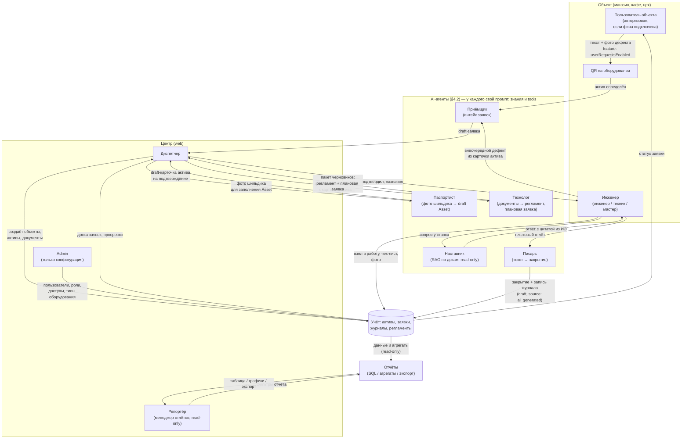

Ключевые контуры на схеме:

1. **Заявочный** (инженер или авторизованный пользователь при включённой фиче → Приёмщик → диспетчер → инженер → учёт): внеочередную заявку нельзя создать анонимно. QR только определяет актив и открывает разрешённое действие; Приёмщик структурирует, ищет дубли и проверяет feature flag, диспетчер подтверждает и назначает.
2. **Исполнительский** (инженер ↔ Наставник/Писарь ↔ учёт): у станка инженера обслуживают два разных агента — read-only Наставник отвечает по документации, Писарь оформляет сказанное в закрытие и журнал; журнал пополняется как побочный эффект работы.
3. **Справочный / плановый** (диспетчер → Паспортист/Технолог → учёт): объекты и единицы оборудования создаёт **диспетчер**; admin только настраивает типы (`EquipmentCategory`). Паспортист помогает заполнить карточку по шильдику. При добавлении документации Технолог создаёт пакет черновиков — **диспетчер** подтверждает.
4. **Отчётный / управленческий** (учёт → отчётный модуль → руководитель/reporter): руководитель смотрит дашборд и выгружает журналы к проверке; reporter формирует любые read-only отчёты в рамках доступа. AI здесь не используется.

Сквозной сценарий (микро-сегмент, все центральные роли — один человек):

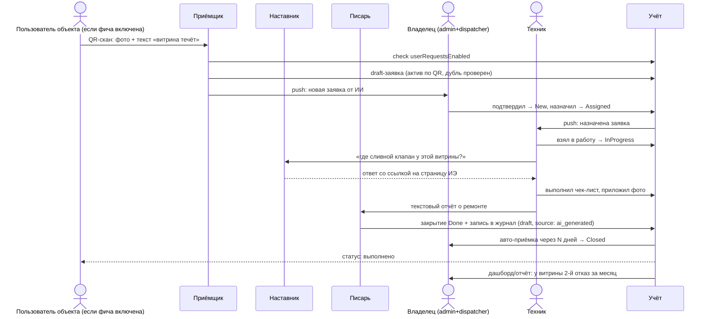

Каждый агент в сценарии видит только своё: Приёмщик — активы объекта и открытые заявки, Наставник — документы конкретной витрины, Писарь — текущую заявку. Отчёты строятся не агентом, а read-only модулем отчётности поверх базы.

Сценарий плановой работы из документации:

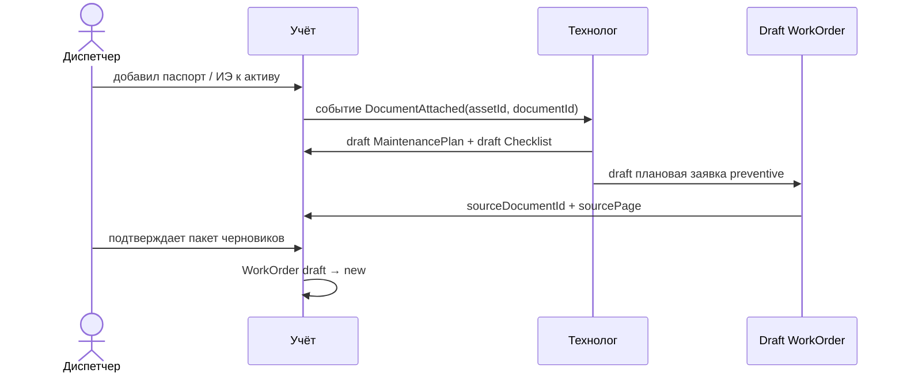

Критично: плановая заявка создаётся **агентом Технологом из документации** и связана с регламентом/чек-листом. Если в документации указаны расходники или запчасти, это остаётся текстовой пометкой в чек-листе до появления складского контура в backlog.

---

## 8. Технический контур (кратко, в связке с B2B_MVP_SCOPE)

| Слой | Решение |
|------|---------|
| Клиенты | KMP (Decompose, MVIKotlin) — Android для инженера, Web для диспетчера (как в B2B_MVP_SCOPE); авторизованный web/mobile/бот для пользователей объекта только при включённой фиче `userRequestsEnabled` |
| **Auth** | **Zitadel Cloud** — внешний OIDC-провайдер; вход только по **email + пароль**, регистрация **только по invite** (§8.1) |
| Backend | **Микросервисы** (§8.2): 7 bounded-context сервисов + API Gateway; PostgreSQL per service; NATS для событий; MinIO для файлов |
| AI-слой | Мультиагентный (§4.2): общий рантайм агентов + декларативные определения (промпт, источники знаний, tools, модель — конфиг на агента); RAG-инфраструктура (Onyx-контур из B2C Atlant) как разделяемый сервис, но индексы скоупятся на агента |
| Маршрутизация | Детерминированная: канал входа / экран / тип действия → конкретный агент; без агента-оркестратора |
| AI-провайдеры | Абстракция над моделями на уровне рантайма: каждому агенту — свой tier (дешёвые на Приёмщика/Писаря, тяжёлые на Технолога); для РФ-рынка — вариант с YandexGPT/GigaChat для клиентов с требованиями к локализации данных |
| Отчёты | SQL/ORM-запросы + предрасчитанные агрегаты + экспорт PDF/Excel; без LLM/AI-агента |
| Качество | Per-agent eval-наборы и метрики (§4.2); логирование вызовов агентов для разбора ошибок извлечения |

### 8.1 Авторизация (Zitadel Cloud)

Аутентификация вынесена во **внешний облачный сервис** — не храним пароли в своём backend. Выбран **Zitadel Cloud** (managed OIDC): B2B-модель организаций из коробки, фиксированные роли, стандартный OIDC для KMP/Android и Web.

#### Методы входа (первые релизы)

| Метод | Статус |
|-------|--------|
| **Email + пароль** | ✅ единственный способ входа |
| Регистрация по invite | ✅ admin приглашает пользователя на email |
| Self-signup | ❌ отключён |
| Magic link / email OTP | backlog |
| Телефон (логин, SMS, MFA) | backlog |
| Social login (Google, Microsoft) | backlog |
| SSO / SAML для enterprise | backlog |

#### Модель в Zitadel

| Сущность Zitadel | Соответствие в TOiR |
|------------------|---------------------|
| Instance | Продукт Masterdoc (один tenant SaaS) |
| Organization | Клиент — малая компания (1–50 объектов) |
| User | Сотрудник клиента |
| Project role | Фиксированная роль системы: `admin`, `dispatcher`, `engineer`, `requester`, `reporter` |
| Invite | Admin приглашает пользователя по email → пользователь задаёт пароль |

Кастомные роли в первых релизах **не создаём** — только пять фиксированных ролей из §7.1.

Ограничение доступа к **объектам (Site)** хранится в нашем backend (таблица `user_site_access`), а не в Zitadel: JWT даёт `org_id` + `roles`, API дополнительно проверяет `site_ids` для конкретного запроса.

#### Поток входа

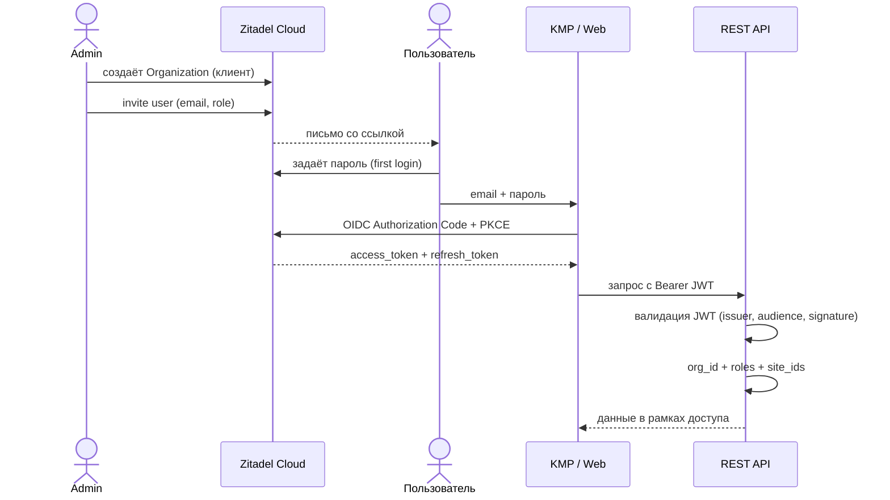

#### Интеграция по клиентам

| Клиент | Протокол |
|--------|----------|
| Web (диспетчер, admin, reporter) | OIDC Authorization Code + PKCE |
| Android (инженер) | OIDC Authorization Code + PKCE (AppAuth или аналог) |
| REST API | Middleware: проверка JWT, извлечение `sub`, `org_id`, `roles`; пароли не храним |

Backend **не реализует** `POST /auth/login` с собственной сессией — клиент получает токены напрямую от Zitadel, API только валидирует JWT. Refresh token — на стороне клиента по стандартному OIDC flow.

#### Что admin делает (только конфигурация)

1. Создаёт организацию клиента (при подключении).
2. Приглашает пользователей по email и назначает роль (`admin`, `dispatcher`, `engineer`, `requester`, `reporter`).
3. Назначает доступ к объектам (`user_site_access`).
4. Настраивает feature flags (`userRequestsEnabled` и др.).
5. Ведёт каталог **типов** оборудования (`EquipmentCategory`).

Admin **не** подтверждает заявки, **не** создаёт активы, **не** загружает документы — это диспетчер.

#### Почему Zitadel Cloud, а не альтернативы

| Сервис | Вердикт для TOiR |
|--------|------------------|
| **Zitadel Cloud** | ✅ выбран: B2B org + роли, облако, OIDC, нейтрален к стеку (KMP + REST) |
| Clerk | Хорош для React/Next.js, но сильнее привязан к фронтенд-экосистеме |
| Auth0 | Избыточен и дороже для MVP с 1–20 пользователями на клиента |
| Supabase / Firebase Auth | Org + RBAC пришлось бы строить в своём backend |

### 8.2 Микросервисная архитектура backend

Принцип: **разделяем по bounded context и скорости изменений**, а не «один микросервис = одна таблица». Для малого бизнеса (1–50 объектов, 1–20 инженеров) не нужно 20 сервисов — нужно **7 логических контуров**, которые можно деплоить независимо и масштабировать точечно (AI, search, reports).

> **Решение по плановому ТО:** отдельный `maintenance-service` **не выделяем**. Регламенты, чек-листы и плановые заявки живут в **dashboard-service** — это те же `WorkOrder`, но с типом `preventive` вместо `corrective`. Одна стейт-машина, один журнал, один календарь.

#### Три варианта (и выбор)

| Вариант | Состав | Плюсы | Минусы | Вердикт |
|---------|--------|-------|--------|---------|
| **A. Модульный монолит** | 1 deployable, модули внутри | Быстрый старт, простые транзакции | AI и отчёты тянут весь релиз; сложнее масштабировать RAG | Слишком тесная связка для AI-контура |
| **B. Прагматичные микросервисы** | 7 сервисов + gateway | Независимый релиз AI/docs/reports; чёткие границы данных | Нужен брокер и контракты событий | ✅ **выбран** |
| **C. Мелкие микросервисы** | 15+ (Site, Asset, WO, Journal…) | Максимальная изоляция | Overhead для команды и 1–20 юзеров на клиента | Overkill для MVP |

#### Карта сервисов

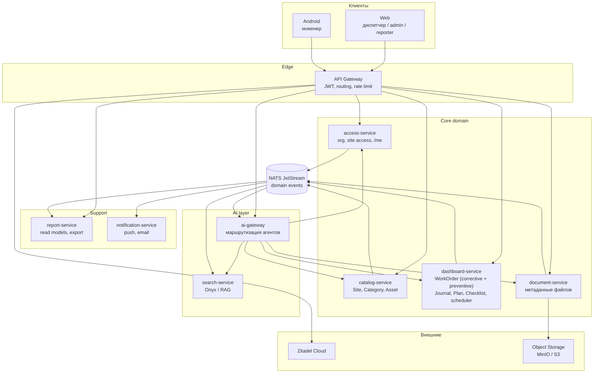

#### Подробно: за что отвечает каждый сервис

Ниже — не таблица полей, а **смысл сервиса**: какую бизнес-задачу он закрывает, кто им пользуется и где его граница.

---

##### API Gateway — единая входная дверь

**Задача:** принять запрос от KMP/Web, проверить JWT от Zitadel и направить в нужный внутренний сервис.

| Делает | Не делает |
|--------|-----------|
| Проверяет токен, режет по rate limit | Бизнес-логику заявок, активов, отчётов |
| Маршрутизирует `/api/v1/work-orders` → dashboard-service | Хранение данных |
| Пробрасывает `orgId`, `userId`, `roles` во внутренние заголовки | Решает, на какие объекты у пользователя доступ — это access-service |

**Пример:** инженер открывает список заявок → gateway проверяет JWT → пересылает в dashboard-service с заголовком `X-Org-Id`.

---

##### access-service — кто ты и куда тебе можно

**Задача:** всё, что Zitadel **не** хранит про наш продукт: настройки организации, доступ к объектам, feature flags.

**Владеет данными:**
- `org_settings` — название сети, часовой пояс, лимиты
- `user_site_access` — какой пользователь видит какие объекты (Site)
- `feature_flags` — например `userRequestsEnabled` (могут ли пользователи объекта создавать заявки)

**Кто пользуется:**

| Роль | Действие |
|------|----------|
| admin | Назначает доступ к объектам; включает feature flags; настройки организации |
| все | `GET /me` — профиль: email, роль, список доступных объектов |
| ai-gateway | `checkFeatureFlag` — может ли requester создать заявку |

**Не делает:**
- Не логинит (это Zitadel)
- Не создаёт объекты и оборудование (это catalog)
- Не хранит заявки

**Пример:** диспетчер видит заявки только по 5 магазинам из 12 — потому что в `user_site_access` у него только эти `siteId`.

---

##### catalog-service — справочник «где и что стоит»

**Задача:** операционные справочники (`Site`, `Asset`) и каталог **типов** (`EquipmentCategory`). Типы — конфигурация (CRUD только **admin**); объекты и активы — операции (CRUD **диспетчер**).

**Владеет данными:**
- `Site` — магазин, кафе, цех (dispatcher)
- `EquipmentCategory` — шаблоны типов оборудования (**admin**)
- `Asset` — конкретная единица (dispatcher)

**Кто пользуется:**

| Роль | Действие |
|------|----------|
| **admin** | CRUD `EquipmentCategory` |
| **dispatcher** | CRUD `Site`, `Asset`; подтверждает `draft Asset` от Паспортиста; QR |
| engineer | Читает карточку, сканирует QR |
| ai-gateway (Паспортист) | `createDraftAsset` |

**Не делает:** заявки, журнал, файлы, плановое ТО.

**Пример:** admin создал тип «Кофемашина» → диспетчер создал объект и актив «Saeco №1» → QR.

**События:** `asset.draft.created`, `asset.activated` — подтверждает диспетчер.

---

##### dashboard-service — заявки, журнал и плановое ТО (ядро ТОиР)

**Задача:** весь **операционный цикл** — от появления заявки до записи в журнал — плюс **плановое ТО**. Внеочередной ремонт и плановое обслуживание — это **одна сущность `WorkOrder`**, различаются полем `type`:

| `WorkOrder.type` | Когда создаётся | Кто создаёт |
|------------------|-----------------|-------------|
| `corrective` | Поломка, дефект | engineer, requester (если фича), Приёмщик (draft) |
| `preventive` | Регламент / календарь ТО | Технолог (draft), scheduler по `MaintenancePlan` |

**Владеет данными:**
- `WorkOrder` — заявка любого типа, общая стейт-машина §6.1
- `JournalEntry` — запись журнала (ТО, неисправность, устранение)
- `WorkOrderChecklistItem` — выполнение пунктов чек-листа **на конкретной заявке**
- `MaintenancePlan` — регламент на актив: интервал, `nextDueAt` (фаза 2)
- `Checklist` — шаблон работ, привязанный к плану или типу заявки (фаза 2)
- **Scheduler** (внутри сервиса) — cron: `nextDueAt` наступил → создаёт `WorkOrder` типа `preventive`

**Кто пользуется:**

| Роль | Действие |
|------|----------|
| engineer | Создаёт внеочередную (`corrective`) заявку с карточки актива |
| engineer | Берёт в работу, отмечает чек-лист, закрывает — **любой тип** |
| dispatcher | Подтверждает draft, назначает, смотрит календарь ТО |
| requester | Создаёт обращение (если фича) → draft `corrective` |
| dispatcher | Подтверждает пакет черновиков от Технолога (план + checklist + preventive WO) |
| ai-gateway (Приёмщик) | `createDraftWorkOrder(type: corrective)` |
| ai-gateway (Писарь) | `draftCloseout` + `draftJournalEntry` |
| ai-gateway (Технолог) | `createDraftPlan` + `createDraftChecklist` + `createDraftWorkOrder(type: preventive)` |
| scheduler (внутренний) | `createWorkOrder(type: preventive)` по `MaintenancePlan.nextDueAt` |

**Не делает:**
- Не хранит PDF документы (document-service)
- Не шлёт push (публикует событие → notification-service)
- Не хранит справочник активов (catalog-service)

**Примеры:**

1. **Внеочередная:** инженер сканирует QR → `corrective` → диспетчер назначает → закрытие → журнал.
2. **Плановая (фаза 2):** диспетчер загрузил ИЭ → Технолог создал draft-пакет → диспетчер подтвердил → scheduler создаёт `preventive` → инженер выполняет.

**События:** `work_order.draft.created`, `work_order.status.changed`, `work_order.closed`, `journal.entry.created`, `maintenance_plan.approved` (внутреннее, тот же publisher — dashboard).

**API (фаза 2 добавляет к базовым):** `GET/POST /maintenance-plans`, `GET/POST /checklists`, `GET /work-orders/calendar?type=preventive`.

---

##### document-service — файлы и привязка к оборудованию

**Задача:** загрузить, сохранить и отдать файлы (паспорт, ИЭ, схема, фото к заявке). Сам файл лежит в S3; сервис хранит **метаданные** и связь «этот PDF → этот Asset».

**Владеет данными:**
- `Document` — id, orgId, assetId?, workOrderId?, type, fileName, s3Key, uploadedBy, uploadedAt

**Кто пользуется:**

| Роль | Действие |
|------|----------|
| dispatcher | Загружает паспорт к активу |
| engineer | Смотрит ИЭ на карточке актива; прикладывает фото к заявке |
| search-service | Получает событие и индексирует PDF |
| ai-gateway (Технолог) | Читает метаданные документа для анализа |

**Не делает:**
- Не парсит PDF и не отвечает на вопросы (search + ai-gateway)
- Не создаёт регламенты (dashboard-service)
- Не меняет карточку актива

**Пример:** диспетчер загрузил `passport_vitrina.pdf` к активу «Витрина №2» → search индексирует → Технолог (фаза 2) создаёт draft-пакет.

---

##### report-service — отчёты и выгрузки (только чтение)

**Задача:** собрать данные для руководителя и reporter: просрочки, журналы за период, повторяющиеся поломки, экспорт PDF/Excel. **Никогда не пишет** в учёт.

**Владеет данными:**
- Денормализованные **read models** (копии для быстрых запросов)
- `report_templates` — сохранённые фильтры reporter
- `export_jobs` — очередь генерации PDF/Excel

**Кто пользуется:**

| Роль | Действие |
|------|----------|
| dispatcher | Дашборд: просроченные заявки по сети |
| reporter | Выгрузка журнала за квартал, конструктор отчётов |

**Не делает:**
- Не создаёт и не меняет заявки
- Не вызывает LLM (отчёты = SQL, не AI)
- На MVP может читать read-replica dashboard_db напрямую; позже — только свои проекции из событий

**Пример:** reporter выбирает «все заявки по магазину №3 за март, статус done» → report-service отдаёт таблицу и файл Excel.

**События:** слушает `work_order.*`, `journal.entry.created` — обновляет проекции.

---

##### notification-service — доставка уведомлений

**Задача:** когда в системе что-то случилось — **донести до человека** push или email. Сам бизнес-событий не создаёт.

**Владеет данными:**
- `notification_preferences` — кому какой канал
- `delivery_log` — что отправили, доставлено ли
- Очередь исходящих сообщений

**Кто пользуется:**

| Триггер | Кому | Канал |
|---------|------|-------|
| `work_order.draft.created` | dispatcher | push: «Новая заявка от ИИ» |
| `work_order.status.changed` → assigned | engineer | push: «Вам назначена заявка» |
| `asset.draft.created` | dispatcher | push: «Подтвердите карточку актива» |
| `work_order.closed` | requester | push: «Заявка выполнена» |

**Не делает:**
- Не решает логику заявок
- Не хранит заявки
- Не формирует отчёты

**Пример:** инженер закрыл заявку → dashboard публикует событие → notification шлёт push диспетчеру и requester.

---

##### ai-gateway — ИИ-агенты (только черновики)

**Задача:** запустить нужного агента (§4.2), дать ему **узкий контекст**, вызвать LLM/VLM, через tools создать **draft** в других сервисах. Человек подтверждает — только тогда данные попадают в учёт.

**Владеет данными:**
- `agent_run_log` — кто, когда, какой агент, вход, выход, latency, cost
- Конфиг агентов: промпт, модель, список tools

**Агенты и их «рабочие места»:**

| Агент | Вход | Куда пишет draft | Читает у |
|-------|------|------------------|----------|
| Паспортист | фото шильдика | catalog: draft Asset | catalog (категории) |
| Приёмщик | текст + фото дефекта | dashboard: draft WorkOrder | catalog, dashboard, access |
| Наставник | вопрос инженера | **ничего** (read-only) | search, dashboard (история) |
| Писарь | текстовый отчёт | dashboard: draft closeout + journal | dashboard (текущая заявка) |
| Технолог | событие document.attached | dashboard: draft plan, checklist, preventive WO | document, catalog |

**Не делает:**
- Не подтверждает черновики (человек)
- Не хранит активы и заявки как source of truth
- Не выбирает агента через LLM — маршрут **детерминирован** (экран/endpoint → агент)

**Пример:** инженер пишет «заменил уплотнитель, течь ушла» → Писарь → draft «дефект: трещина уплотнителя; действие: замена; результат: без течи» → инженер жмёт «подтвердить».

---

##### search-service — поиск и RAG по документам

**Задача:** проиндексировать PDF/ИЭ и отдавать **релевантные фрагменты** для Наставника и текстового поиска в UI.

**Владеет данными:**
- Индексы Onyx (per org / per asset)
- `search_db` — статус индексации, documentSetId

**Кто пользуется:**

| Роль / сервис | Действие |
|---------------|----------|
| engineer | Текстовый поиск «сливной клапан» по документам актива |
| ai-gateway (Наставник) | `searchDocs(assetId, query)` → фрагменты с номером страницы |
| document-service | Триггер: `document.attached` → переиндексация |

**Не делает:**
- Не хранит оригиналы файлов
- Не отвечает пользователю напрямую (Наставник формулирует ответ)
- Не создаёт регламенты

**Пример:** инженер спрашивает «где сливной клапан?» → Наставник → search находит стр. 14 ИЭ → ответ с цитатой.

---

##### Внешние компоненты (не наши микросервисы)

| Компонент | Задача |
|-----------|--------|
| **Zitadel Cloud** | Логин email+пароль, invite, роли в JWT |
| **S3 / MinIO** | Хранение бинарников: PDF, фото |
| **Onyx** | Движок RAG внутри search-service |

---

##### Как сервисы делят одну задачу (шпаргалка)

| Бизнес-задача | Кто ведёт |
|---------------|-----------|
| «Где стоит оборудование?» | catalog |
| «Что сломалось и кто чинит?» | dashboard |
| «Что мы делали с этим агрегатом год назад?» | dashboard (journal) + report |
| «Где инструкция?» | document (файл) + search (поиск) + ai (ответ) |
| «Когда следующее ТО?» | dashboard (`MaintenancePlan` + `WorkOrder` type=preventive) |
| «Сколько просрочек по сети?» | report |
| «Кто может видеть магазин №3?» | access |
| «Кто залогинен?» | Zitadel |
| «ИИ предложил регламент — что дальше?» | ai → dashboard (draft-пакет) → **диспетчер** подтверждает |

#### Сервисы: владение данными и API (краткая таблица)

| Сервис | Владеет (write model) | Публичные маршруты (через gateway) | Внутренние вызовы |
|--------|----------------------|-------------------------------------|-------------------|
| **access-service** | `org_settings`, `user_site_access`, `feature_flags` (`userRequestsEnabled`) | `GET /me`, `GET/PUT /org/settings`, `GET/PUT /users/{id}/sites` | Читает claims из JWT; кэш профиля |
| **catalog-service** | `Site`, `EquipmentCategory`, `Asset` | `GET/POST /sites`, `GET/POST /assets`, `GET/POST /equipment-categories`, `POST /assets/from-photo` → draft | Отдаёт asset/site по id для dashboard/ai |
| **dashboard-service** | `WorkOrder` (type: `corrective` \| `preventive`), `JournalEntry`, `MaintenancePlan`, `Checklist`, чек-лист на заявке, scheduler | `GET/POST /work-orders`, `PATCH /work-orders/{id}/status`, `GET/POST /journal-entries`, `GET/POST /maintenance-plans`, `GET/POST /checklists`, `GET /work-orders/calendar`, `POST /work-orders/text`, `POST /work-orders/{id}/closeout/text` | Стейт-машина §6.1; scheduler создаёт preventive WO внутри сервиса |
| **document-service** | `Document` (метаданные), ссылки на blob | `POST /documents`, `GET /documents/{id}`, `GET /assets/{id}/documents` | Upload в S3; после commit → `document.attached` |
| **report-service** | read models, `report_templates`, `export_jobs` | `GET /reports/*`, `GET /export/journal`, `POST /reports/run` | Только read; строит проекции из событий |
| **notification-service** | `notification_preferences`, `delivery_log` | `GET /notifications`, `PUT /notifications/preferences` | Слушает события; FCM/APNs, SMTP |
| **ai-gateway** | `agent_run_log`, конфиг агентов | `POST /ai/passportist`, `POST /ai/intake`, `POST /ai/mentor`, `POST /ai/scribe`, `POST /ai/technologist` | Детерминированная маршрутизация §4.2; tools → draft в catalog/dashboard |
| **search-service** | индексы Onyx per asset/org | `GET /search/docs`, `POST /search/reindex` | Индексирует по `document.attached`; read-only для Наставника |

**Auth (Zitadel)** и **blob storage (S3/MinIO)** — внешние; не наши микросервисы.

#### Базы данных

| Сервис | БД | Примечание |
|--------|-----|------------|
| access | `access_db` | Мало данных, частые чтения — Redis-кэш site access |
| catalog | `catalog_db` | Asset + Category + Site |
| dashboard | `dashboard_db` | WorkOrder (corrective + preventive), JournalEntry, MaintenancePlan, Checklist, scheduler |
| document | `document_db` | Метаданные; файлы в S3 |
| report | `report_db` | Денормализованные проекции; можно отставать от write |
| notification | `notification_db` | Очередь доставки, лог |
| ai-gateway | `ai_db` | Логи вызовов, eval-метрики |
| search | Onyx + `search_db` | Метаданные индексов |

На MVP допустим **один PostgreSQL-кластер с отдельной schema per service** — границы логические, миграция на physical split без смены контрактов.

#### События (NATS JetStream)

Асинхронная связь вместо распределённых транзакций. Формат: CloudEvents, envelope с `orgId`, `actorId`, `correlationId`.

| Событие | Publisher | Consumers | Зачем |
|---------|-----------|-----------|-------|
| `asset.draft.created` | catalog | notification | Диспетчеру: подтвердить карточку от Паспортиста |
| `document.attached` | document | search, ai-gateway | Индексация + Технолог (фаза 2) → draft в dashboard |
| `work_order.draft.created` | dashboard | notification | Диспетчеру: подтвердить draft от Приёмщика или Технолога |
| `work_order.status.changed` | dashboard | notification, report | Push + обновление проекций |
| `work_order.closed` | dashboard | report | Агрегаты просрочек, повторов |
| `journal.entry.created` | dashboard | report | Журналы в выгрузках |
| `maintenance_plan.approved` | dashboard | notification | Диспетчеру: регламент активирован, первая preventive WO создана |

**Правило:** AI-агенты **не пишут напрямую** в чужие сервисы — только `createDraft*` через внутренний API catalog/dashboard (инвариант §4.1). Плановое ТО — те же `WorkOrder` с `type: preventive`, без отдельного сервиса.

#### Сквозные сценарии

**Внеочередная заявка (фаза 1.1):**

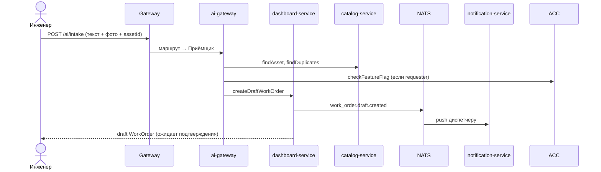

**Добавление документации → Технолог (фаза 2):**

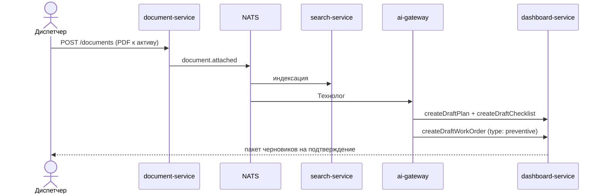

#### API Gateway

| Задача | Реализация |
|--------|------------|
| TLS termination | Traefik / nginx ingress |
| JWT validation | JWKS от Zitadel; кэш ключей |
| Routing | `/api/v1/sites` → catalog, `/api/v1/work-orders` → dashboard, … |
| Rate limiting | Per org_id; жёстче на `/ai/*` |
| CORS | Только домены web-клиента |
| Request context | Проброс `X-Org-Id`, `X-User-Id`, `X-Roles` в internal headers после валидации JWT |

Клиенты ходят **только в gateway**. Service-to-service — internal network + mTLS или signed service JWT.

#### Стек и деплой

| Компонент | Выбор | Почему |
|-----------|-------|--------|
| Язык сервисов | **Kotlin + Ktor** (или Spring Boot) | Единый стек с KMP-командой; хорошая поддержка coroutines |
| API | REST + OpenAPI 3 | Ktor client на KMP уже есть |
| Брокер | **NATS JetStream** | Легче Kafka для нашего масштаба; persistence из коробки |
| Object storage | MinIO (dev) / S3-compatible (prod) | Документы и фото |
| Миграции | Flyway per service | Независимые schema |
| Observability | OpenTelemetry + structured logs | `correlationId` сквозь gateway → ai → dashboard |
| Деплой MVP | Docker Compose (dev), Kubernetes (prod) | 7 сервисов + gateway + NATS + PG + MinIO |

#### Фазы выката сервисов

| Фаза | Деплои | Комментарий |
|------|--------|-------------|
| **MVP** | gateway, access, catalog, dashboard, document, report (stub) | catalog+dashboard — критический путь; report может читать dashboard_db read-replica на старте |
| **1.1** | + ai-gateway, search, notification | Приёмщик, Наставник, Писарь, push |
| **2** | dashboard-service: + MaintenancePlan, Checklist, scheduler, календарь | Технолог (draft-пакет в dashboard) |
| **3** | report → полноценные проекции | Конструктор отчётов для reporter |

На MVP допустимо **физически объединить** `catalog + dashboard` в один deployable (`core-service`), но **логически держать раздельными модулями** с разными schema и контрактами — чтобы split был без переписывания.

#### Антипаттерны (чего не делаем)

- **Распределённые 2PC-транзакции** — только saga через события; draft-пакет Технолога: partial failure → retry + dead letter
- **Общая write-БД** на все сервисы — только read-replica для report
- **Синхронные цепочки** gateway → ai → dashboard → catalog → notification в одном HTTP-запросе — AI отвечает быстро с draft id, push уходит асинхронно
- **Агент-оркестратор** — маршрутизация детерминирована (§4.2), не LLM-роутер

Новые endpoint'ы поверх черновика API из B2B_MVP_SCOPE: `POST /assets/from-photo` (шильдик → draft), `POST /documents` (добавление документации к активу → событие для Технолога), `POST /documents/{id}/analyze-maintenance` (ручной перезапуск анализа), `GET/POST /maintenance-plans`, `POST /work-orders/text` (текст/фото → draft), `POST /work-orders/{id}/closeout/text`.

---

## 9. Roadmap (дельта к фазам B2B_MVP_SCOPE)

| Фаза | Содержание | AI-агенты |
|------|------------|-----------|
| **1 MVP** | Сущности и экраны по B2B_MVP_SCOPE: объекты, каталог типов, единицы оборудования, заявки, журнал, документы, выгрузка | Паспортист (draft-карточка актива для подтверждения диспетчером) |
| **1.1** | Фото, push, QR-карточка актива, опциональные заявки от авторизованных пользователей объекта | Приёмщик (текст/фото → draft-заявка от инженера или авторизованного пользователя при включённой фиче), Наставник (чат по докам на активе), Писарь (текстовое закрытие) |
| **2** | MaintenancePlan + Checklist, календарь ТО | Технолог (при добавлении документации: draft-регламент + draft-плановая заявка + checklist) |
| **3** | Конструктор отчётов для reporter; дашборды руководителя из базы | AI не используется |
| **Backlog** | Склад ЗИП и кладовщик; заявки на запчасти; внешний инженер/contractor не в штате | Возвращаем по сигналам custdev |

Сдвиг относительно B2B_MVP_SCOPE: регламенты ТО (там фаза 3) поднимаются в фазу 2, потому что AI-генерация из ИЭ снимает главную причину, по которой ППР был «тяжёлым». Склад ЗИП и кладовщик, которые раньше рассматривались как фаза 2, теперь сознательно вынесены в backlog.

---

## 10. Позиционирование против конкурентов (сообщение)

> «1С:ТОиР внедряют квартал. HubEx подключает ИИ за две недели и отдельные деньги. У нас инженер заводит внеочередную заявку текстом и фото прямо с карточки оборудования, спрашивает инструкцию у агрегата, а журнал под проверку собирается сам — из работы, а не вместо неё.»

Не обещаем в H1: «ИИ-ТОиР» (нет поискового спроса — см. [WORDSTAT_MARKET_MATRIX.md](WORDSTAT_MARKET_MATRIX.md)); ИИ продаём на демо, SEO-вход остаётся через журналы/заявки/документацию.

---

## 11. Риски

| Риск | Митигация |
|------|-----------|
| Точность извлечения (стёртые шильдики, неполное описание дефекта) | Human-in-the-loop везде; метрика % принятых без правки; fallback на ручной ввод в том же экране |
| Стоимость инференса | Свой tier модели на агента: дешёвые на частые вызовы (Приёмщик, Писарь), тяжёлые на редкие (Технолог); лимиты на организацию |
| Недоверие «ИИ придумал регламент» | Каждый пункт чек-листа со ссылкой на страницу источника (ИЭ); бейдж source: ai_generated + кто подтвердил |
| Конкуренты скопируют (Limble/UpKeep уже имеют примитивы) | Они не идут в РФ и в малый бизнес; наша защита — рублёвый рынок, Telegram-каналы, отраслевые шаблоны под холод/ритейл |
| Требования локализации данных (152-ФЗ) | Опция российских LLM-провайдеров; анонимизация как у «ТОиР Аналитик» |
