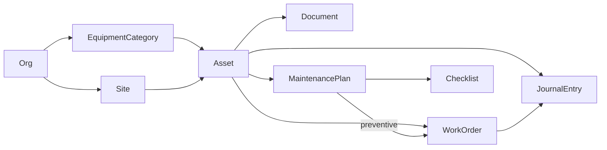

# ТОиР: технический дизайн

**Дата:** 2026-07-18  
**Связанные:** [B2B_MVP_SCOPE.md](B2B_MVP_SCOPE.md), [masterdoc-zitadel](https://github.com/masterdoc-app/masterdoc-zitadel)

Скоуп первых релизов: учёт, заявки, журналы, регламенты ТО, роли, AI-агенты. Склад ЗИП и подрядчики — backlog.

---

## 1. Стек

| Слой | Решение |
|------|---------|
| Клиенты | KMP (Decompose, MVIKotlin): Android — инженер; Web — диспетчер / admin / reporter |
| Auth | Zitadel self-host (РФ), OIDC, email+пароль, invite-only |
| Backend | 7 сервисов + API Gateway; PostgreSQL (schema per service на MVP); NATS JetStream; MinIO |
| AI | Специализированные агенты; детерминированный маршрут (экран/endpoint → агент); RAG через search/Onyx |
| Отчёты | SQL + агрегаты + экспорт; без LLM |

**Инварианты AI:** (1) агент пишет только `draft` + `source: ai_generated`, в учёт — человек; (2) один агент = свой промпт, знания, tools.

---

## 2. Модель данных

База из B2B_MVP_SCOPE: `Organization`, `Site`, `Asset`, `Document`, `WorkOrder`, `JournalEntry`, `User`.

| Сущность | Кто владеет | Поля (минимум) |
|----------|-------------|----------------|
| `EquipmentCategory` | admin | id, orgId, name, parentId?, defaultFields[], isActive |
| `Site` / `Asset` | dispatcher | Site: сеть объектов; Asset: единица + status + source |
| `Document` | dispatcher | file → S3; meta в document-service; связь с Asset |
| `MaintenancePlan` | dispatcher (+ draft от Технолога) | assetId, title, interval, checklistId, nextDueAt, isActive, source |
| `Checklist` | dispatcher (+ draft от Технолога) | title, items[] |
| `WorkOrder` | dispatcher / engineer | type: `corrective` \| `preventive`; status; assetId; source |
| `JournalEntry` | engineer / system | append-only; status: draft → posted → voided |

---

## 3. Стейты

**WorkOrder:** `draft` → `new` → `assigned` → `in_progress` ↔ `on_hold` → `done` → `closed`; также `cancelled`.  
`draft` — только AI; диспетчер подтверждает → `new`. Плановые заявки — тот же цикл, `type=preventive`.

**Asset:** `draft` → `active` → `inactive` → `retired`. Флаг `down` — вычисляемый (есть открытая WO «остановлено»).

**MaintenancePlan:** draft-пакет → `active` ↔ `paused` → `archived`. Scheduler по `nextDueAt` создаёт следующие `preventive` WO.

**JournalEntry:** `draft` → `posted`; сторно через `voided` (оригинал не удаляется).

---

## 4. Роли

| Роль | Клиент | Зона |
|------|--------|------|
| `admin` | Web | Пользователи, роли, invite, `user_site_access`, feature flags, `EquipmentCategory`. Не операции. |
| `dispatcher` | Web | Site, Asset, документы, доска WO, входящие AI-draft, календарь ТО |
| `engineer` | Android | Заявки, чек-лист, документы актива, Copilot, закрытие; QR/шильдик в поле |
| `requester` | Web/mobile/бот | Внеочередная заявка только если `userRequestsEnabled` |
| `reporter` | Web | Read-only отчёты и выгрузки |

JWT: `org_id` + `roles`. Доступ к Site — таблица `user_site_access` в access-service.

---

## 5. AI-агенты

Маршрут детерминирован. Пишущие tools — только `createDraft*`.

| Агент | Вход | Выход | Tools | Фаза |
|-------|------|-------|-------|------|
| **Технолог** | Диспетчер загружает доки + оборудование (ИЭ / руководство по ремонту) | Карточки автоматически: draft Asset + plan + checklist + preventive WO | `createDraftAsset`, `createDraftPlan`, `createDraftChecklist`, `createDraftWorkOrder(preventive)` | MVP |
| **Приёмщик** | Текст/фото дефекта | draft corrective WO | `createDraftWorkOrder`, `findAsset`, `findDuplicates`, `checkFeatureFlag` | 1.1 |
| **Наставник** (Copilot) | Вопрос у станка | Ответ с цитатой; read-only | `searchDocs`, `getAssetHistory` | 1.1 |
| **Писарь** (Репортер) | Текстовый отчёт инженера | draft closeout + JournalEntry | `draftCloseout`, `draftJournalEntry` | 1.1 |

Шильдик/QR — только идентификация актива инженером в поле, не вход Технолога.

---

## 6. Сервисы

| Сервис | Данные | API (через gateway) |
|--------|--------|---------------------|
| **access-service** | users/roles mirror, `user_site_access`, org settings | `/me`, `/org/settings`, `/users/{id}/sites` |
| **catalog-service** | Site, EquipmentCategory, Asset | `/sites`, `/assets`, `/equipment-categories`, `/assets/from-documents` |
| **dashboard-service** | WorkOrder, JournalEntry, MaintenancePlan, Checklist, scheduler | `/work-orders`, `/journal-entries`; фаза 2: `/maintenance-plans`, `/checklists`, calendar |
| **document-service** | meta документов; файлы в MinIO | `/documents`, `/assets/{id}/documents` |
| **report-service** | проекции / read-replica | `/export/journal`, конструктор отчётов |
| **notification-service** | очередь push | consumers событий |
| **ai-gateway** | `agent_run_log`, конфиг агентов | `/ai/technologist`, `/ai/intake`, `/ai/mentor`, `/ai/scribe` |
| **search-service** | Onyx-индексы | `/search/docs` |

Плановое ТО — в **dashboard-service** (не отдельный maintenance-service).

### События (NATS)

| Событие | Publisher → consumers |
|---------|----------------------|
| `document.attached` | document → search, ai-gateway (Технолог) |
| `asset.draft.created` | catalog → notification |
| `work_order.draft.created` | dashboard → notification |
| `work_order.status.changed` / `.closed` | dashboard → notification, report |
| `journal.entry.created` | dashboard → report |
| `maintenance_plan.approved` | dashboard → notification |

### Auth (кратко)

Zitadel Organization = клиент. Роли проекта: пять фиксированных из §4. Клиенты — OIDC Authorization Code + PKCE. API валидирует JWT, пароли не хранит. Канон: `masterdoc-zitadel`.

---

## 7. Фазы

| Фаза | Backend / UI | AI |
|------|--------------|-----|
| **MVP** | access, catalog, dashboard (WO+journal), document, report stub | Технолог |
| **1.1** | push, QR, `userRequestsEnabled` | Приёмщик, Наставник, Писарь |
| **2** | MaintenancePlan, Checklist, scheduler, календарь | пакет Технолога полностью в UI |
| **3** | конструктор отчётов | — |
| **Backlog** | склад ЗИП, contractor | — |
